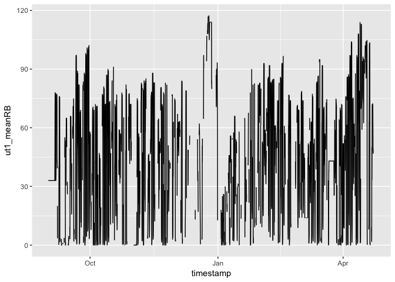
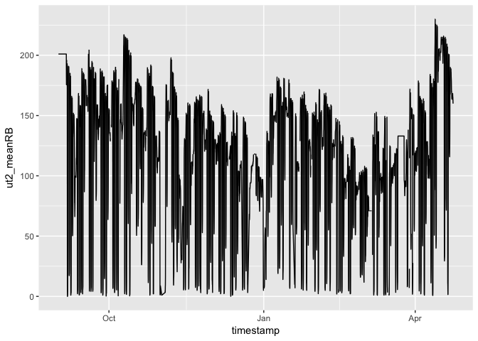
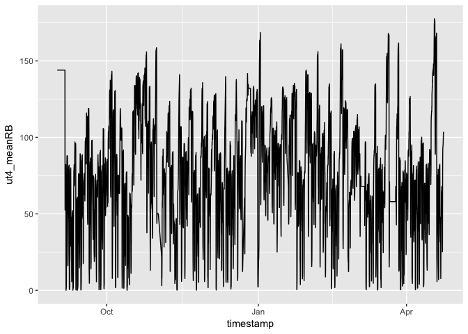
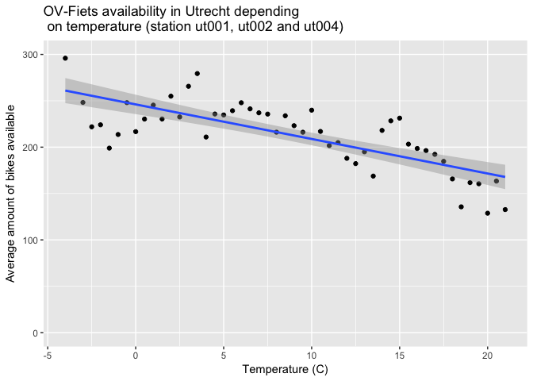
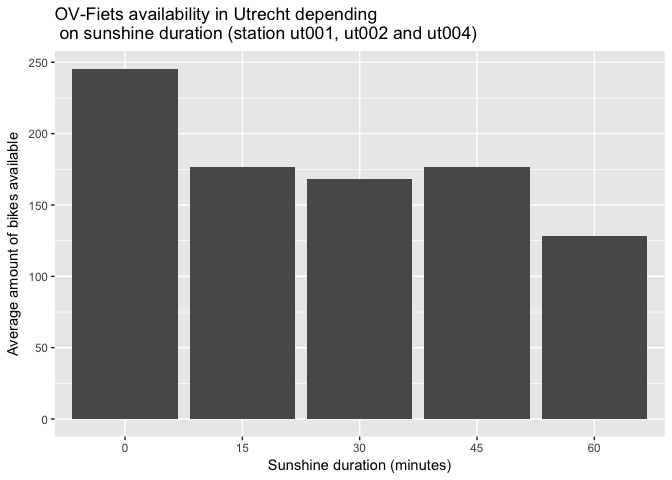
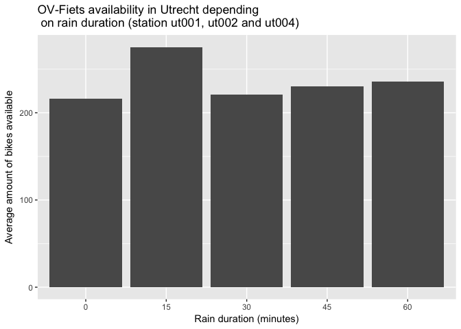

C°F 5th Weather Chart - Bike Shares (NL, Utrecht) Analysis
===========================================================

About
-----

In this analysis, we compared the number of bike shares around Utrecht Central train station with the average temperature, sunshine duration and rain duration.

OV-Fiets is a bike share system of the Netherlands. Thanks to the Geodienst department of the University of Groningen, we could access the bike share stations monitoring data. The data monitored is the number of bikes available at a bike share station. The data provided focuses on 4 OV-Fiets stations in Utrecht.

We conducted this analysis by making the assumption that *the number of bikes available at a bike share station is a fair indicator of the number of bikes that are currently being used*.

The steps taken for this analysis are:

-   Get OV-Fiets data
-   Calculate the average number of bikes available per hour at each OV-Fiets station
-   Get weather data per hour
-   Merge weather data and OV-Fiets data per hour and date
-   Get the overall average number of bikes available for 3 OV-Fiets station
-   Aggregate per temperature, per sunshine duration and finally per rain duration

In the following section, you will find more details about each step.

Sources
-------

-   Geodienst - University of Groningen, data was available on request. More information: <http://www.rug.nl/society-business/centre-for-information-technology/research/services/gis/blog/blog-19-11-2015-live-ov-fiets-kaart>
-   KNMI Hourly weather :
    -   <http://www.knmi.nl/nederland-nu/klimatologie/uurgegevens>
    -   <http://www.knmi.nl/kennis-en-datacentrum/achtergrond/data-ophalen-vanuit-een-script>

Methodology
-----------

``` r
library(plyr)
library(ggplot2)
library(lubridate)
library(dplyr)
source('../utils_NL.R')
```

### Get OV-Fiets data

``` r
data <- read.csv('../data/OVFietsUtrechtCentraal01092404.csv', header=TRUE)
head(data)
```

    ##   OBJECTID STATIONCODE OPEN                            DESCRIPTION
    ## 1 42543171          UT   No        Utrecht Centraal, Stationsplein
    ## 2 42543446          UT  Yes      Utrecht Centraal, Hoog Catharijne
    ## 3 42543470          UT  Yes Utrecht Centraal Oost, Smakkelaarsveld
    ## 4 42543776          UT  Yes                  Utrecht Centraal West
    ## 5 42544070          UT  Yes Utrecht Centraal Oost, Smakkelaarsveld
    ## 6 42544671          UT   No        Utrecht Centraal, Stationsplein
    ##   LOCATIONCODE RENTALBIKES          DATUMTIJD
    ## 1        ut005           5 4/19/2017 22:27:15
    ## 2        ut001         103 4/19/2017 22:32:15
    ## 3        ut004          75 4/19/2017 22:32:15
    ## 4        ut002         209 4/19/2017 22:37:15
    ## 5        ut004          76 4/19/2017 22:42:15
    ## 6        ut005           5 4/19/2017 22:52:16

The `STATIONCODE`, `DESCRIPTION` and `LOCATIONCODE` indicate the OV-Fiets station. `OPEN` indicate if the station is open (some stations close at night). `DATUMTIJD` is the timestamp at which the data was captured. `RENTALBIKES` is the number of bikes currently at the station.

Some formatting is needed:

``` r
# Format date
data$date <- as.Date(data$DATUMTIJD, "%m/%d/%Y")

# Format hour 
data$hour <- format(strptime(data$DATUMTIJD,format = '%m/%d/%Y %H:%M:%S'), "%H")
data$hour <- gsub("(?<![0-9])0+", "", data$hour, perl = TRUE)
data[data$hour == "", 'hour'] <- "0"

# Clean data (station is open and rental bikes number is not NA)
data_ov <- data[data$OPEN == 'Yes' & !is.na(data$RENTALBIKES), ]

head(data_ov)
```

    ##   OBJECTID STATIONCODE OPEN                            DESCRIPTION
    ## 2 42543446          UT  Yes      Utrecht Centraal, Hoog Catharijne
    ## 3 42543470          UT  Yes Utrecht Centraal Oost, Smakkelaarsveld
    ## 4 42543776          UT  Yes                  Utrecht Centraal West
    ## 5 42544070          UT  Yes Utrecht Centraal Oost, Smakkelaarsveld
    ## 7 42544970          UT  Yes Utrecht Centraal Oost, Smakkelaarsveld
    ## 8 42545546          UT  Yes      Utrecht Centraal, Hoog Catharijne
    ##   LOCATIONCODE RENTALBIKES          DATUMTIJD       date hour
    ## 2        ut001         103 4/19/2017 22:32:15 2017-04-19   22
    ## 3        ut004          75 4/19/2017 22:32:15 2017-04-19   22
    ## 4        ut002         209 4/19/2017 22:37:15 2017-04-19   22
    ## 5        ut004          76 4/19/2017 22:42:15 2017-04-19   22
    ## 7        ut004          76 4/19/2017 22:57:16 2017-04-19   22
    ## 8        ut001         103 4/19/2017 23:07:16 2017-04-19   23

### Get average number of bikes available per hour

We are going to analyse the variation of OV-Fiets availability per hour.

``` r
# Average rental bikes data per location and date and hour
data_ov_byhour <- aggregate(data_ov$RENTALBIKES, by=list(data_ov$LOCATIONCODE, data_ov$STATIONCODE, data_ov$DESCRIPTION, data_ov$date, data_ov$hour), FUN=mean)
colnames(data_ov_byhour) <- c('LOCATIONCODE', 'STATIONCODE', 'DESCRIPTION', 'date', 'hour', 'meanRB')

head(data_ov_byhour)
```

    ##   LOCATIONCODE STATIONCODE                            DESCRIPTION
    ## 1        ut004          UT Utrecht Centraal Oost, Smakkelaarsveld
    ## 2        ut002          UT                  Utrecht Centraal West
    ## 3        ut001          UT      Utrecht Centraal, Hoog Catharijne
    ## 4        ut004          UT Utrecht Centraal Oost, Smakkelaarsveld
    ## 5        ut002          UT                  Utrecht Centraal West
    ## 6        ut001          UT      Utrecht Centraal, Hoog Catharijne
    ##         date hour meanRB
    ## 1 2016-09-01    0    144
    ## 2 2016-09-01    0    201
    ## 3 2016-09-01    0     33
    ## 4 2016-09-02    0    144
    ## 5 2016-09-02    0    201
    ## 6 2016-09-02    0     33

### Get weather data

For more information on how the weather is treated, see the related reference. For this analysis we need hourly data.

``` r
# KNMI weather stations
nl_stations <- read.csv('../data/all_station_KNMI_cleaned.csv', header=TRUE, sep=",")

# Get weather data
weather_hour_data <- getKNMIHourlyData('2016090101', '2017042324')
```

    ## [1] "http://projects.knmi.nl/klimatologie/uurgegevens/getdata_uur.cgi?stns=ALL&vars=all&start=2016090101&end2017042324"

``` r
# Select weather records which have temperature, rain and sunshine data
weather_data_hour_full <- weather_hour_data[!is.na(weather_hour_data$T) & !is.na(weather_hour_data$RH) & !is.na(weather_hour_data$DR) & !is.na(weather_hour_data$SQ), ]

# Format weather data
weather_data_hour_format <- formatNLWeatherHourlyData(weather_data_hour_full)

# Get stations that have records for temperature, rain and sunshine data
nl_stations_hour_full <- merge(nl_stations, unique(weather_data_hour_format[c("STN")]), by='STN')
head(nl_stations_hour_full)
```

    ##   STN   LON    LAT ALT.m.        NAME
    ## 1 215 4.437 52.141   -1.1 VOORSCHOTEN
    ## 2 235 4.781 52.928    1.2          DE
    ## 3 240 4.790 52.318   -3.3    SCHIPHOL
    ## 4 249 4.979 52.644   -2.4    BERKHOUT
    ## 5 251 5.346 53.392    0.7       HOORN
    ## 6 257 4.603 52.506    8.5        WIJK

### Get closest weather station to OV-Fiets station

The geolocation of the OV-Fiets station was also provided by the university of Groningen.

``` r
location <- read.csv('../data/NL_OV_Location.csv')
names(location)[names(location) == 'POINT_X'] <- 'LON'
names(location)[names(location) == 'POINT_Y'] <- 'LAT'
head(location)
```

    ##        X LOCATIONCODE STATIONCODE           DESCRIPTION      LON      LAT
    ## 1      1       Hto001          HT 's-Hertogenbosch Oost 5.319214 51.70088
    ## 2  61821       atn001         ATN                Aalten 6.579290 51.92161
    ## 3 123641       amr001         AMR               Alkmaar 4.739850 52.63753
    ## 4 185461      amrn001        AMRN         Alkmaar Noord 4.763710 52.64396
    ## 5 247281       aml001         AML                Almelo 6.657320 52.35614
    ## 6 309101       alm001         ALM        Almere Centrum 5.217810 52.37462

For each OV-Fiets station in the dataset we want to find the closest weather station.

``` r
# Get utrecht OV-Fiets locations
location_ut <- location[location$LOCATIONCODE %in% data_ov_byhour$LOCATIONCODE,]

# Find closest weather station to each
closest_stations_hour <- getClosestWeatherStation(location_ut, nl_stations_hour_full)
closest_stations_hour
```

    ##            X LOCATIONCODE STATIONCODE
    ## 230 13654218        ut001          UT
    ## 231 13716039        ut004          UT
    ## 232 13777858        ut005          UT
    ## 233 13839678        ut002          UT
    ##                               DESCRIPTION      LON      LAT STN  LON  LAT
    ## 230      Utrecht Centraal Hoog Catharijne 5.112247 52.08961 260 5.18 52.1
    ## 231 Utrecht Centraal Oost Smakkelaarsveld 5.110170 52.09220 260 5.18 52.1
    ## 232        Utrecht Centraal Stationsplein 5.113063 52.08879 260 5.18 52.1
    ## 233                 Utrecht Centraal West 5.107613 52.09140 260 5.18 52.1
    ##     ALT.m. NAME apply(d, 1, function(x) sort(x, decreasing = F)[1])
    ## 230    1.9   DE                                          0.06854548
    ## 231    1.9   DE                                          0.07026428
    ## 232    1.9   DE                                          0.06786902
    ## 233    1.9   DE                                          0.07289608

In fact all the OV-Fiets station are the closest to the weather station 260.

### Get average amount of bikes available per hour and date

There are 4 OV-Fiets stations. They have values per hour and date. We want an overview of what is happening by hour and date, in Utrecht, therefore we want to have per hour and per date the average number of bike available for each station.

``` r
# Station ut001
df_01 <- data_ov_byhour[data_ov_byhour$LOCATIONCODE == 'ut001',]
df_01 <- df_01[c('date', 'hour', 'meanRB')]
colnames(df_01) <- c('date', 'hour', 'ut1_meanRB')

# Station ut002
df_02 <- data_ov_byhour[data_ov_byhour$LOCATIONCODE == 'ut002',]
df_02 <- df_02[c('date', 'hour', 'meanRB')]
colnames(df_02) <- c('date', 'hour', 'ut2_meanRB')

# Station ut004
df_04 <- data_ov_byhour[data_ov_byhour$LOCATIONCODE == 'ut004',]
df_04 <- df_04[c('date', 'hour', 'meanRB')]
colnames(df_04) <- c('date', 'hour', 'ut4_meanRB')

# Station ut005
df_05 <- data_ov_byhour[data_ov_byhour$LOCATIONCODE == 'ut005',]
df_05 <- df_05[c('date', 'hour', 'meanRB')]
colnames(df_05) <- c('date', 'hour', 'ut5_meanRB')

# Merge by date and hour
df_0102 <- merge(df_02, df_01, by=c('date', 'hour'), all.x=TRUE)
df_010204 <- merge(df_04, df_0102, by=c('date', 'hour'), all.x=TRUE)
df_all <- merge(df_010204, df_05, by=c('date', 'hour'), all.x=TRUE)

head(df_all)
```

    ##         date hour ut4_meanRB ut2_meanRB ut1_meanRB ut5_meanRB
    ## 1 2016-09-01    0        144        201         33         NA
    ## 2 2016-09-01    1        144        201         33         NA
    ## 3 2016-09-01   10        144        201         33         NA
    ## 4 2016-09-01   11        144        201         33         NA
    ## 5 2016-09-01   12        144        201         33         NA
    ## 6 2016-09-01   13        144        201         33         NA

### Merge OV-Fiets data and weather data

``` r
df_all$STN <- 260
df_all_weather <- merge(df_all , weather_data_hour_format, by=c('STN', 'date', 'hour'))
head(df_all_weather)
```

    ##   STN       date hour ut4_meanRB ut2_meanRB ut1_meanRB ut5_meanRB    T RH
    ## 1 260 2016-09-01    0        144        201         33         NA 13.3  0
    ## 2 260 2016-09-01    1        144        201         33         NA 13.9  0
    ## 3 260 2016-09-01   10        144        201         33         NA 21.5  0
    ## 4 260 2016-09-01   11        144        201         33         NA 22.5  0
    ## 5 260 2016-09-01   12        144        201         33         NA 22.0  0
    ## 6 260 2016-09-01   13        144        201         33         NA 21.3  0
    ##   DR  SQ M R S O Y roundedT roundedSQ roundedDR roundedRH
    ## 1  0 0.0 0 0 0 0 0       13         0         0         0
    ## 2  0 0.0 0 0 0 0 0       13         0         0         0
    ## 3  0 0.6 0 0 0 0 0       21         0         0         0
    ## 4  0 0.3 0 0 0 0 0       22         0         0         0
    ## 5  0 0.3 0 0 0 0 0       22         0         0         0
    ## 6  0 0.2 0 0 0 0 0       21         0         0         0

### Clean dataset

As we can see in the summary, among the 4 OV-Fiets station, the `ut005` one has 2905 NAs. We are going to exclude `ut005` from the analysis for that reason.

``` r
summary(df_all_weather)
```

    ##       STN           date                hour             ut4_meanRB    
    ##  Min.   :260   Min.   :2016-09-01   Length:4952        Min.   :  0.00  
    ##  1st Qu.:260   1st Qu.:2016-10-28   Class :character   1st Qu.: 50.15  
    ##  Median :260   Median :2016-12-30   Mode  :character   Median : 75.79  
    ##  Mean   :260   Mean   :2016-12-27                      Mean   : 75.86  
    ##  3rd Qu.:260   3rd Qu.:2017-02-26                      3rd Qu.:101.92  
    ##  Max.   :260   Max.   :2017-04-23                      Max.   :177.64  
    ##                                                                        
    ##    ut2_meanRB      ut1_meanRB       ut5_meanRB           T         
    ##  Min.   :  0.0   Min.   :  0.00   Min.   : 0.000   Min.   :-7.100  
    ##  1st Qu.: 71.0   1st Qu.: 14.04   1st Qu.: 2.667   1st Qu.: 4.100  
    ##  Median :118.0   Median : 42.00   Median : 7.417   Median : 7.700  
    ##  Mean   :109.5   Mean   : 42.07   Mean   : 7.551   Mean   : 7.869  
    ##  3rd Qu.:152.0   3rd Qu.: 64.42   3rd Qu.:11.833   3rd Qu.:11.100  
    ##  Max.   :230.0   Max.   :117.25   Max.   :22.250   Max.   :31.300  
    ##  NA's   :670     NA's   :1925     NA's   :2905                     
    ##        RH                DR                SQ               M          
    ##  Min.   :0.00000   Min.   :0.00000   Min.   :0.0000   Min.   :0.00000  
    ##  1st Qu.:0.00000   1st Qu.:0.00000   1st Qu.:0.0000   1st Qu.:0.00000  
    ##  Median :0.00000   Median :0.00000   Median :0.0000   Median :0.00000  
    ##  Mean   :0.06634   Mean   :0.06569   Mean   :0.1826   Mean   :0.07048  
    ##  3rd Qu.:0.00000   3rd Qu.:0.00000   3rd Qu.:0.2000   3rd Qu.:0.00000  
    ##  Max.   :8.40000   Max.   :1.00000   Max.   :1.0000   Max.   :1.00000  
    ##                                                                        
    ##        R                S                 O                  Y          
    ##  Min.   :0.0000   Min.   :0.00000   Min.   :0.000000   Min.   :0.00000  
    ##  1st Qu.:0.0000   1st Qu.:0.00000   1st Qu.:0.000000   1st Qu.:0.00000  
    ##  Median :0.0000   Median :0.00000   Median :0.000000   Median :0.00000  
    ##  Mean   :0.1678   Mean   :0.01474   Mean   :0.001212   Mean   :0.01757  
    ##  3rd Qu.:0.0000   3rd Qu.:0.00000   3rd Qu.:0.000000   3rd Qu.:0.00000  
    ##  Max.   :1.0000   Max.   :1.00000   Max.   :1.000000   Max.   :1.00000  
    ##                                                                         
    ##     roundedT        roundedSQ        roundedDR         roundedRH      
    ##  Min.   :-8.000   Min.   :0.0000   Min.   :0.00000   Min.   :0.00000  
    ##  1st Qu.: 4.000   1st Qu.:0.0000   1st Qu.:0.00000   1st Qu.:0.00000  
    ##  Median : 7.000   Median :0.0000   Median :0.00000   Median :0.00000  
    ##  Mean   : 7.424   Mean   :0.1016   Mean   :0.02585   Mean   :0.03352  
    ##  3rd Qu.:11.000   3rd Qu.:0.0000   3rd Qu.:0.00000   3rd Qu.:0.00000  
    ##  Max.   :31.000   Max.   :1.0000   Max.   :1.00000   Max.   :8.00000  
    ## 

``` r
df_all_weather$ut5_meanRB <- NULL
head(df_all_weather)
```

    ##   STN       date hour ut4_meanRB ut2_meanRB ut1_meanRB    T RH DR  SQ M R
    ## 1 260 2016-09-01    0        144        201         33 13.3  0  0 0.0 0 0
    ## 2 260 2016-09-01    1        144        201         33 13.9  0  0 0.0 0 0
    ## 3 260 2016-09-01   10        144        201         33 21.5  0  0 0.6 0 0
    ## 4 260 2016-09-01   11        144        201         33 22.5  0  0 0.3 0 0
    ## 5 260 2016-09-01   12        144        201         33 22.0  0  0 0.3 0 0
    ## 6 260 2016-09-01   13        144        201         33 21.3  0  0 0.2 0 0
    ##   S O Y roundedT roundedSQ roundedDR roundedRH
    ## 1 0 0 0       13         0         0         0
    ## 2 0 0 0       13         0         0         0
    ## 3 0 0 0       21         0         0         0
    ## 4 0 0 0       22         0         0         0
    ## 5 0 0 0       22         0         0         0
    ## 6 0 0 0       21         0         0         0

Next, we observed that the data is not always correctly captured. We noticed this by plotting the data over time. If you look closely you'll find that the number of bikes available remains identical several hours in a row, which is really unlikely.

``` r
df_all_weather$timestamp <- paste(df_all_weather$date, ' ', df_all_weather$hour, ':00:00', sep='')
df_all_weather$timestamp <- strptime(df_all_weather$timestamp , "%Y-%m-%d %H:%M:%S")

ggplot(df_all_weather, aes(x=timestamp, y=ut1_meanRB)) + geom_line()
```



``` r
ggplot(df_all_weather, aes(x=timestamp, y=ut2_meanRB)) + geom_line()
```



``` r
ggplot(df_all_weather, aes(x=timestamp, y=ut4_meanRB)) + geom_line()
```



For example the first days available in the dataset show the same data values over the days. Below is the list of records we removed from the dataset. The methodology was to remove records where the values remained identitcal over several hours.

``` r
OV_out <- read.csv('../data/NL_OV_out.csv')
OV_out$date <- as.Date(OV_out$date, format="%d/%m/%y")
OV_out$timestamp <- paste(OV_out$date, ' ', OV_out$hour, ':00:00', sep='')
OV_out$timestamp <- strptime(OV_out$timestamp , "%Y-%m-%d %H:%M:%S")
OV_out[c('date', 'hour', 'ut1_meanRB', 'ut2_meanRB', 'ut4_meanRB')]
```

    ##           date hour ut1_meanRB ut2_meanRB ut4_meanRB
    ## 1   2016-09-01    0   33.00000   201.0000  144.00000
    ## 2   2016-09-01    1   33.00000   201.0000  144.00000
    ## 3   2016-09-01   10   33.00000   201.0000  144.00000
    ## 4   2016-09-01   11   33.00000   201.0000  144.00000
    ## 5   2016-09-01   12   33.00000   201.0000  144.00000
    ## 6   2016-09-01   13   33.00000   201.0000  144.00000
    ## 7   2016-09-01   14   33.00000   201.0000  144.00000
    ## 8   2016-09-01   15   33.00000   201.0000  144.00000
    ## 9   2016-09-01   16   33.00000   201.0000  144.00000
    ## 10  2016-09-01   17   33.00000   201.0000  144.00000
    ## 11  2016-09-01   18   33.00000   201.0000  144.00000
    ## 12  2016-09-01   19   33.00000   201.0000  144.00000
    ## 13  2016-09-01    2   33.00000   201.0000  144.00000
    ## 14  2016-09-01   20   33.00000   201.0000  144.00000
    ## 15  2016-09-01   21   33.00000   201.0000  144.00000
    ## 16  2016-09-01   22   33.00000   201.0000  144.00000
    ## 17  2016-09-01   23   33.00000   201.0000  144.00000
    ## 18  2016-09-01    3   33.00000   201.0000  144.00000
    ## 19  2016-09-01    4   33.00000   201.0000  144.00000
    ## 20  2016-09-01    5   33.00000   201.0000  144.00000
    ## 21  2016-09-01    6   33.00000   201.0000  144.00000
    ## 22  2016-09-01    7   33.00000   201.0000  144.00000
    ## 23  2016-09-01    8   33.00000   201.0000  144.00000
    ## 24  2016-09-01    9   33.00000   201.0000  144.00000
    ## 25  2016-09-02    0   33.00000   201.0000  144.00000
    ## 26  2016-09-02    1   33.00000   201.0000  144.00000
    ## 27  2016-09-02   10   33.00000   201.0000  144.00000
    ## 28  2016-09-02   11   33.00000   201.0000  144.00000
    ## 29  2016-09-02   12   33.00000   201.0000  144.00000
    ## 30  2016-09-02   13   33.00000   201.0000  144.00000
    ## 31  2016-09-02   14   33.00000   201.0000  144.00000
    ## 32  2016-09-02   15   33.00000   201.0000  144.00000
    ## 33  2016-09-02   16   33.00000   201.0000  144.00000
    ## 34  2016-09-02   17   33.00000   201.0000  144.00000
    ## 35  2016-09-02   18   33.00000   201.0000  144.00000
    ## 36  2016-09-02   19   33.00000   201.0000  144.00000
    ## 37  2016-09-02    2   33.00000   201.0000  144.00000
    ## 38  2016-09-02   20   33.00000   201.0000  144.00000
    ## 39  2016-09-02   21   33.00000   201.0000  144.00000
    ## 40  2016-09-02   22   33.00000   201.0000  144.00000
    ## 41  2016-09-02   23   33.00000   201.0000  144.00000
    ## 42  2016-09-02    3   33.00000   201.0000  144.00000
    ## 43  2016-09-02    4   33.00000   201.0000  144.00000
    ## 44  2016-09-02    5   33.00000   201.0000  144.00000
    ## 45  2016-09-02    6   33.00000   201.0000  144.00000
    ## 46  2016-09-02    7   33.00000   201.0000  144.00000
    ## 47  2016-09-02    8   33.00000   201.0000  144.00000
    ## 48  2016-09-02    9   33.00000   201.0000  144.00000
    ## 49  2016-09-03    0   33.00000   201.0000  144.00000
    ## 50  2016-09-03    1   33.00000   201.0000  144.00000
    ## 51  2016-09-03   10   33.00000   201.0000  144.00000
    ## 52  2016-09-03   11   33.00000   201.0000  144.00000
    ## 53  2016-09-03   12   33.00000   201.0000  144.00000
    ## 54  2016-09-03   13   33.00000   201.0000  144.00000
    ## 55  2016-09-03   14   33.00000   201.0000  144.00000
    ## 56  2016-09-03   15   33.00000   201.0000  144.00000
    ## 57  2016-09-03   16   33.00000   201.0000  144.00000
    ## 58  2016-09-03   17   33.00000   201.0000  144.00000
    ## 59  2016-09-03   18   33.00000   201.0000  144.00000
    ## 60  2016-09-03   19   33.00000   201.0000  144.00000
    ## 61  2016-09-03    2   33.00000   201.0000  144.00000
    ## 62  2016-09-03   20   33.00000   201.0000  144.00000
    ## 63  2016-09-03   21   33.00000   201.0000  144.00000
    ## 64  2016-09-03   22   33.00000   201.0000  144.00000
    ## 65  2016-09-03   23   33.00000   201.0000  144.00000
    ## 66  2016-09-03    3   33.00000   201.0000  144.00000
    ## 67  2016-09-03    4   33.00000   201.0000  144.00000
    ## 68  2016-09-03    5   33.00000   201.0000  144.00000
    ## 69  2016-09-03    6   33.00000   201.0000  144.00000
    ## 70  2016-09-03    7   33.00000   201.0000  144.00000
    ## 71  2016-09-03    8   33.00000   201.0000  144.00000
    ## 72  2016-09-03    9   33.00000   201.0000  144.00000
    ## 73  2016-09-04    0   33.00000   201.0000  144.00000
    ## 74  2016-09-04    1   33.00000   201.0000  144.00000
    ## 75  2016-09-04   10   33.00000   201.0000  144.00000
    ## 76  2016-09-04   11   33.00000   201.0000  144.00000
    ## 77  2016-09-04   12   33.00000   201.0000  144.00000
    ## 78  2016-09-04   13   33.00000   201.0000  144.00000
    ## 79  2016-09-04   14   33.00000   201.0000  144.00000
    ## 80  2016-09-04   15   33.00000   201.0000  144.00000
    ## 81  2016-09-04   16   33.00000   201.0000  144.00000
    ## 82  2016-09-04   17   33.00000   201.0000  144.00000
    ## 83  2016-09-04   18   33.00000   201.0000  144.00000
    ## 84  2016-09-04   19   33.00000   201.0000  144.00000
    ## 85  2016-09-04    2   33.00000   201.0000  144.00000
    ## 86  2016-09-04   20   33.00000   201.0000  144.00000
    ## 87  2016-09-04   21   33.00000   201.0000  144.00000
    ## 88  2016-09-04   22   33.00000   201.0000  144.00000
    ## 89  2016-09-04   23   33.00000   201.0000  144.00000
    ## 90  2016-09-04    3   33.00000   201.0000  144.00000
    ## 91  2016-09-04    4   33.00000   201.0000  144.00000
    ## 92  2016-09-04    5   33.00000   201.0000  144.00000
    ## 93  2016-09-04    6   33.00000   201.0000  144.00000
    ## 94  2016-09-04    7   33.00000   201.0000  144.00000
    ## 95  2016-09-04    8   33.00000   201.0000  144.00000
    ## 96  2016-09-04    9   33.00000   201.0000  144.00000
    ## 97  2016-09-05    0   33.00000   201.0000  144.00000
    ## 98  2016-09-05    1   33.00000   201.0000  144.00000
    ## 99  2016-09-05   10   33.00000   201.0000  144.00000
    ## 100 2016-09-05   11   33.00000   201.0000  144.00000
    ## 101 2016-09-05   12   33.00000   201.0000  144.00000
    ## 102 2016-09-05   13   33.00000   201.0000  144.00000
    ## 103 2016-09-05   14   33.00000   201.0000  144.00000
    ## 104 2016-09-05   15   33.00000   201.0000  144.00000
    ## 105 2016-09-05   16   33.00000   201.0000  144.00000
    ## 106 2016-09-05   17   39.83333   182.7500   88.58333
    ## 107 2016-09-05   18   46.25000   175.5000   52.50000
    ## 108 2016-09-05   19   57.41667   182.4167   61.33333
    ## 109 2016-09-05    2   33.00000   201.0000  144.00000
    ## 110 2016-09-05   20   71.16667   191.5000   71.58333
    ## 111 2016-09-05   21   75.75000   194.7500   79.25000
    ## 112 2016-09-05   22   78.00000   196.0000   79.08333
    ## 113 2016-09-05   23   78.00000   196.0000   79.00000
    ## 114 2016-09-05    3   33.00000   201.0000  144.00000
    ## 115 2016-09-05    4   33.00000   201.0000  144.00000
    ## 116 2016-09-05    5   33.00000   201.0000  144.00000
    ## 117 2016-09-05    6   33.00000   201.0000  144.00000
    ## 118 2016-09-05    7   33.00000   201.0000  144.00000
    ## 119 2016-09-05    8   33.00000   201.0000  144.00000
    ## 120 2016-09-05    9   33.00000   201.0000  144.00000
    ## 121 2016-12-26   10  114.00000   118.0000  132.00000
    ## 122 2016-12-26   11  114.00000   118.0000  132.00000
    ## 123 2016-12-26   12  114.00000   118.0000  132.00000
    ## 124 2016-12-26   13  114.00000   118.0000  132.00000
    ## 125 2016-12-26   14  114.00000   118.0000  132.00000
    ## 126 2016-12-26   15  114.00000   118.0000  132.00000
    ## 127 2016-12-26   16  114.00000   118.0000  132.00000
    ## 128 2016-12-26   17  114.00000   118.0000  132.00000
    ## 129 2016-12-26   18  114.00000   118.0000  132.00000
    ## 130 2016-12-26   19  114.00000   118.0000  132.00000
    ## 131 2016-12-26   20  114.00000   118.0000  132.00000
    ## 132 2016-12-26   21  114.00000   118.0000  132.00000
    ## 133 2016-12-26   22  114.00000   118.0000  132.00000
    ## 134 2016-12-26   23  114.00000   118.0000  132.00000
    ## 135 2016-12-26    3         NA         NA  132.00000
    ## 136 2016-12-26    4         NA         NA  132.00000
    ## 137 2016-12-26    5  114.00000   118.0000  132.00000
    ## 138 2016-12-26    6  114.00000   118.0000  132.00000
    ## 139 2016-12-26    7  114.00000   118.0000  132.00000
    ## 140 2016-12-26    8  114.00000   118.0000  132.00000
    ## 141 2016-12-26    9  114.00000   118.0000  132.00000
    ## 142 2017-03-04   11   14.00000    71.0000   68.00000
    ## 143 2017-03-04   12   14.00000    71.0000   68.00000
    ## 144 2017-03-04   13   14.00000    71.0000   68.00000
    ## 145 2017-03-04   14   14.00000    71.0000   68.00000
    ## 146 2017-03-04   15   14.00000    71.0000   68.00000
    ## 147 2017-03-04   16   14.00000    71.0000   68.00000
    ## 148 2017-03-04   17   14.00000    71.0000   68.00000
    ## 149 2017-03-04   18   14.00000    71.0000   68.00000
    ## 150 2017-03-04   19   14.00000    71.0000   68.00000
    ## 151 2017-03-04    2         NA         NA   71.30769
    ## 152 2017-03-04   20   14.00000    71.0000   68.00000
    ## 153 2017-03-04   21   14.00000    71.0000   68.00000
    ## 154 2017-03-04   22   14.00000    71.0000   68.00000
    ## 155 2017-03-04   23   14.00000    71.0000   68.00000
    ## 156 2017-03-05   11   14.00000    71.0000   68.00000
    ## 157 2017-03-05   12   14.00000    71.0000   68.00000
    ## 158 2017-03-05   13   14.00000    71.0000   68.00000
    ## 159 2017-03-05   14   14.00000    71.0000   68.00000
    ## 160 2017-03-05   15   14.00000    71.0000   68.00000
    ## 161 2017-03-05   16   14.00000    71.0000   68.00000
    ## 162 2017-03-05   17   14.00000    71.0000   68.00000
    ## 163 2017-03-05   18   14.00000    71.0000   68.00000
    ## 164 2017-03-05   19   14.00000    71.0000   68.00000
    ## 165 2017-03-05    2         NA         NA   68.00000
    ## 166 2017-03-05   20   14.00000    71.0000   68.00000
    ## 167 2017-03-05   21   14.00000    71.0000   68.00000
    ## 168 2017-03-05   22   14.00000    71.0000   68.00000
    ## 169 2017-03-05    3         NA         NA   68.00000
    ## 170 2017-03-05    4         NA         NA   68.00000
    ## 171 2017-03-05    5         NA         NA   68.00000
    ## 172 2017-03-05    6         NA    71.0000   68.00000
    ## 173 2017-03-05    7         NA    71.0000   68.00000
    ## 174 2017-03-05    8         NA    71.0000   68.00000
    ## 175 2017-03-05    9         NA    71.0000   68.00000
    ## 176 2017-03-06   10   14.00000    71.0000   68.00000
    ## 177 2017-03-06   11   14.00000    71.0000   68.00000
    ## 178 2017-03-06   12   14.00000    71.0000   68.00000
    ## 179 2017-03-06   13   14.00000    71.0000   68.00000
    ## 180 2017-03-06   14   14.00000    71.0000   68.00000
    ## 181 2017-03-06    5   14.00000    71.0000   68.00000
    ## 182 2017-03-06    6   14.00000    71.0000   68.00000
    ## 183 2017-03-06    7   14.00000    71.0000   68.00000
    ## 184 2017-03-06    8   14.00000    71.0000   68.00000
    ## 185 2017-03-06    9   14.00000    71.0000   68.00000
    ## 186 2017-03-21   19   43.00000   133.0000   58.00000
    ## 187 2017-03-21   20   43.00000   133.0000   58.00000
    ## 188 2017-03-21   21   43.00000   133.0000   58.00000
    ## 189 2017-03-21   22   43.00000   133.0000   58.00000
    ## 190 2017-03-21   23   43.00000   133.0000   58.00000
    ## 191 2017-03-21    3         NA         NA  167.00000
    ## 192 2017-03-21    4         NA         NA  167.00000
    ## 193 2017-03-21    5         NA   122.0000  166.91667
    ## 194 2017-03-21    6         NA   122.0000  167.00000
    ## 195 2017-03-21    7         NA   122.0000  167.00000
    ## 196 2017-03-21    8         NA   122.0000  167.00000
    ## 197 2017-03-21    9         NA   122.0000  167.00000
    ## 198 2017-03-22    0   43.00000   133.0000   58.00000
    ## 199 2017-03-22    1   43.00000   133.0000   58.00000
    ## 200 2017-03-22   10   43.00000   133.0000   58.00000
    ## 201 2017-03-22   11   43.00000   133.0000   58.00000
    ## 202 2017-03-22   12   43.00000   133.0000   58.00000
    ## 203 2017-03-22   13   43.00000   133.0000   58.00000
    ## 204 2017-03-22   14   43.00000   133.0000   58.00000
    ## 205 2017-03-22   15   43.00000   133.0000   58.00000
    ## 206 2017-03-22   16   43.00000   133.0000   58.00000
    ## 207 2017-03-22   17   43.00000   133.0000   58.00000
    ## 208 2017-03-22   18   43.00000   133.0000   58.00000
    ## 209 2017-03-22   19   43.00000   133.0000   58.00000
    ## 210 2017-03-22    2   43.00000   133.0000   58.00000
    ## 211 2017-03-22   20   43.00000   133.0000   58.00000
    ## 212 2017-03-22   21   43.00000   133.0000   58.00000
    ## 213 2017-03-22   22   43.00000   133.0000   58.00000
    ## 214 2017-03-22   23   43.00000   133.0000   58.00000
    ## 215 2017-03-22    3   43.00000   133.0000   58.00000
    ## 216 2017-03-22    4   43.00000   133.0000   58.00000
    ## 217 2017-03-22    5   43.00000   133.0000   58.00000
    ## 218 2017-03-22    6   43.00000   133.0000   58.00000
    ## 219 2017-03-22    7   43.00000   133.0000   58.00000
    ## 220 2017-03-22    8   43.00000   133.0000   58.00000
    ## 221 2017-03-22    9   43.00000   133.0000   58.00000
    ## 222 2017-03-23    0   43.00000   133.0000   58.00000
    ## 223 2017-03-23    1   43.00000   133.0000   58.00000
    ## 224 2017-03-23   10   43.00000   133.0000   58.00000
    ## 225 2017-03-23   11   43.00000   133.0000   58.00000
    ## 226 2017-03-23   12   43.00000   133.0000   58.00000
    ## 227 2017-03-23   13   43.00000   133.0000   58.00000
    ## 228 2017-03-23   14   43.00000   133.0000   58.00000
    ## 229 2017-03-23   15   43.00000   133.0000   58.00000
    ## 230 2017-03-23   16   43.00000   133.0000   58.00000
    ## 231 2017-03-23   17   43.00000   133.0000   58.00000
    ## 232 2017-03-23   18   43.00000   133.0000   58.00000
    ## 233 2017-03-23   19   43.00000   133.0000   58.00000
    ## 234 2017-03-23    2   43.00000   133.0000   58.00000
    ## 235 2017-03-23   20   43.00000   133.0000   58.00000
    ## 236 2017-03-23   21   43.00000   133.0000   58.00000
    ## 237 2017-03-23   22   43.00000   133.0000   58.00000
    ## 238 2017-03-23   23   43.00000   133.0000   58.00000
    ## 239 2017-03-23    3   43.00000   133.0000   58.00000
    ## 240 2017-03-23    4   43.00000   133.0000   58.00000
    ## 241 2017-03-23    5   43.00000   133.0000   58.00000
    ## 242 2017-03-23    6   43.00000   133.0000   58.00000
    ## 243 2017-03-23    7   43.00000   133.0000   58.00000
    ## 244 2017-03-23    8   43.00000   133.0000   58.00000
    ## 245 2017-03-23    9   43.00000   133.0000   58.00000
    ## 246 2017-03-24    0   43.00000   133.0000   58.00000
    ## 247 2017-03-24    1   43.00000   133.0000   58.00000
    ## 248 2017-03-24   10   43.00000   133.0000   58.00000
    ## 249 2017-03-24   11   43.00000   133.0000   58.00000
    ## 250 2017-03-24   12   43.00000   133.0000   58.00000
    ## 251 2017-03-24   13   43.00000   133.0000   58.00000
    ## 252 2017-03-24   14   43.00000   133.0000   58.00000
    ## 253 2017-03-24   15   43.00000   133.0000   58.00000
    ## 254 2017-03-24   16   43.00000   133.0000   58.00000
    ## 255 2017-03-24   17   43.00000   133.0000   58.00000
    ## 256 2017-03-24   18   43.00000   133.0000   58.00000
    ## 257 2017-03-24   19   43.00000   133.0000   58.00000
    ## 258 2017-03-24    2   43.00000   133.0000   58.00000
    ## 259 2017-03-24   20   43.00000   133.0000   58.00000
    ## 260 2017-03-24   21   43.00000   133.0000   58.00000
    ## 261 2017-03-24   22   43.00000   133.0000   58.00000
    ## 262 2017-03-24   23   43.00000   133.0000   58.00000
    ## 263 2017-03-24    3   43.00000   133.0000   58.00000
    ## 264 2017-03-24    4   43.00000   133.0000   58.00000
    ## 265 2017-03-24    5   43.00000   133.0000   58.00000
    ## 266 2017-03-24    6   43.00000   133.0000   58.00000
    ## 267 2017-03-24    7   43.00000   133.0000   58.00000
    ## 268 2017-03-24    8   43.00000   133.0000   58.00000
    ## 269 2017-03-24    9   43.00000   133.0000   58.00000
    ## 270 2017-03-25    0   43.00000   133.0000   58.00000
    ## 271 2017-03-25    1   43.00000   133.0000   58.00000

That accounts for 271 records removed.

``` r
nrow(df_all_weather)
```

    ## [1] 4952

``` r
df_all_clean <- df_all_weather[!(df_all_weather$timestamp %in% OV_out$timestamp), ]
nrow(df_all_clean)
```

    ## [1] 4681

``` r
df_all_clean$timestamp <- as.character(df_all_clean$timestamp)
```

Finally we remove the rows when one of the station value is NA.

``` r
df_all_clean <- df_all_clean[!is.na(df_all_clean$ut1_meanRB) & !is.na(df_all_clean$ut2_meanRB) & !is.na(df_all_clean$ut4_meanRB),]
nrow(df_all_clean)
```

    ## [1] 2774

### Get average amount of bikes available for the 3 stations

We have now the average amount of bikes available, per station, per hour and per date. We want an overview for the three stations. To do this we sum the three averages together.

``` r
df_all_clean$sum124 <- df_all_clean$ut1_meanRB + df_all_clean$ut2_meanRB + df_all_clean$ut4_meanRB
head(df_all_clean)
```

    ##     STN       date hour ut4_meanRB  ut2_meanRB ut1_meanRB    T RH DR  SQ M
    ## 121 260 2016-09-06   10  2.4545455   0.7272727   33.00000 22.3  0  0 0.7 0
    ## 122 260 2016-09-06   11  0.8333333   1.0000000   33.16667 22.7  0  0 0.5 0
    ## 123 260 2016-09-06   12  1.4545455   4.3636364   34.90909 23.1  0  0 0.0 0
    ## 124 260 2016-09-06   13  2.9166667  18.4166667   36.00000 23.3  0  0 0.0 0
    ## 125 260 2016-09-06   14  6.3333333  52.2500000   38.83333 23.0  0  0 0.0 0
    ## 126 260 2016-09-06   15 40.0000000 112.5833333   50.91667 23.1  0  0 0.1 0
    ##     R S O Y roundedT roundedSQ roundedDR roundedRH           timestamp
    ## 121 0 0 0 0       22         0         0         0 2016-09-06 10:00:00
    ## 122 0 0 0 0       22         0         0         0 2016-09-06 11:00:00
    ## 123 0 0 0 0       23         0         0         0 2016-09-06 12:00:00
    ## 124 0 0 0 0       23         0         0         0 2016-09-06 13:00:00
    ## 125 0 0 0 0       23         0         0         0 2016-09-06 14:00:00
    ## 126 0 0 0 0       23         0         0         0 2016-09-06 15:00:00
    ##        sum124
    ## 121  36.18182
    ## 122  35.00000
    ## 123  40.72727
    ## 124  57.33333
    ## 125  97.41667
    ## 126 203.50000

Plots
-----

### Temperature

We want one value per 0.5C. To do this we can average `sum124` by each temperature, rounded to 0.5C. We will remove data points that have less than 10 hours of records to account for.

``` r
# Round temperature values to 0.5C
df_all_clean$roundedT_05 <- round(df_all_clean$T/0.5,0)*0.5

# Aggregate per rounded temperature
df_temp <- df_all_clean %>% group_by(roundedT_05) %>% summarise(mean124 = mean(sum124), count=length(timestamp))

# Remove outliers
df_temp_out <- df_temp[df_temp$count >= 10,]
head(df_temp_out)
```

    ## # A tibble: 6 x 3
    ##   roundedT_05  mean124 count
    ##         <dbl>    <dbl> <int>
    ## 1        -4.0 295.9308    10
    ## 2        -3.5 303.4773    11
    ## 3        -3.0 248.2359    13
    ## 4        -2.5 221.9414    12
    ## 5        -2.0 224.0950    27
    ## 6        -1.5 198.9704    26

``` r
# Linear regression
fit <- lm(mean124 ~ roundedT_05, df_temp_out, na.action=na.omit)
fit
```

    ## 
    ## Call:
    ## lm(formula = mean124 ~ roundedT_05, data = df_temp_out, na.action = na.omit)
    ## 
    ## Coefficients:
    ## (Intercept)  roundedT_05  
    ##     248.609       -3.919

``` r
# Plot
p1 <- ggplot(df_temp_out, aes(x=roundedT_05, y=mean124)) + geom_point() + geom_smooth(method='lm') +
    ylim(c(0,300)) +
    xlab("Temperature (C)") +
    ylab("Average amount of bikes available") +
    ggtitle("OV-Fiets availability in Utrecht depending \n on temperature (station ut001, ut002 and ut004)")
p1
```



### Sunshine duration

We want one value per 15mn. To do this we can average `sum124` by each 15mn of sunshine duration.

``` r
# Round temperature values to 0.5C
df_all_clean$roundedSQ_15 <- round(df_all_clean$SQ*60/15,0)*15

# Aggregate per rounded temperature
df_sq <- df_all_clean %>% group_by(roundedSQ_15) %>% summarise(mean124 = mean(sum124), count=length(sum124))
head(df_sq)
```

    ## # A tibble: 5 x 3
    ##   roundedSQ_15  mean124 count
    ##          <dbl>    <dbl> <int>
    ## 1            0 245.6084  1939
    ## 2           15 176.6191   164
    ## 3           30 168.0125   151
    ## 4           45 176.6818   146
    ## 5           60 128.5545   374

``` r
# Plot
p2 <- ggplot(df_sq, aes(as.character(roundedSQ_15))) + geom_bar(aes(weight=mean124)) +
    xlab("Sunshine duration (minutes)") +
    ylab("Average amount of bikes available") +
    ggtitle("OV-Fiets availability in Utrecht depending \n on sunshine duration (station ut001, ut002 and ut004)")
p2
```



### Rain duration

We want one value per 15mn. To do this we can average `sum124` by each 15mn of rain duration.

``` r
# Round temperature values to 0.5C
df_all_clean$roundedDR_15 <- round(df_all_clean$DR*60/15,0)*15

# Aggregate per rounded temperature
df_dr <- df_all_clean %>% group_by(roundedDR_15) %>% summarise(mean124 = mean(sum124), count=length(sum124))
head(df_dr)
```

    ## # A tibble: 5 x 3
    ##   roundedDR_15  mean124 count
    ##          <dbl>    <dbl> <int>
    ## 1            0 216.0206  2522
    ## 2           15 275.4108    35
    ## 3           30 220.9222    65
    ## 4           45 230.0671    39
    ## 5           60 236.0104   113

``` r
# Plot
p3 <- ggplot(df_dr, aes(as.character(roundedDR_15))) + geom_bar(aes(weight=mean124)) +
    xlab("Rain duration (minutes)") +
    ylab("Average amount of bikes available") +
    ggtitle("OV-Fiets availability in Utrecht depending \n on rain duration (station ut001, ut002 and ut004)")
p3
```


