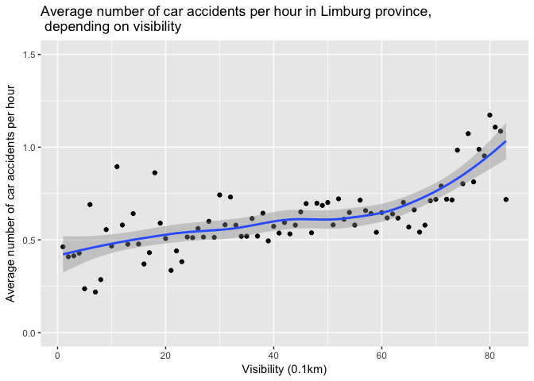
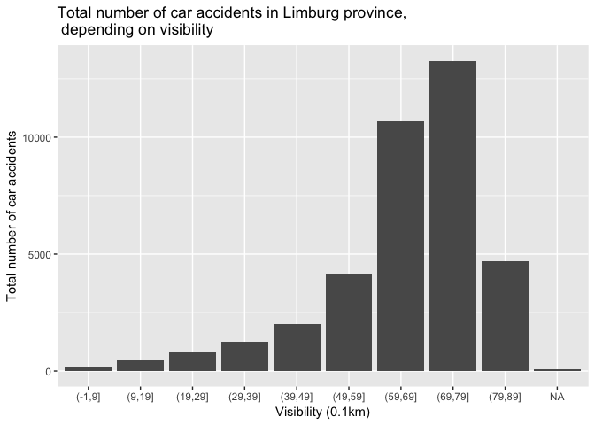
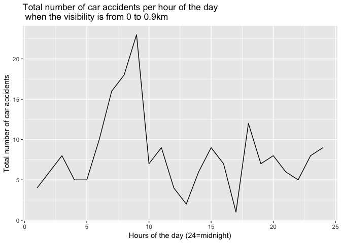
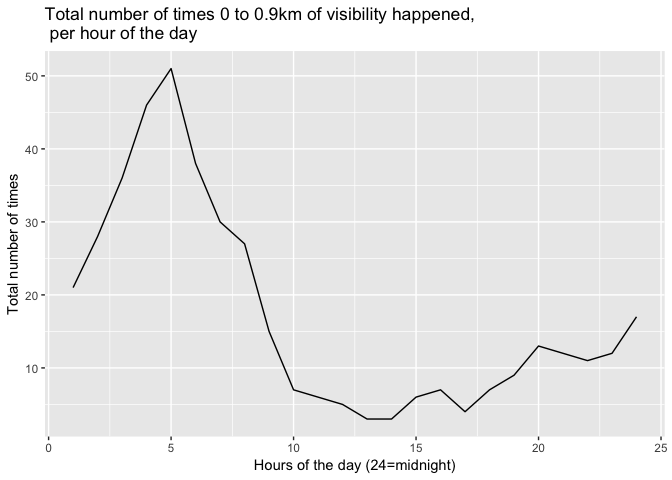
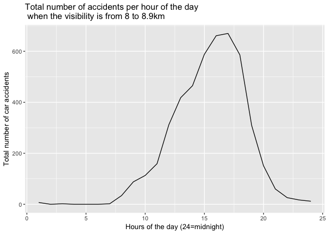
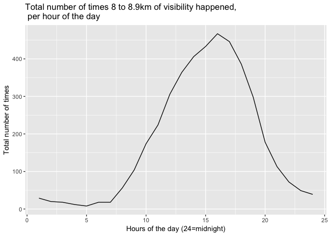

C°F 5th Weather Chart - Car Accidents (NL, Limburg) Analysis
=============================================================

About
-----

In this analysis, we compared the number of car accidents with the visibility.

The file Registered Road Crash Netherlands lists road crashes reports from the police.

The steps taken for this analysis are:

-   Get the car accidents data
-   Calculate the number of car accidents per hour and municipality
-   Get the weather data per hour
-   Associate closest weather station to each car accident location
-   Merge weather data and car accidents data per hour, date and weather station
-   Calculate average and total number of car accidents per visibility
-   Calculate the number of car accidents per hour of the day
-   Calculate the number of times a visibility was observed per hour of the day

In the following section, you will find more details about each step.

Sources
-------

* Rijkswaterstaat - Traffic accidents - Registered Road Crash Netherlands :
    * [2010](https://geoservices.rijkswaterstaat.nl/apps/geonetwork/srv/dut/catalog.search#/metadata/4gqrs90k-vobr-5t59-x726-4x2unrs1vavw) 
    * [2011](https://geoservices.rijkswaterstaat.nl/apps/geonetwork/srv/dut/catalog.search#/metadata/4gqrs90k-vobr-5t59-x726-4x2unrs1vavx) 
    * [2012](https://geoservices.rijkswaterstaat.nl/apps/geonetwork/srv/dut/catalog.search#/metadata/4gqrs90k-vobr-5t59-x726-4x2unrs1vavy) 
    * [2013](https://geoservices.rijkswaterstaat.nl/apps/geonetwork/srv/dut/catalog.search#/metadata/4gqrs90k-vobr-5t59-x726-4x2unrs1vavz) 
    * [2014](https://geoservices.rijkswaterstaat.nl/apps/geonetwork/srv/dut/catalog.search#/metadata/4gqrs90k-vobr-5t59-x726-4x2unrs1vawa) 
    * [2015](https://geoservices.rijkswaterstaat.nl/apps/geonetwork/srv/dut/catalog.search#/metadata/4gqrs90k-vobr-5t59-x726-4x2unrs1vawb)
*   KNMI Hourly weather : 
    * <http://www.knmi.nl/nederland-nu/klimatologie/uurgegevens> 
    * <http://www.knmi.nl/kennis-en-datacentrum/achtergrond/data-ophalen-vanuit-een-script>
*   Limburg population per municipality : <https://en.wikipedia.org/wiki/List_of_municipalities_of_the_Netherlands>

Methodology
-----------

``` r
library(plyr)
library(ggplot2)
library(lubridate)
library(dplyr)
library(reshape)
source('../utils_NL.R')
```

### Get accident data

We used data from 2010 to 2015. Each year comes as a seperate .csv file. We're only interested by accidents in the province of Limburg.

``` r
# Loads the csv and filter by province name
getNL_accidents_Data <- function(province, file){
  nl_accidents <- read.csv(file, sep=",", header=TRUE)
  return(nl_accidents[nl_accidents$PVE_NAAM == province,])
}

# Get the 6 files
nl_accidents2010 <- getNL_accidents_Data('Limburg', '../data/ongevallen2010.csv')
nl_accidents2011 <- getNL_accidents_Data('Limburg', '../data/ongevallen2011.csv')
nl_accidents2012 <- getNL_accidents_Data('Limburg', '../data/ongevallen2012.csv')
nl_accidents2013 <- getNL_accidents_Data('Limburg', '../data/ongevallen2013.csv')
nl_accidents2014 <- getNL_accidents_Data('Limburg', '../data/ongevallen2014.csv')
nl_accidents2015 <- getNL_accidents_Data('Limburg', '../data/ongevallen2015.csv')

# Bind data together (by row)
nl_accidents <- rbind(nl_accidents2010, nl_accidents2011, nl_accidents2012, nl_accidents2013, nl_accidents2014, nl_accidents2015)

# Format date
nl_accidents$date <- as.Date(as.character(nl_accidents$DATUM_VKL), "%Y%m%d")

# Accident data has an hour column that is mapped on 0 to 23 while weather data is mapped on 1 to 24.
nl_accidents$UUR <- nl_accidents$UUR + 1

head(nl_accidents)
```

    ##        VKL_NUMMER    REGNUMMER PVOPGEM DATUM_VKL DAG_CODE MND_NUMMER
    ## 27002 20100159519 2010058209-1       J  20100518       DI          5
    ## 27003 20100286710 2010122797-1       J  20101011       MA         10
    ## 27004 20100159500 2010055400-1       J  20100511       DI          5
    ## 27005 20109072605   2010136939          20101113       ZA         11
    ## 27006 20109072484   2010134260          20101107       ZO         11
    ## 27007 20109072478   2010120753          20101006       WO         10
    ##       JAAR_VKL TIJDSTIP UUR DDL_ID AP3_CODE AP4_CODE AP5_CODE ANTL_SLA
    ## 27002     2010     1540  16      3      UMS      UMS      UMS        0
    ## 27003     2010     1545  16      3      LET      LZW      LZH        1
    ## 27004     2010     1510  16      3      LET      LZW      LZH        1
    ## 27005     2010     1657  17      4      UMS      UMS      UMS        0
    ## 27006     2010     1600  17      4      UMS      UMS      UMS        0
    ## 27007     2010     1655  17      4      UMS      UMS      UMS        0
    ##       ANTL_DOD ANTL_GZH ANTL_SEH ANTL_GOV ANTL_PTJ ANTL_TDT MNE_CODE
    ## 27002        0        0        0        0        2        1      J04
    ## 27003        0        1        0        0        2        1      J10
    ## 27004        0        1        0        0        2        1      J05
    ## 27005        0        0        0        0        0        0      K01
    ## 27006        0        0        0        0        0        0      K01
    ## 27007        0        0        0        0        0        0      K01
    ##       AOL_ID NIVEAUKOP WSE_ID WSE_AN BEBKOM MAXSNELHD WVL_ID WVG_ID WVG_AN
    ## 27002      7         E      5     NA     BU        80      2      2       
    ## 27003      7         E      6     NA     BU       120      2      2       
    ## 27004      7         E      5     NA     BI        30      2      2       
    ## 27005      0         S     NA     NA               NA     NA     NA       
    ## 27006      0         S     NA     NA               NA     NA     NA       
    ## 27007      0         S     NA     NA               NA     NA     NA       
    ##       WDK_ID WDK_AN LGD_ID ZAD_ID WGD_CODE_1 WGD_CODE_2 BZD_ID_VM1
    ## 27002      1             1     NA          D                   160
    ## 27003      1             1     NA          D                    NA
    ## 27004      2             1     NA          D                    NA
    ## 27005     NA             3     NA                               NA
    ## 27006     NA             1     NA                               NA
    ## 27007     NA             1     NA                               NA
    ##       BZD_ID_VM2 BZD_ID_VM3 BZD_VM_AN BZD_ID_IF1 BZD_ID_IF2 BZD_ID_IF3
    ## 27002         NA         NA                   NA         NA         NA
    ## 27003         NA         NA                   NA         NA         NA
    ## 27004         NA         NA                   NA         NA         NA
    ## 27005         NA         NA                   NA         NA         NA
    ## 27006         NA         NA                   NA         NA         NA
    ## 27007         NA         NA                   NA         NA         NA
    ##       BZD_IF_AN BZD_ID_TA1 BZD_ID_TA2 BZD_ID_TA3 BZD_TA_AN    JTE_ID
    ## 27002                   NA         NA         NA           375075010
    ## 27003                   NA         NA         NA                  NA
    ## 27004                   NA         NA         NA           370064044
    ## 27005                   NA         NA         NA                  NA
    ## 27006                   NA         NA         NA                  NA
    ## 27007                   NA         NA         NA                  NA
    ##          WVK_ID HECTOMETER          FK_VELD5 HUISNUMMER GME_ID
    ## 27002        NA         NA     JTE0375075010              1883
    ## 27003 367061005         37 HTT03670610050037              1883
    ## 27004        NA         NA     JTE0370064044              1883
    ## 27005 365061028         NA     WVK0365061028              1883
    ## 27006 366063007         NA     WVK0366063007              1883
    ## 27007 378068032         NA     WVK0378068032              1883
    ##             GME_NAAM PVE_CODE PVE_NAAM
    ## 27002 Sittard-Geleen       LB  Limburg
    ## 27003 Sittard-Geleen       LB  Limburg
    ## 27004 Sittard-Geleen       LB  Limburg
    ## 27005 Sittard-Geleen       LB  Limburg
    ## 27006 Sittard-Geleen       LB  Limburg
    ## 27007 Sittard-Geleen       LB  Limburg
    ##                                       KDD_NAAM
    ## 27002 REGIO LIMBURG                           
    ## 27003 REGIO LIMBURG                           
    ## 27004 REGIO LIMBURG                           
    ## 27005 REGIO LIMBURG                           
    ## 27006 REGIO LIMBURG                           
    ## 27007 REGIO LIMBURG                           
    ##                                       PLT_NAAM
    ## 27002 REGIO LIMBURG ZUID                      
    ## 27003 REGIO LIMBURG ZUID                      
    ## 27004 REGIO LIMBURG ZUID                      
    ## 27005 REGIO LIMBURG ZUID                      
    ## 27006 REGIO LIMBURG ZUID                      
    ## 27007 REGIO LIMBURG ZUID                      
    ##                                       BSD_NAAM
    ## 27002 BASISEENHEID SITTARD                    
    ## 27003 BASISEENHEID SITTARD                    
    ## 27004 BASISEENHEID SITTARD                    
    ## 27005 BASISEENHEID SITTARD                    
    ## 27006 BASISEENHEID SITTARD                    
    ## 27007 BASISEENHEID SITTARD                    
    ##                                       WTM_NAAM WTP_NAAM WIK_NAAM
    ## 27002                                                           
    ## 27003 SITTARD-GELEEN                                            
    ## 27004 SITTARD-GELEEN                                            
    ## 27005 SITTARD-GELEEN                                            
    ## 27006 SITTARD-GELEEN                                            
    ## 27007 SITTARD-GELEEN                                            
    ##             date
    ## 27002 2010-05-18
    ## 27003 2010-10-11
    ## 27004 2010-05-11
    ## 27005 2010-11-13
    ## 27006 2010-11-07
    ## 27007 2010-10-06

### Get number of car accidents per date, hour and municipality

From this dataset we essentially need the date, hour and location of each accident. Then we can count the number of accidents per date, hour and municipality:

``` r
sum_data <- aggregate(x=nl_accidents$date, by=list(nl_accidents$date,nl_accidents$UUR, nl_accidents$GME_NAAM), FUN=length)
colnames(sum_data) <- c('date', 'HH', 'gemeente', 'Count')
head(sum_data)
```

    ##         date HH gemeente Count
    ## 1 2010-03-21  1     Beek     1
    ## 2 2013-10-26  1     Beek     1
    ## 3 2010-12-01  2     Beek     1
    ## 4 2013-02-15  2     Beek     1
    ## 5 2013-03-31  2     Beek     1
    ## 6 2013-07-08  2     Beek     1

### Get the location and population data of each municipality

This is a list of the municipality in Limburg, with the population and the geolocation.[1]

``` r
gemeente <- read.csv('../data/NL_Accidents_LimburgGemeente.csv', header=TRUE)
gemeente
```

    ##                  gemeente      LAT      LON Population
    ## 1                   Weert 51.24390 5.714200      48727
    ## 2                  Leudal 51.26200 5.891000      36213
    ## 3          Sittard-Geleen 51.00320 5.823700      93806
    ## 4       Horst aan de Maas 51.42320 6.030300      41718
    ## 5           Echt-Susteren 51.10350 5.874600      31940
    ## 6                  Venray 51.52563 5.973699      43120
    ## 7                   Venlo 51.37040 6.172400     100381
    ## 8                    Beek 50.93930 5.795600      16268
    ## 9                    Nuth 50.91140 5.892600      15577
    ## 10             Maastricht 50.85140 5.691000     122331
    ## 11               Meerssen 50.88490 5.752600      19259
    ## 12                 Gennep 51.69790 5.972700      17285
    ## 13           Peel en Maas 51.33990 6.012300      43298
    ## 14               Maasgouw 51.16780 5.884100      23888
    ## 15 Valkenburg aan de Geul 50.86850 5.826400      16668
    ## 16               Schinnen 50.94360 5.879400      12961
    ## 17                Heerlen 50.88820 5.979500      88202
    ## 18               Roermond 51.19130 5.987800      57030
    ## 19              Roerdalen 51.13920 6.034300      20808
    ## 20             Voerendaal 50.87920 5.931200      12447
    ## 21             Nederweert 51.28660 5.752700      16773
    ## 22      Eijsden-Margraten 50.82000 5.821500      24980
    ## 23                 Beesel 51.26970 6.046800      13593
    ## 24               Brunssum 50.94890 5.972200      28914
    ## 25                  Stein 50.96800 5.766200      34268
    ## 26             Simpelveld 50.83400 5.982600      10844
    ## 27                  Vaals 50.77320 6.011300       9682
    ## 28      Mook en Middelaar 51.75120 5.881600       7783
    ## 29              Landgraaf 50.89280 6.022400      37530
    ## 30               Kerkrade 50.86590 6.070500      46773
    ## 31              Bergen LB 51.60000 6.033333      13230
    ## 32          Gulpen-Wittem 50.80090 5.897300      14492
    ## 33            Onderbanken 50.96990 5.965400       7882

### Get the weather data

The date range is 2010-01-01 to 2015-12-31. We want hourly weather data.

``` r
nl_stations <- read.csv('../data/all_station_KNMI_cleaned.csv', header=TRUE, sep=",")

# Get stations of area
area_stations <- nl_stations[ nl_stations$LAT > 50.751601 & nl_stations$LAT < 51.801337 & nl_stations$LON < 6.171017 & nl_stations$LON > 5.555782, ]

# Get hourly weather data
weather_data <- getKNMIHourlyData('2010010101', '2015123124')
```

    ## [1] "http://projects.knmi.nl/klimatologie/uurgegevens/getdata_uur.cgi?stns=ALL&vars=all&start=2010010101&end2015123124"

``` r
colnames(weather_data) <- c('STN', 'YYYYMMDD',   'HH',   'DD',   'FH',   'FF',   'FX',    'T',  'T10',   'TD',   'SQ',    'Q',   'DR',   'RH',    'P',   'VV',    'N',    'U',   'WW',   'IX',    'M',    'R',    'S',    'O',    'Y')

# Format date
weather_data$date <- as.Date(as.character(weather_data$YYYYMMDD), "%Y%m%d")

weather_data <- weather_data[weather_data$date <= '2015-12-31' & weather_data$date >= '2010-01-01', ]

# Get weather station that have data for visibility
weather_data_temp <- weather_data[!is.na(weather_data$VV), ]
area_stations <- merge(area_stations, unique(weather_data_temp[c("STN")]), by='STN')

# Merge with station data
weather_data_stn <- merge(weather_data, area_stations, by="STN")
head(weather_data_stn)
```

    ##   STN YYYYMMDD HH  DD FH FF  FX   T T10  TD SQ  Q DR RH     P VV N  U WW
    ## 1 375 20100127 13 220 60 60  90 -15  NA -77  0 28  0  0 10258 58 8 59  4
    ## 2 375 20100127 14 220 70 80 100  -5  NA -84  0 22  0  0 10234 59 8 51  4
    ## 3 375 20100127 17 240 80 80 120   3  NA -62  0  0  0 -1 10180 62 8 62 54
    ## 4 375 20100127 18 240 90 90 140   5 -15 -38  0  0  0 -1 10164 61 8 73 25
    ## 5 375 20100127 15 230 90 90 120  -1  NA -88  0 21  0  0 10215 61 8 48 NA
    ## 6 375 20100127 16 240 80 70 110   3  NA -89  0  2  0  0 10196 65 8 50 NA
    ##   IX M R S O Y       date   LON    LAT ALT.m.   NAME
    ## 1  7 0 0 0 0 0 2010-01-27 5.707 51.659     22 VOLKEL
    ## 2  7 0 0 0 0 0 2010-01-27 5.707 51.659     22 VOLKEL
    ## 3  7 0 1 0 0 1 2010-01-27 5.707 51.659     22 VOLKEL
    ## 4  7 0 1 0 0 1 2010-01-27 5.707 51.659     22 VOLKEL
    ## 5  5 0 0 0 0 0 2010-01-27 5.707 51.659     22 VOLKEL
    ## 6  5 0 0 0 0 0 2010-01-27 5.707 51.659     22 VOLKEL

### Find the closest weather station to each municipality

Now, for each municipality, we'll find the closest weather stations.

``` r
sp.gemeente <- gemeente
coordinates(sp.gemeente) <- ~LON+LAT
sp.area_stations <- area_stations
coordinates(sp.area_stations) <- ~LON+LAT

# Get distance between all points
d <- gDistance(sp.area_stations, sp.gemeente, byid=TRUE)
min.d <- apply(d, 1, function(x) order(x, decreasing=F)[1])

# Get minimum distance to point and merge it with corresponding weather station
closest_stations <- cbind(gemeente, area_stations[min.d,], apply(d, 1, function(x) sort(x, decreasing=F)[1]))
head(closest_stations)
```

    ##              gemeente      LAT      LON Population STN   LON    LAT ALT.m.
    ## 2               Weert 51.24390 5.714200      48727 377 5.763 51.198   30.0
    ## 2.1            Leudal 51.26200 5.891000      36213 377 5.763 51.198   30.0
    ## 3      Sittard-Geleen 51.00320 5.823700      93806 380 5.762 50.906  114.3
    ## 2.2 Horst aan de Maas 51.42320 6.030300      41718 377 5.763 51.198   30.0
    ## 2.3     Echt-Susteren 51.10350 5.874600      31940 377 5.763 51.198   30.0
    ## 1              Venray 51.52563 5.973699      43120 375 5.707 51.659   22.0
    ##           NAME apply(d, 1, function(x) sort(x, decreasing = F)[1])
    ## 2          ELL                                           0.0669944
    ## 2.1        ELL                                           0.1431084
    ## 3   MAASTRICHT                                           0.1151292
    ## 2.2        ELL                                           0.3495201
    ## 2.3        ELL                                           0.1462355
    ## 1       VOLKEL                                           0.2981895

``` r
# Merge gemeent lat and long with data
sum_data_gemeente <- merge(sum_data, closest_stations[c('gemeente', 'STN')], by='gemeente')

head(sum_data_gemeente)
```

    ##   gemeente       date HH Count STN
    ## 1     Beek 2010-03-21  1     1 380
    ## 2     Beek 2013-10-26  1     1 380
    ## 3     Beek 2010-12-01  2     1 380
    ## 4     Beek 2013-02-15  2     1 380
    ## 5     Beek 2013-03-31  2     1 380
    ## 6     Beek 2013-07-08  2     1 380

Merge weather and accident data
===============================

Finally we can merge weather data with accident data.

``` r
weather_data_vv <- weather_data_stn[c('STN', 'date', 'HH', 'VV')]
sum_data_weather <- merge(weather_data_vv, sum_data_gemeente, by=c('STN', 'date', 'HH'), all.x=TRUE)

# When there are no accidents in an hour, fill with zeros
sum_data_weather$Count[is.na(sum_data_weather$Count)] <- 0

head(sum_data_weather)
```

    ##   STN       date HH VV gemeente Count
    ## 1 375 2010-01-01  1 66     <NA>     0
    ## 2 375 2010-01-01  2 67     <NA>     0
    ## 3 375 2010-01-01  3 70     <NA>     0
    ## 4 375 2010-01-01  4 70     <NA>     0
    ## 5 375 2010-01-01  5 70   Venray     1
    ## 6 375 2010-01-01  6 75     <NA>     0

### Get the number of car accidents per date and hour

We are interested in the visibility (weather code is VV). We will sum the number of car accidents per date and hour over the different municipalities. And average the visibility per date and hour over the different municipalities.

``` r
# Sum all accidents per date and hour
sumperDayandHour <- aggregate(x=sum_data_weather$Count, by=list(sum_data_weather$date, sum_data_weather$HH), FUN = sum)

# Get average visibility in limburg per date and hour
meanperDayandHour <- aggregate(sum_data_weather$VV, by=list(sum_data_weather$date, sum_data_weather$HH), FUN = mean)

# Bind results 
df_vv <- merge(sumperDayandHour, meanperDayandHour, by=c('Group.1', 'Group.2'))
colnames(df_vv) <- c('date', 'hour', 'sumAccidents', 'avgVV')

head(df_vv)
```

    ##         date hour sumAccidents    avgVV
    ## 1 2010-01-01    1            0 52.33333
    ## 2 2010-01-01   10            0 65.33333
    ## 3 2010-01-01   11            0 63.00000
    ## 4 2010-01-01   12            0 65.66667
    ## 5 2010-01-01   13            0 64.66667
    ## 6 2010-01-01   14            1 67.00000

Plots
-----

### Average number of car accidents per visibility

The visibility is given in 0.1km. So a value of 50 means a visibility range of 5-6 km. For each possible rounded visibility, we'll average the number of car accidents per hour. We'll remove data points that have less than 20 hours of occurences.

``` r
df_vv$rounded_VV <- round(df_vv$avgVV, 0)
df_vv_perhour <- df_vv %>% group_by(rounded_VV) %>% summarise(avgacc = mean(sumAccidents), count = length(rounded_VV))

# Remove low base data points
df_vv_perhour <- df_vv_perhour[df_vv_perhour$count >= 20,]

p1 <- ggplot(df_vv_perhour, aes(x=rounded_VV, y=avgacc)) + geom_point() + geom_smooth() +
    xlab("Visibility (0.1km)") +
    ylab("Average number of car accidents per hour") +
    ggtitle("Average number of car accidents per hour in Limburg province, \n depending on visibility") +
    ylim(c(0,1.5))

p1
```

    ## `geom_smooth()` using method = 'loess'



### Total number of accidents per visibility

We also want to know how many car accidents occur per visibility, in total over the years.

``` r
df_vv_total <- df_vv %>% group_by(rounded_VV) %>% summarise(sumacc = sum(sumAccidents), count = length(rounded_VV))

# Create bins to group by 1km visibility
df_vv_total$bin <- cut(df_vv_total$rounded_VV, breaks = seq(-1, 90, by = 10))
totals <- df_vv_total %>% group_by(bin) %>% summarise(sumBin=sum(sumacc))

p2 <- ggplot(totals, aes(x=bin)) + geom_bar(aes(weight=sumBin)) +
    xlab("Visibility (0.1km)") +
    ylab("Total number of car accidents") +
    ggtitle("Total number of car accidents in Limburg province, \n depending on visibility")

p2
```



### Total occurences of visibility and car accidents per hour

We want to count the number of car accidents that happen at each hour of the day, depending on the visibility. We'll group the visibility by range of 1km. Then, for each group of visibility, we will count how many hours it happened at a certain hour of the day. In short, we want to plot the frequency of car accidents and visibility in a day.

``` r
# Create bins to group by 1 km visibility
df_vv$bin <- cut(df_vv$rounded_VV, breaks = seq(-1, 90, by = 10))

# For each hour of the day (1 to 24), count how many accidents happen at that hour, at a given visibility
reshape1 <- df_vv[c('bin', 'hour', 'sumAccidents')]
df_acc_freq <- cast(reshape1, hour~bin, sum)
```

    ## Using sumAccidents as value column.  Use the value argument to cast to override this choice

``` r
# This table shows on the first row the bins of visibility. The left column shows the hours of the day.
# The values of the table are the total amount of accidents
df_acc_freq
```

    ##    hour (-1,9] (9,19] (19,29] (29,39] (39,49] (49,59] (59,69] (69,79]
    ## 1     1      4      6      29      31      49      80     222     123
    ## 2     2      6      6      22      25      44      62     173      80
    ## 3     3      8     12      25      25      30      58     142      61
    ## 4     4      5      7      20      23      38      57     124      45
    ## 5     5      5      9      21      36      37      40      96      47
    ## 6     6     10     18      24      30      26      68     151      59
    ## 7     7     16     39      43      50      63     103     190     166
    ## 8     8     18     40      89      72     130     215     491     402
    ## 9     9     23     52      47     140     169     314     696     705
    ## 10   10      7     16      31      57      78     223     518     593
    ## 11   11      9     10      30      43      84     210     474     733
    ## 12   12      4     10      24      35      91     207     489     896
    ## 13   13      2     11      22      37      75     168     578    1012
    ## 14   14      6     13      14      34      91     206     558    1113
    ## 15   15      9     14      16      52      99     228     608    1289
    ## 16   16      7     20      22      58      68     239     675    1219
    ## 17   17      1     21      45      66     151     283     774    1190
    ## 18   18     12     37      73      98     165     326     928    1158
    ## 19   19      7     28      42      95     107     242     729     673
    ## 20   20      8     13      42      52      99     231     545     575
    ## 21   21      6     35      53      48      94     193     442     377
    ## 22   22      5     25      55      38      79     147     374     294
    ## 23   23      8     15      32      57      85     149     398     270
    ## 24   24      9      7      24      61      72     115     294     190
    ##    (79,89] NA
    ## 1        7  1
    ## 2        0  0
    ## 3        2  1
    ## 4        0  2
    ## 5        0  0
    ## 6        0  3
    ## 7        2  1
    ## 8       34  5
    ## 9       88  8
    ## 10     113  3
    ## 11     159  3
    ## 12     312  6
    ## 13     418  8
    ## 14     465  7
    ## 15     588  4
    ## 16     661  4
    ## 17     670  4
    ## 18     586  3
    ## 19     309  1
    ## 20     151  2
    ## 21      60  2
    ## 22      26  2
    ## 23      17  1
    ## 24      12  1

``` r
# For each hour of the day (1 to 24), count how many times a visibility happen at that hour
reshape2 <- df_vv[c('bin', 'hour')]
df_vis_freq <- cast(reshape1, hour~bin, length)
```

    ## Using sumAccidents as value column.  Use the value argument to cast to override this choice

``` r
# This table shows on the first row the bins of visibility. The left column shows the hours of the day.
# The values of the table are the total amount of times it happened.
df_vis_freq 
```

    ##    hour (-1,9] (9,19] (19,29] (29,39] (39,49] (49,59] (59,69] (69,79]
    ## 1     1     21     45     109     141     198     340     854     448
    ## 2     2     28     62     112     149     220     337     851     406
    ## 3     3     36     73     142     144     228     371     835     338
    ## 4     4     46     77     139     155     237     392     820     307
    ## 5     5     51     77     146     147     229     386     800     341
    ## 6     6     38     79     141     144     186     365     799     415
    ## 7     7     30     68     113     134     165     320     820     517
    ## 8     8     27     40      88     102     150     323     753     646
    ## 9     9     15     31      54      98     126     294     703     761
    ## 10   10      7     25      45      60     104     265     670     836
    ## 11   11      6     12      32      60      83     230     612     927
    ## 12   12      5     11      29      43      71     207     581     933
    ## 13   13      3      8      21      37      73     173     554     953
    ## 14   14      3     10      19      28      78     179     499     966
    ## 15   15      6      5      19      38      76     169     492     950
    ## 16   16      7      8      25      45      59     186     502     889
    ## 17   17      4     10      36      41      87     183     565     816
    ## 18   18      7     15      34      58      92     188     621     787
    ## 19   19      9     23      40      61     101     210     706     740
    ## 20   20     13     15      56      66     109     260     730     761
    ## 21   21     12     18      69      74     128     267     791     716
    ## 22   22     11     30      77      82     144     297     833     642
    ## 23   23     12     34      86     101     165     324     839     578
    ## 24   24     17     34      90     132     188     319     871     496
    ##    (79,89] NA
    ## 1       29  6
    ## 2       20  6
    ## 3       18  6
    ## 4       12  6
    ## 5        8  6
    ## 6       18  6
    ## 7       18  6
    ## 8       56  6
    ## 9      104  5
    ## 10     174  5
    ## 11     224  5
    ## 12     306  5
    ## 13     364  5
    ## 14     406  3
    ## 15     433  3
    ## 16     467  3
    ## 17     446  3
    ## 18     386  3
    ## 19     298  3
    ## 20     178  3
    ## 21     113  3
    ## 22      72  3
    ## 23      49  3
    ## 24      39  5

This plot shows how many car accidents per hour occur when the visibility is from 0 to 0.9km. If it's 9am, that's when most of the accident happen when there is low visibility.

``` r
p3 <- ggplot() + geom_line(data=df_acc_freq, aes_string(x='hour', y='`(-1,9]`')) +
    xlab("Hours of the day (24=midnight)") +
    ylab("Total number of car accidents") +
    ggtitle("Total number of car accidents per hour of the day \n when the visibility is from 0 to 0.9km")
p3
```



This plot shows how many times the visibility from 0 to 0.9km has happened, per hour. For example 0 to 0.9km of visibility is most likely to happen at 5am.

``` r
p4 <- ggplot() +  geom_line(data=df_vis_freq, aes_string(x='hour', y='`(-1,9]`')) +
        xlab("Hours of the day (24=midnight)") +
        ylab("Total number of times") +
        ggtitle("Total number of times 0 to 0.9km of visibility happened, \n per hour of the day")
p4
```



This plot shows how many accidents per hour occur when the visibility is from 8 to 8.9km. If it's 5pm or 6pm, that's when most of the accident happen when there is high visibility.

``` r
p5 <- ggplot() + geom_line(data=df_acc_freq, aes_string(x='hour', y='`(79,89]`')) +
    xlab("Hours of the day (24=midnight)") +
    ylab("Total number of car accidents") +
    ggtitle("Total number of accidents per hour of the day \n when the visibility is from 8 to 8.9km")
p5
```



This plot shows how many times the visibility from 8 to 8.9km has happened, per hour. For example 8 to 8.9km of visibility is most likely to happen at 4pm.

``` r
p6 <- ggplot() +  geom_line(data=df_vis_freq, aes_string(x='hour', y='`(79,89]`')) +
        xlab("Hours of the day (24=midnight)") +
        ylab("Total number of times") +
        ggtitle("Total number of times 8 to 8.9km of visibility happened, \n per hour of the day")
p6
```



Map data
--------

The map shows the amount of accidents per municipality, per 1000 inhabitants, and per year.

``` r
# Get amount of accidents per municipality
geoloc <- aggregate(x=sum_data_gemeente$Count, by=list(sum_data_gemeente$gemeente), FUN=sum)
colnames(geoloc) <- c('gemeente', 'Sum per gemeente')

# Merge with municipalities geodata
geoloc <- merge(geoloc, gemeente, by='gemeente')

# Get amount of accidents per 1000 inhabitants, per year (there are 6 years)
geoloc$perThousandperYear <- ((geoloc$`Sum per gemeente` / geoloc$Population ) * 1000) / 6

geoloc
```

    ##                  gemeente Sum per gemeente      LAT      LON Population
    ## 1                    Beek              602 50.93930 5.795600      16268
    ## 2                  Beesel              321 51.26970 6.046800      13593
    ## 3               Bergen LB              407 51.60000 6.033333      13230
    ## 4                Brunssum              590 50.94890 5.972200      28914
    ## 5           Echt-Susteren             1614 51.10350 5.874600      31940
    ## 6       Eijsden-Margraten              388 50.82000 5.821500      24980
    ## 7                  Gennep              545 51.69790 5.972700      17285
    ## 8           Gulpen-Wittem              409 50.80090 5.897300      14492
    ## 9                 Heerlen             3237 50.88820 5.979500      88202
    ## 10      Horst aan de Maas             1452 51.42320 6.030300      41718
    ## 11               Kerkrade             1335 50.86590 6.070500      46773
    ## 12              Landgraaf              734 50.89280 6.022400      37530
    ## 13                 Leudal             1618 51.26200 5.891000      36213
    ## 14               Maasgouw              771 51.16780 5.884100      23888
    ## 15             Maastricht             2807 50.85140 5.691000     122331
    ## 16               Meerssen              395 50.88490 5.752600      19259
    ## 17      Mook en Middelaar              178 51.75120 5.881600       7783
    ## 18             Nederweert              545 51.28660 5.752700      16773
    ## 19                   Nuth              495 50.91140 5.892600      15577
    ## 20            Onderbanken              141 50.96990 5.965400       7882
    ## 21           Peel en Maas             1614 51.33990 6.012300      43298
    ## 22              Roerdalen              664 51.13920 6.034300      20808
    ## 23               Roermond             2720 51.19130 5.987800      57030
    ## 24               Schinnen              364 50.94360 5.879400      12961
    ## 25             Simpelveld              160 50.83400 5.982600      10844
    ## 26         Sittard-Geleen             2880 51.00320 5.823700      93806
    ## 27                  Stein              426 50.96800 5.766200      34268
    ## 28                  Vaals              274 50.77320 6.011300       9682
    ## 29 Valkenburg aan de Geul              434 50.86850 5.826400      16668
    ## 30                  Venlo             5431 51.37040 6.172400     100381
    ## 31                 Venray             1612 51.52563 5.973699      43120
    ## 32             Voerendaal              306 50.87920 5.931200      12447
    ## 33                  Weert             2177 51.24390 5.714200      48727
    ##    perThousandperYear
    ## 1            6.167527
    ## 2            3.935849
    ## 3            5.127236
    ## 4            3.400890
    ## 5            8.422041
    ## 6            2.588738
    ## 7            5.255038
    ## 8            4.703745
    ## 9            6.116641
    ## 10           5.800853
    ## 11           4.757018
    ## 12           3.259615
    ## 13           7.446681
    ## 14           5.379270
    ## 15           3.824324
    ## 16           3.418315
    ## 17           3.811726
    ## 18           5.415449
    ## 19           5.296270
    ## 20           2.981477
    ## 21           6.212758
    ## 22           5.318467
    ## 23           7.949033
    ## 24           4.680709
    ## 25           2.459117
    ## 26           5.116943
    ## 27           2.071904
    ## 28           4.716656
    ## 29           4.339653
    ## 30           9.017311
    ## 31           6.230674
    ## 32           4.097373
    ## 33           7.446248

[1] The population comes from the Wikipedia page listed in the sources. The geolocation comes from google maps (it points at the center of the municipality).
