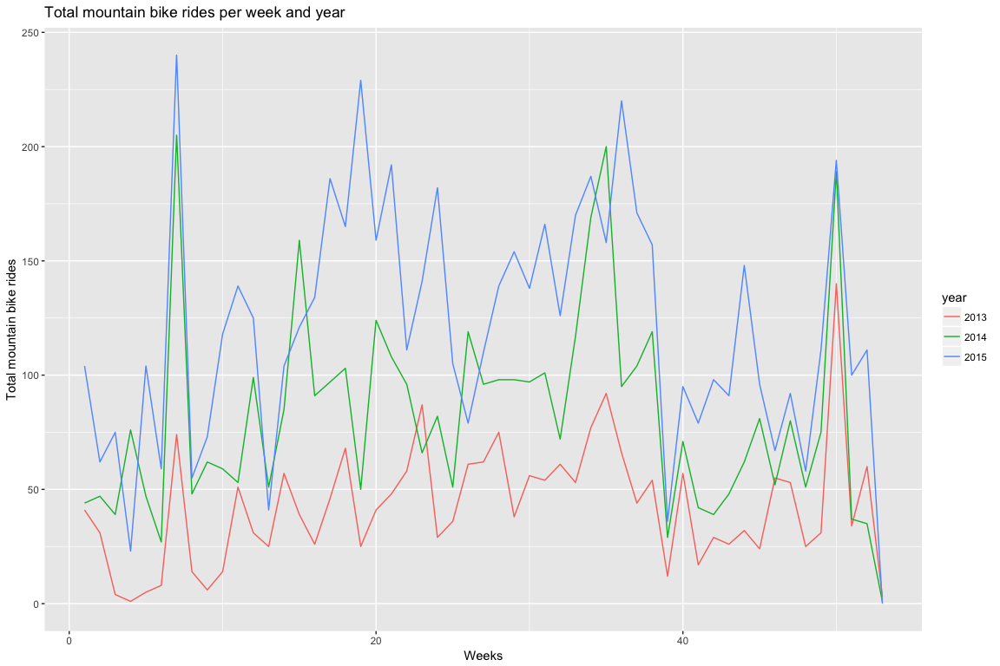
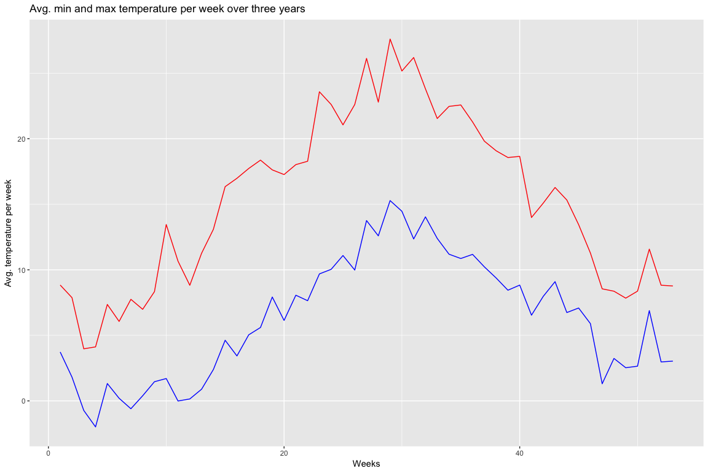
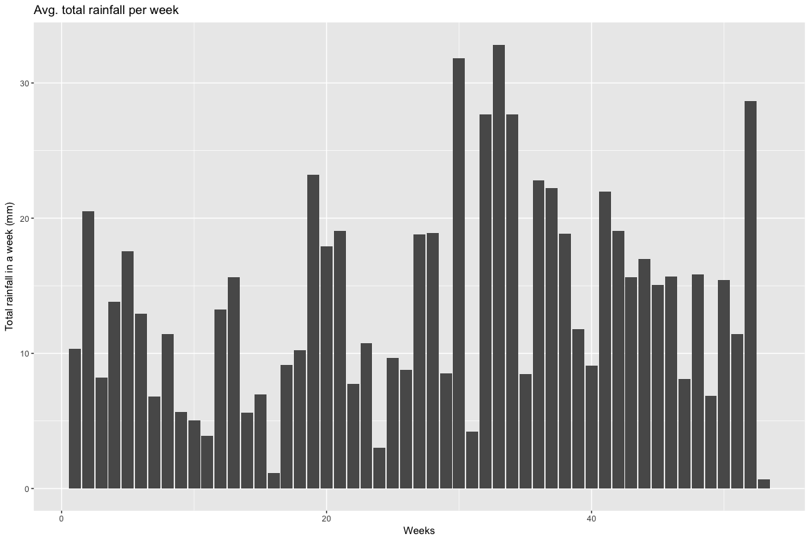

C°F 5th Weather Chart - Mountain Biking (NL, Eindhoven) Analysis
=================================================================

On Strava
---------

Strava is a website and mobile app used to track athletic activity via GPS. One type of data from Strava is called a *Segment* and is defined as "specific sections of road" on which "athletes' times are compared". An athlete performance is called an *Effort*. Back when the analysis was made, Strava API had an available endpoint `/segments/{segment_id}/all_efforts` which allowed to request for all the performance of athletes on a given segment, for a given date range, without the need of athlete's approval. This endpoint is unfortunately not available anymore, thus fetching the data is not reproducible.

About
-----

In this analysis, we compared the amount of people mountain biking for sport with temperature and rainfall.

The steps taken for this analysis are:

-   Get the number of mountain bike rides per day
-   Merge with the weather data
-   Aggregate to the total number of rides per week, mean temperature and rainfall per week.

In the following section, you will find more details about each step.

Sources
-------

-   Strava API : <https://strava.github.io/api/>
-   KNMI Daily weather :
    -   <http://www.knmi.nl/nederland-nu/klimatologie/daggegevens>
    -   <http://www.knmi.nl/kennis-en-datacentrum/achtergrond/data-ophalen-vanuit-een-script>
-   Highlights :
    -   <http://www.mountainbike.nl/forum/viewtopic.php?f=5&t=118369>
    -   <http://www.wtccw.nl/nieuws/18-aankondiging-activiteit/1229-rondje-geldrop-13-december-2015>
    -   <http://nos.nl/artikel/2014977-knmi-code-oranje-vanwege-ijzel.html>

Methodology
-----------

``` r
library(plyr)
library(ggplot2)
library(lubridate)
library(dplyr)
source('../utils_NL.R')
```

### Find a segment

There are many segments available. After logging in the Strava website, it is possible to [explore segments](https://www.strava.com/segments/explore) for a given location.

The criterias to pick a segment to analyse were:

-   The segment should have a large amount of athlete efforts recorded
-   The segment should not be a particular segment where the attendance levels could be influenced by a major factor. For example, a segment located on a university campus could be biased by scheduled sport trainings, and therefore would not reflect a weather influence.

Following this two rules we picked a segment called ["Gulberg Correct"](https://www.strava.com/segments/8596410). It is a mountain biking ride segment in Mierlo, Noord-Brabant, near Eindhoven.

### Get efforts for a segment

By querying the API with the segment ID, a start timestamp and an end timestamp, we get back the list of efforts conducted on the segment. For the segment we picked, the ID was `8596410`, and the date range was `start_date_local=2015-01-01T00:00:00Z` to `end_date_local=2015-12-31T23:59:59Z`. Example of the response head:

``` r
segmentData <- read.csv('../data/segment_8596410.csv')

# Format date
segmentData$YYYYMMDD <- as.Date(segmentData$start_date_local, "%Y-%m-%d")

head(segmentData)
```

    ##   X         id resource_state            name elapsed_time moving_time
    ## 1 1 5343480197              2 Gulberg Correct          120         120
    ## 2 2 5343480246              2 Gulberg Correct          135         135
    ## 3 3 5343480012              2 Gulberg Correct          203         203
    ## 4 4 5343480330              2 Gulberg Correct          106         106
    ## 5 5 5343480154              2 Gulberg Correct           93          93
    ## 6 6 5343480262              2 Gulberg Correct          108         108
    ##             start_date     start_date_local distance start_index end_index
    ## 1 2013-01-01T12:46:06Z 2013-01-01T13:46:06Z    414.3        1842      1962
    ## 2 2013-01-01T12:46:20Z 2013-01-01T13:46:20Z    351.7         509       554
    ## 3 2013-01-01T13:48:49Z 2013-01-01T14:48:49Z    398.6         819       881
    ## 4 2013-01-02T11:09:39Z 2013-01-02T12:09:39Z    346.6        1907      2013
    ## 5 2013-01-02T11:50:51Z 2013-01-02T12:50:51Z    344.1         486       517
    ## 6 2013-01-02T14:16:31Z 2013-01-02T15:16:31Z    428.7         384       420
    ##   device_watts average_watts average_heartrate max_heartrate kom_rank
    ## 1        FALSE         316.4             177.9           185       NA
    ## 2        FALSE         151.2                NA            NA       NA
    ## 3        FALSE            NA                NA            NA       NA
    ## 4        FALSE         232.1                NA            NA       NA
    ## 5        FALSE         173.8                NA            NA       NA
    ## 6        FALSE         170.8                NA            NA       NA
    ##   pr_rank average_cadence activity.id activity.resource_state athlete.id
    ## 1      NA              NA    35186343                       1     608646
    ## 2      NA              NA    35113987                       1     396048
    ## 3      NA              NA    35118973                       1     905097
    ## 4      NA              NA    36465945                       1     806780
    ## 5      NA              NA    35334717                       1    1388137
    ## 6      NA              NA    35368537                       1     632762
    ##   athlete.resource_state segment.id segment.resource_state    segment.name
    ## 1                      1    8596410                      2 Gulberg Correct
    ## 2                      1    8596410                      2 Gulberg Correct
    ## 3                      1    8596410                      2 Gulberg Correct
    ## 4                      1    8596410                      2 Gulberg Correct
    ## 5                      1    8596410                      2 Gulberg Correct
    ## 6                      1    8596410                      2 Gulberg Correct
    ##   segment.activity_type segment.distance segment.average_grade
    ## 1                  Ride            414.6                   4.7
    ## 2                  Ride            414.6                   4.7
    ## 3                  Ride            414.6                   4.7
    ## 4                  Ride            414.6                   4.7
    ## 5                  Ride            414.6                   4.7
    ## 6                  Ride            414.6                   4.7
    ##   segment.maximum_grade segment.elevation_high segment.elevation_low
    ## 1                  17.3                   53.9                  34.2
    ## 2                  17.3                   53.9                  34.2
    ## 3                  17.3                   53.9                  34.2
    ## 4                  17.3                   53.9                  34.2
    ## 5                  17.3                   53.9                  34.2
    ## 6                  17.3                   53.9                  34.2
    ##   segment.start_latitude segment.start_longitude segment.end_latitude
    ## 1               51.45032                5.578769             51.44969
    ## 2               51.45032                5.578769             51.44969
    ## 3               51.45032                5.578769             51.44969
    ## 4               51.45032                5.578769             51.44969
    ## 5               51.45032                5.578769             51.44969
    ## 6               51.45032                5.578769             51.44969
    ##   segment.end_longitude segment.climb_category segment.city segment.state
    ## 1              5.577003                      0       Mierlo Noord-Brabant
    ## 2              5.577003                      0       Mierlo Noord-Brabant
    ## 3              5.577003                      0       Mierlo Noord-Brabant
    ## 4              5.577003                      0       Mierlo Noord-Brabant
    ## 5              5.577003                      0       Mierlo Noord-Brabant
    ## 6              5.577003                      0       Mierlo Noord-Brabant
    ##   segment.country segment.private segment.hazardous segment.starred
    ## 1     Netherlands           FALSE             FALSE           FALSE
    ## 2     Netherlands           FALSE             FALSE           FALSE
    ## 3     Netherlands           FALSE             FALSE           FALSE
    ## 4     Netherlands           FALSE             FALSE           FALSE
    ## 5     Netherlands           FALSE             FALSE           FALSE
    ## 6     Netherlands           FALSE             FALSE           FALSE
    ##     YYYYMMDD
    ## 1 2013-01-01
    ## 2 2013-01-01
    ## 3 2013-01-01
    ## 4 2013-01-02
    ## 5 2013-01-02
    ## 6 2013-01-02

### Get number of mountain bike rides per day

``` r
sf_data <- ddply( segmentData , .(YYYYMMDD) , summarise , Count = length(YYYYMMDD), totalDistance = sum(distance), totalTime = sum(elapsed_time), meanTime= mean(elapsed_time), meanDistance=mean(distance) )
names(sf_data)[names(sf_data) == 'YYYYMMDD'] <- 'date'

head(sf_data)
```

    ##         date Count totalDistance totalTime meanTime meanDistance
    ## 1 2013-01-01     3        1164.6       458 152.6667     388.2000
    ## 2 2013-01-02     5        1961.5       580 116.0000     392.3000
    ## 3 2013-01-04    15        5847.8      2186 145.7333     389.8533
    ## 4 2013-01-05     8        3072.2      1743 217.8750     384.0250
    ## 5 2013-01-06    10        3924.3      1470 147.0000     392.4300
    ## 6 2013-01-10     1         371.0       114 114.0000     371.0000

### Get the weather

For more information on how the weather is treated, see the related reference. First we subset the weather stations to those around Eindhoven. For this particular case the subset correspond to one station only.

``` r
# KNMI weather stations
nl_stations <- read.csv('../data/all_station_KNMI_cleaned.csv', header=TRUE, sep=",")
# Get stations of area
area_stations <- nl_stations[ nl_stations$LAT > 51.384754 & nl_stations$LAT < 51.496760 & nl_stations$LON < 5.559295 & nl_stations$LON > 5.2, ]
area_stations
```

    ##     STN   LON    LAT ALT.m.      NAME
    ## 107 370 5.377 51.451   22.6 EINDHOVEN

Then we get the weather from KNMI and merge it with the station in order to get the weather of that station. After some formatting the weather data is ready to use.

``` r
# Weather data between 2013 and 2015
weather_data <- getKNMIDailyData('2013', '01', '01', '2015', '12', '31')
```

    ## [1] "http://projects.knmi.nl/klimatologie/daggegevens/getdata_dag.cgi?stns=ALL&vars=all&byear=2013&bmonth=01&bday=01&eyear=2015&emonth=12&eday=31"

``` r
# Merge with station data
weather_data_stn <- merge(weather_data, area_stations, by='STN')
# Format weather data
weather_data_format <- formatNLWeatherDailyData(weather_data_stn)
head(weather_data_format)
```

    ##   STN       date    FG  FHN  FHX   TG  TN   TX   SQ  DR  RH   LON    LAT
    ## 1 370 2013-01-01 18.00 10.8 25.2  6.3 2.3  8.4  1.4 8.6 7.3 5.377 51.451
    ## 2 370 2013-01-02 16.20 10.8 25.2  5.5 2.1  8.2  4.7 1.6 0.4 5.377 51.451
    ## 3 370 2015-10-01 15.48  7.2 28.8 11.1 5.6 16.8 10.5 0.0 0.0 5.377 51.451
    ## 4 370 2015-10-02 10.08  7.2 18.0 10.1 2.6 18.2 10.5 0.0 0.0 5.377 51.451
    ## 5 370 2015-10-03  3.96  0.0 10.8 11.0 3.7 19.5  5.2 0.0 0.0 5.377 51.451
    ## 6 370 2015-10-04  6.84  3.6 14.4 11.6 4.5 18.8  7.6 0.0 0.0 5.377 51.451
    ##   roundedFG roundedFHN roundedFHX roundedTG roundedTN roundedTX roundedSQ
    ## 1        18         10         25         6         2         8         1
    ## 2        16         10         25         5         2         8         4
    ## 3        15          7         28        11         5        16        10
    ## 4        10          7         18        10         2        18        10
    ## 5         3          0         10        11         3        19         5
    ## 6         6          3         14        11         4        18         7
    ##   roundedDR roundedRH
    ## 1         8         7
    ## 2         1         0
    ## 3         0         0
    ## 4         0         0
    ## 5         0         0
    ## 6         0         0

### Merge mountain bike rides and weather data

We merge by date.

``` r
sf_data_weather <- merge(sf_data, weather_data_format, by='date', all.y=TRUE)
sf_data_weather$Count[is.na(sf_data_weather$Count)] <- 0

head(sf_data_weather)
```

    ##         date Count totalDistance totalTime meanTime meanDistance STN    FG
    ## 1 2013-01-01     3        1164.6       458 152.6667     388.2000 370 18.00
    ## 2 2013-01-02     5        1961.5       580 116.0000     392.3000 370 16.20
    ## 3 2013-01-03     0            NA        NA       NA           NA 370 17.28
    ## 4 2013-01-04    15        5847.8      2186 145.7333     389.8533 370 14.76
    ## 5 2013-01-05     8        3072.2      1743 217.8750     384.0250 370  8.28
    ## 6 2013-01-06    10        3924.3      1470 147.0000     392.4300 370 10.08
    ##    FHN  FHX  TG  TN   TX  SQ  DR  RH   LON    LAT roundedFG roundedFHN
    ## 1 10.8 25.2 6.3 2.3  8.4 1.4 8.6 7.3 5.377 51.451        18         10
    ## 2 10.8 25.2 5.5 2.1  8.2 4.7 1.6 0.4 5.377 51.451        16         10
    ## 3 14.4 25.2 9.6 6.9 11.0 0.0 2.5 0.9 5.377 51.451        17         14
    ## 4 10.8 18.0 9.2 8.0 10.4 0.0 4.5 0.7 5.377 51.451        14         10
    ## 5  7.2 10.8 7.8 7.0  8.5 0.0 3.3 0.5 5.377 51.451         8          7
    ## 6  7.2 10.8 8.7 7.4 10.0 0.0 0.0 0.0 5.377 51.451        10          7
    ##   roundedFHX roundedTG roundedTN roundedTX roundedSQ roundedDR roundedRH
    ## 1         25         6         2         8         1         8         7
    ## 2         25         5         2         8         4         1         0
    ## 3         25         9         6        11         0         2         0
    ## 4         18         9         8        10         0         4         0
    ## 5         10         7         7         8         0         3         0
    ## 6         10         8         7        10         0         0         0

### Aggregate per week

``` r
sumbyweek <- aggregate(cbind(Count, RH, SQ)~week(date)+year(date),data=sf_data_weather, FUN=sum, na.rm=TRUE)
colnames(sumbyweek) <- c('week', 'year', 'sumcount', 'sumRH', 'sumSQ')
sumbyweek$year <- as.factor(sumbyweek$year)
head(sumbyweek)
```

    ##   week year sumcount sumRH sumSQ
    ## 1    1 2013       41   9.8   6.1
    ## 2    2 2013       31   7.4  24.4
    ## 3    3 2013        4   7.6   5.9
    ## 4    4 2013        1   4.2  13.8
    ## 5    5 2013        5  33.2  11.3
    ## 6    6 2013        8  18.0  26.5

``` r
meanbyweek <- aggregate(cbind(Count, TX, TN)~week(date),data=sf_data_weather, FUN=mean, na.rm=TRUE)
colnames(meanbyweek) <- c('week', 'sumcount', 'meanTX', 'meanTN')
head(meanbyweek)
```

    ##   week sumcount   meanTX     meanTN
    ## 1    1 9.000000 8.838095  3.7285714
    ## 2    2 6.666667 7.876190  1.8142857
    ## 3    3 5.619048 3.971429 -0.7285714
    ## 4    4 4.761905 4.119048 -1.9857143
    ## 5    5 7.428571 7.357143  1.3238095
    ## 6    6 4.476190 6.061905  0.2000000

``` r
avgRH <- aggregate(cbind(sumbyweek$sumRH), data=sumbyweek, FUN=mean, by=list(sumbyweek$week))
colnames(avgRH) <- c('week', 'avgRH')
head(avgRH)
```

    ##   week    avgRH
    ## 1    1 10.33333
    ## 2    2 20.50000
    ## 3    3  8.20000
    ## 4    4 13.80000
    ## 5    5 17.53333
    ## 6    6 12.93333

Plots
-----

``` r
p1 <- ggplot(sumbyweek, aes(x=week, y=sumcount)) + geom_line(aes(colour=year)) +
  xlab("Weeks") +
  ylab("Total mountain bike rides") +
  ggtitle("Total mountain bike rides per week and year")

p1
```



``` r
p2 <- ggplot(meanbyweek, aes(x=week)) +
  geom_line(colour='red', aes(y=meanTX)) +
  geom_line(colour='blue', aes(y=meanTN)) +
  xlab("Weeks") +
  ylab("Avg. temperature per week") +
  ggtitle("Avg. min and max temperature per week over three years")

p2
```



``` r
p3 <- ggplot(avgRH, aes(week)) +
  geom_bar(aes(weight=avgRH)) +
  xlab("Weeks") +
  ylab("Total rainfall in a week (mm)") +
  ggtitle("Avg. total rainfall per week")

p3
```


