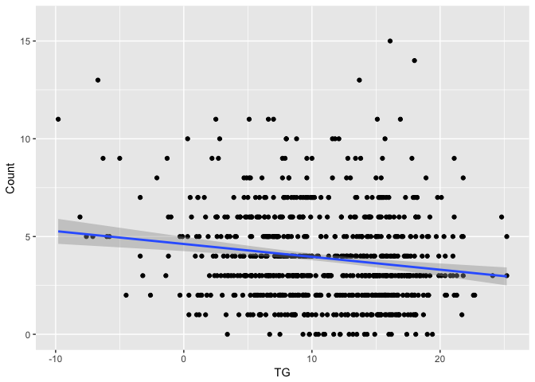

C°F 5th Weather Chart - Street Robberies (NL, Rotterdam) Analysis
==================================================================

About
-----

In this analysis, we compared the number of street robberies with the temperature.

A street robbery is defined as "Offender used purposefully and deliberately before or during the robbery, violence against their victims, to take possession of any property or to force the release of such goods. This includes the robberies committed in an elevator, gallery, interior street, porch or landing." [1]

The steps taken for this analysis are:

-   Get the street robberies data
-   Count the number of street robberies per day
-   Merge with the weather data per day
-   Calculate the temperature tercile

In the following section, you will find more details about each step.

Sources
-------

-   Rotterdam street robberies in 2011 and 2012 : <http://rotterdamopendata.nl/dataset/straatroven-rotterdam-2011-en-2012>
-   KNMI Daily weather :
    -   <http://www.knmi.nl/nederland-nu/klimatologie/daggegevens>
    -   <http://www.knmi.nl/kennis-en-datacentrum/achtergrond/data-ophalen-vanuit-een-script>
-   Testing time-sensitive influences of weather on street robbery : <https://crimesciencejournal.springeropen.com/articles/10.1186/s40163-015-0022-9>

Methodology
-----------

``` r
source('../utils_NL.R')

library(plyr)
library(ggplot2)
library(lubridate)
library(dplyr)
```

### Get the street robberies data

The street robberies dataset contains the date of the robbery and the location. There are more fields available but we don't need them for the analysis.

``` r
data <- read.csv('../data/Straatroof-2011.csv', header=TRUE, sep=",")
# Get non empty lines
data <- data[data$gem.datum != '', ]
# Format date column
data$date <- as.Date(data$gem.datum, "%d/%m/%Y")

head(data)
```

    ##     Voorval.nr Registratie..Zaak.Dossier...........Begindatum Maandnaam
    ## 1 2011000116-1                                       1/1/2011       jan
    ## 2 2011000127-1                                       1/1/2011       jan
    ## 3 2011000362-1                                       1/1/2011       jan
    ## 4 2011000739-1                                       1/1/2011       jan
    ## 5 2011000766-1                                       1/1/2011       jan
    ## 6 2011000820-1                                       1/1/2011       jan
    ##   Gem.week gem.datum dagsoort     dagdeel X24uur
    ## 1       52  1/1/2011       ZA 00:00-05:59     ja
    ## 2       52  1/1/2011       ZA 00:00-05:59     ja
    ## 3       52  1/1/2011       ZA 00:00-05:59     ja
    ## 4       52  1/1/2011       ZA 00:00-05:59     ja
    ## 5       52  1/1/2011       ZA 00:00-05:59     ja
    ## 6       52  1/1/2011       ZA 18:00-23:59     ja
    ##   Exacte.tijdstippen..Begindatum Begintijd Einddatum Eindtijd Kode
    ## 1                       1/1/2011      1:30  1/1/2011     1:30  B70
    ## 2                       1/1/2011      1:10  1/1/2011     1:33  B70
    ## 3                       1/1/2011      2:00  1/1/2011     2:00  B70
    ## 4                       1/1/2011      1:00  1/1/2011     1:00  B70
    ## 5                       1/1/2011      5:00  1/1/2011     5:00  B70
    ## 6                       1/1/2011     19:45  1/1/2011    19:50  B70
    ##   MK.omschrijving      Plaats   District     Wijk           Buurt
    ## 1      STRAATROOF   ROTTERDAM DISTRICT 9    1-Jan  7-KOP VAN ZUID
    ## 2      STRAATROOF   ROTTERDAM DISTRICT 9    9-Sep    0-BEVERWAARD
    ## 3      STRAATROOF VLAARDINGEN DISTRICT 1 1-WIJK 1       1-CENTRUM
    ## 4      STRAATROOF VLAARDINGEN DISTRICT 1 4-WIJK 4   2-HAVENGEBIED
    ## 5      STRAATROOF   ROTTERDAM DISTRICT 3    2-Feb 4-NIEUWE WESTEN
    ## 6      STRAATROOF   ROTTERDAM DISTRICT 5    3-Mar   4-LISKWARTIER
    ##          Subbuurt                 Straat nr toev postcode soort.locatie
    ## 1             0-0             VEEMSTRAAT NA        3072DC           WEG
    ## 2             0-0       RIJSENBURGSTRAAT NA          3077              
    ## 3       0-CENTRUM             HOOGSTRAAT 20  THV   3131BN           WEG
    ## 4   0-HAVENGEBIED KON WILHELMINAHAVEN ZZ NA                         WEG
    ## 5             9-9            DUYSTSTRAAT NA                         WEG
    ## 6             5-5     WILLEBRORDUSSTRAAT NA        3037TZ  OPENBARE WEG
    ##   poging.tot Opgelost pva...ja.of.neen.                              X
    ## 1          N        J                ja                   openbare weg
    ## 2          N        N                ja           in park of plantsoen
    ## 3          N        N                ja openbare weg/nabij pinautomaat
    ## 4          N        J                ja                   openbare weg
    ## 5          N        N                ja                   openbare weg
    ## 6          N        N                ja                   openbare weg
    ##   sexe.SO..m.of.v. leeftijdcat...kies.uit.lijst..              X.1
    ## 1                m                         17-Dec      portemonnee
    ## 2                m                          35-49 sieraden/ketting
    ## 3                v                          18-24  GSM/portemonnee
    ## 4                m                          18-24              GSM
    ## 5                m                          18-24  GSM/portemonnee
    ## 6                v                          25-34              GSM
    ##   wapen.ja.of.neen.            X.2 bijz..wapen..vrije.tekst..bijv..kleur.
    ## 1                                                                        
    ## 2                ja vuistvuurwapen                                       
    ## 3              neen                                                      
    ## 4              neen                                                      
    ## 5              neen                                                      
    ## 6                ja            mes                             stanleymes
    ##   letsel.SO..ja.of.neen.
    ## 1                   neen
    ## 2                   neen
    ## 3                   neen
    ## 4                   neen
    ## 5                     ja
    ## 6                   neen
    ##                                                          X.3
    ## 1 dreigen met geweld/schoppen/slaan/duwen/trekken/vastpakken
    ## 2       dreigen met vuurwapen/wapen tegen hoofd/wapen gezien
    ## 3                    schoppen/slaan/duwen/trekken/vastpakken
    ## 4                    schoppen/slaan/duwen/trekken/vastpakken
    ## 5                    schoppen/slaan/duwen/trekken/vastpakken
    ## 6                 dreigen met steekwapen/steken/wapen gezien
    ##                             X.4
    ## 1 wegrukken/doorgang belemmeren
    ## 2           doorgang belemmeren
    ## 3 wegrukken/doorgang belemmeren
    ## 4           doorgang belemmeren
    ## 5                     wegrukken
    ## 6 wegrukken/doorgang belemmeren
    ##                                     vrije.tekst.MO..kort.omschrijven.
    ## 1                      SO vastgepakt en portemonnee uit tas getrokken
    ## 2 SO kreeg wapen tegen hoofd, heeft uit angst ketting aan ddr gegeven
    ## 3                                          SO werd bij de keel gepakt
    ## 4                     SO uit angst gsm gegeven, werd in buik gestompt
    ## 5  Toen SO bij bewustzijn kwam, bleek hij te zijn geslagen en beroofd
    ## 6                       SO onder bedreiging van een mes GSM afgegeven
    ##              trefwoorden.taalgebruik..specifieke.termen. aantal.daders
    ## 1                                      "Ik ga jou slaan"             3
    ## 2 "Geld, ik moet geld hebben, geef dan die ketting maar"             1
    ## 3                         "Jij hebt zeker drugs gekocht"             3
    ## 4           "Geef me je telefoon, wel je mond houden he"             4
    ## 5                                                             onbekend
    ## 6                                  "Geef me je telefoon"             1
    ##                 X.5 bijz.voertuig..merk..type..kleur.
    ## 1            lopend                                  
    ## 2 scooter/bromfiets                                  
    ## 3            lopend                                  
    ## 4            lopend                                  
    ## 5            lopend                                  
    ## 6             fiets                        herenfiets
    ##   daderindicatie..ja.of.neen. gekoppelde.zaken..in.te.vullen.door.I.desk.
    ## 1                          ja                                            
    ## 2                        neen                                            
    ## 3                        neen                                            
    ## 4                          ja                                            
    ## 5                        neen                                            
    ## 6                        neen                                            
    ##   Herkennen.ja.nee.   Merk.GSM Aantal Jaar Imeinr Imeinr.1 Be X.6 X.7 X.8
    ## 1                                   1 2011                  1  NA  NA  NA
    ## 2                                   1 2011                  1  NA  NA  NA
    ## 3          onbekend Blackberry      1 2011                  2  NA  NA  NA
    ## 4                                   1 2011                  1  NA  NA  NA
    ## 5                                   1 2011                  5  NA  NA  NA
    ## 6                ja Blackberry      1 2011                 19  NA  NA  NA
    ##   X.9 X.10       date
    ## 1  NA   NA 2011-01-01
    ## 2  NA   NA 2011-01-01
    ## 3  NA   NA 2011-01-01
    ## 4  NA   NA 2011-01-01
    ## 5  NA   NA 2011-01-01
    ## 6  NA   NA 2011-01-01

### Get the number of street robberies per day

We are going to count the street robberies by day:

``` r
sum_data <- ddply( data , .(date) , summarise , Count = length(date))
colnames(sum_data) <- c('date', 'Count')
head(sum_data)
```

    ##         date Count
    ## 1 2011-01-01     7
    ## 2 2011-01-02     6
    ## 3 2011-01-03     1
    ## 4 2011-01-04     2
    ## 5 2011-01-05     5
    ## 6 2011-01-06     3

### Get the weather

For more information on how the weather is treated, see the related reference. First we subset the weather stations to those around Rotterdam. For this particular case the subset correspond to one station only.

``` r
# KNMI weather stations
nl_stations <- read.csv('../data/all_station_KNMI_cleaned.csv', header=TRUE, sep=",")

# Get stations of Rotterdam area
rot_stations <- nl_stations[ nl_stations$LAT > 51.854132 & nl_stations$LAT < 51.983343 & nl_stations$LON < 4.640430 & nl_stations$LON > 4.393526, ]
rot_stations
```

    ##    STN   LON    LAT ALT.m.      NAME
    ## 55 344 4.447 51.962   -4.3 ROTTERDAM

Then we get the weather from KNMI and merge it with the station in order to get the weather of that station. After some formatting the weather data is ready to use.

``` r
# Weather data between 2011 and 2012
weather_data <- getKNMIDailyData('2011', '01', '01', '2012', '12', '31')
```

    ## [1] "http://projects.knmi.nl/klimatologie/daggegevens/getdata_dag.cgi?stns=ALL&vars=all&byear=2011&bmonth=01&bday=01&eyear=2012&emonth=12&eday=31"

``` r
# Merge with station data
weather_data_stn <- merge(weather_data, rot_stations, by='STN')
# Format weather data
weather_data_format <- formatNLWeatherDailyData(weather_data_stn)
head(weather_data_format)
```

    ##   STN       date    FG  FHN  FHX  TG   TN  TX  SQ  DR  RH   LON    LAT
    ## 1 344 2011-01-02 10.08  3.6 14.4 1.7 -1.3 5.1 4.6 0.0 0.0 4.447 51.962
    ## 2 344 2011-01-03  8.64  3.6 14.4 1.2 -2.3 3.9 1.1 1.6 2.4 4.447 51.962
    ## 3 344 2011-01-01 12.60  3.6 21.6 3.9 -1.4 6.8 2.0 1.9 0.7 4.447 51.962
    ## 4 344 2011-02-10 18.00  7.2 25.2 7.5  4.0 9.9 0.4 7.7 8.6 4.447 51.962
    ## 5 344 2011-02-11 14.40  3.6 25.2 8.2  5.5 9.9 0.0 7.3 7.5 4.447 51.962
    ## 6 344 2011-02-12 17.64 10.8 25.2 6.6  3.6 9.3 0.0 6.7 8.1 4.447 51.962
    ##   roundedFG roundedFHN roundedFHX roundedTG roundedTN roundedTX roundedSQ
    ## 1        10          3         14         1        -2         5         4
    ## 2         8          3         14         1        -3         3         1
    ## 3        12          3         21         3        -2         6         2
    ## 4        18          7         25         7         4         9         0
    ## 5        14          3         25         8         5         9         0
    ## 6        17         10         25         6         3         9         0
    ##   roundedDR roundedRH
    ## 1         0         0
    ## 2         1         2
    ## 3         1         0
    ## 4         7         8
    ## 5         7         7
    ## 6         6         8

### Merge street robberies data and weather data

We merge by date.

``` r
# Merge by date
sum_data_weather <- merge(sum_data, weather_data_format, by='date', all.y=TRUE)
```

There might be days without any street robbery, therefore we fill in with zeros:

``` r
sum_data_weather$Count[is.na(sum_data_weather$Count)] <- 0
head(sum_data_weather)
```

    ##         date Count STN    FG  FHN  FHX  TG   TN  TX  SQ   DR   RH   LON
    ## 1 2011-01-01     7 344 12.60  3.6 21.6 3.9 -1.4 6.8 2.0  1.9  0.7 4.447
    ## 2 2011-01-02     6 344 10.08  3.6 14.4 1.7 -1.3 5.1 4.6  0.0  0.0 4.447
    ## 3 2011-01-03     1 344  8.64  3.6 14.4 1.2 -2.3 3.9 1.1  1.6  2.4 4.447
    ## 4 2011-01-04     2 344 19.80 10.8 25.2 1.3  0.2 2.8 3.2  0.0  0.0 4.447
    ## 5 2011-01-05     5 344 24.84 21.6 28.8 1.2 -0.2 3.9 3.9  2.6  1.7 4.447
    ## 6 2011-01-06     3 344 12.96  7.2 25.2 4.8  2.1 6.1 0.0 16.2 20.3 4.447
    ##      LAT roundedFG roundedFHN roundedFHX roundedTG roundedTN roundedTX
    ## 1 51.962        12          3         21         3        -2         6
    ## 2 51.962        10          3         14         1        -2         5
    ## 3 51.962         8          3         14         1        -3         3
    ## 4 51.962        19         10         25         1         0         2
    ## 5 51.962        24         21         28         1        -1         3
    ## 6 51.962        12          7         25         4         2         6
    ##   roundedSQ roundedDR roundedRH
    ## 1         2         1         0
    ## 2         4         0         0
    ## 3         1         1         2
    ## 4         3         0         0
    ## 5         3         2         1
    ## 6         0        16        20

``` r
nrow(sum_data_weather)
```

    ## [1] 731

### Terciles

"The nth percentile of an observation variable is the value that cuts off the first n percent of the data values when it is sorted in ascending order."[2] Average temperature was sorted in ascending order and then cut into three parts.

-   The 1st part has 244 days
-   The 2nd part has 244 days
-   The 3rd part has 243 days

``` r
# Terciles
q <- quantile(sum_data_weather$TG, seq(0,1, by=1/3))
q
```

    ##        0% 33.33333% 66.66667%      100% 
    ##      -9.8       8.1      14.4      25.2

``` r
# Order by max temperature
ordered <- sum_data_weather[order(sum_data_weather$TG, sum_data_weather$date),]

# Get the three sections
first <- ordered[1:244,]
second <- ordered[245:488,]
third <- ordered[489:731,]

# % of street robberies - First
100 * sum(first$Count) / sum(sum_data_weather$Count)
```

    ## [1] 37.70147

``` r
# % of street robberies - Second 
100 * sum(second$Count) / sum(sum_data_weather$Count)
```

    ## [1] 31.3595

``` r
# % of street robberies - Third
100 * sum(third$Count) / sum(sum_data_weather$Count)
```

    ## [1] 30.93903

The number above are slightly different from the one we used on the weather chart. The reason for this is that we did the quantile analysis in Excel, in which the ordering of the temperature might differ for equal temperatures. Around the first quantile, there are several temperature values of 8.1C. Excel seem to have order the data differently from R, therefore the data with a temperature of 8.1C does not fall in the same quantiles in both analysis.

Plots
-----

``` r
p1 <- ggplot(sum_data_weather, aes(x=TG, y=Count)) + geom_point() +
    ylim(c(0,16)) +
    geom_smooth(method="lm")
p1
```



[1] From <http://rotterdamopendata.nl/dataset/straatroven-rotterdam-2011-en-2012>

[2] From <http://www.r-tutor.com/elementary-statistics/numerical-measures/percentile>
