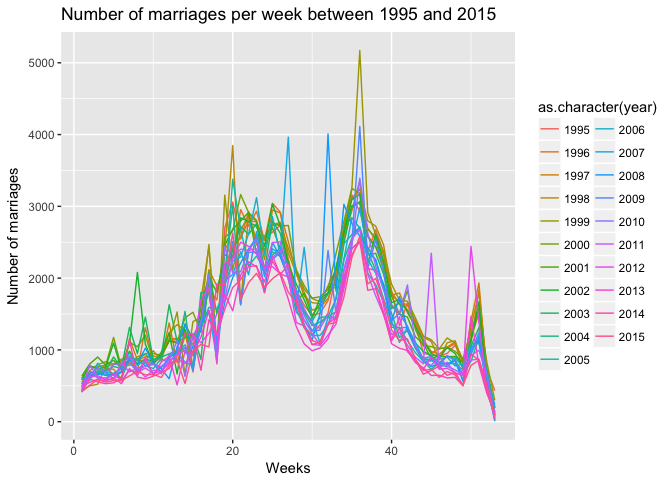
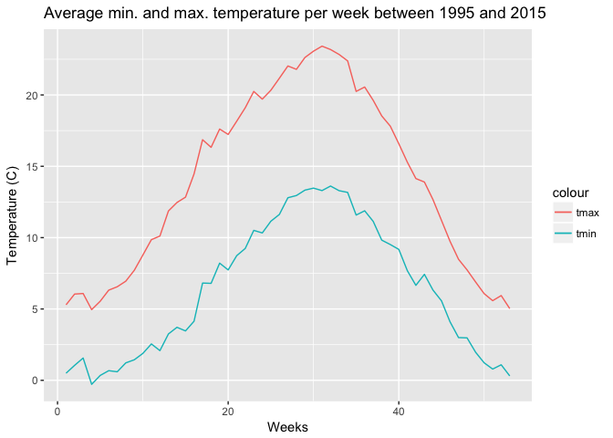
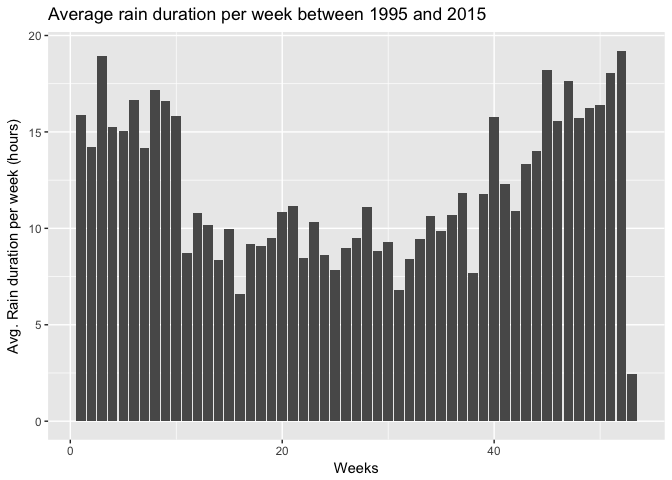

C°F 5th Weather Chart - Weddings (NL) Analysis
===============================================

About
-----

In this analysis, we compared the number of weddings per week with the temperature and the rain duration.

The weddings data comes from CBS Statline and contains data on population development in the Netherlands, per day. In this table, the data is broken down to the following attributes:

-   Births
-   Deceased
-   Marriage closures (excluding closed partnership registrations)
-   Partnership registrations
-   (Real) divorces (from 2010 including disbanded partnership registrations)
-   Persons moving within the Netherlands
-   Foreign migration
-   Nationality changes

Data available from: 1995

The steps taken for this analysis are:

-   Get weddings data
-   Count total number of weddings per day and per year
-   Get weather data
-   Merge weddings and weather data by day
-   Sum the total number of weddings per week for each year
-   Average the temperature and rain duration per week over all the years

In the following section, you will find more details about each step.

Sources
-------

-   Population Development; births, deaths and migration, per day : <http://statline.cbs.nl/Statweb/publication/?DM=SLNL&PA=70703NED&D1=a&D2=8044-8074,l&VW=T>
-   KNMI Daily weather :
    -   <http://www.knmi.nl/nederland-nu/klimatologie/daggegevens>
    -   <http://www.knmi.nl/kennis-en-datacentrum/achtergrond/data-ophalen-vanuit-een-script>

Methodology
-----------

``` r
library(plyr)
library(ggplot2)
library(lubridate)
library(dplyr)
source('../utils_NL.R')
```

### Get the marriage data

The CBS Marriage date column is written in plain text, therefore we need to format it to a usable format.

``` r
data <- read.csv('../data/NL_Marriages_Divorces_all.csv')
head(data)
```

    ##             Onderwerpen_2 Totaal.huwelijken X.Echt.scheidingen
    ## 1 Zondag 9 september 2007                10                  0
    ## 2 Zondag 9 september 2001                12                  0
    ## 3   Zondag 9 oktober 2005                 5                  0
    ## 4  Zondag 9 november 2008                 2                  0
    ## 5  Zondag 9 november 2003                 2                  1
    ## 6  Zondag 9 november 1997                 4                  1

``` r
data$month <- NA
data$date <- NA

# Format date field
for (i in 1:nrow(data)) {
  splits <- strsplit(as.character(data$Onderwerpen_2[i]), " ")
  length <- length(splits[[1]])

  for (j in 1:length) {
    colname <- paste('split', j)
    value <- splits[[1]][j]
    
    value_date <- as.Date(value, '%d-%m-%Y')

    if (!is.na(value_date)) {
      data[i, 'date'] <- value_date
      break
    } else {
      if (value == 'januari') { data[i, 'month'] <- 1 }
      if (value == 'februari') { data[i, 'month'] <- 2 }
      if (value == 'maart') { data[i, 'month'] <- 3 }
      if (value == 'april') { data[i, 'month'] <- 4 }
      if (value == 'mei') { data[i, 'month'] <- 5 }
      if (value == 'juni') { data[i, 'month'] <- 6 }
      if (value == 'juli') { data[i, 'month'] <- 7 }
      if (value == 'augustus') { data[i, 'month'] <- 8 }
      if (value == 'september') { data[i, 'month'] <- 9 }
      if (value == 'oktober') { data[i, 'month'] <- 10 }
      if (value == 'november') { data[i, 'month'] <- 11 }
      if (value == 'december') { data[i, 'month'] <- 12 }
      
      data[i, colname] <- value
    }
  }
}

for (i in 1:nrow(data)) {
  if (!is.na(data[i, 'month'])) {
    newDate <- paste(data[i, 'split 4'], '-', data[i, 'month'], '-', data[i, 'split 2'], sep='')
    data[i, 'date'] <- as.Date(newDate, '%Y-%m-%d')
  }
}

class(data$date) <- "Date"

data <- data[c('date', 'Totaal.huwelijken', 'X.Echt.scheidingen')]
colnames(data) <- c('date' ,'marriages', 'divorces')
data$year <- year(data$date)
head(data)
```

    ##         date marriages divorces year
    ## 1 2007-09-09        10        0 2007
    ## 2 2001-09-09        12        0 2001
    ## 3 2005-10-09         5        0 2005
    ## 4 2008-11-09         2        0 2008
    ## 5 2003-11-09         2        1 2003
    ## 6 1997-11-09         4        1 1997

### Get the weather

For more information on how the weather is treated, see the related reference. The marriages data is not geolocated. This data is about the whole Netherlands. Therefore, we have only one option which is to average the weather per day across the whole country.

``` r
# KNMI weather stations
nl_stations <- read.csv('../data/all_station_KNMI_cleaned.csv', header=TRUE, sep=",")

# Weather data between 1995 and 2015
weather_data <- getKNMIDailyData('1995', '01', '01', '2015', '12', '31')
```

    ## [1] "http://projects.knmi.nl/klimatologie/daggegevens/getdata_dag.cgi?stns=ALL&vars=all&byear=1995&bmonth=01&bday=01&eyear=2015&emonth=12&eday=31"

``` r
# Merge with station data
weather_data_stn <- merge(weather_data, nl_stations, by='STN')

# Format weather data
weather_data_format <- formatNLWeatherDailyData(weather_data_stn)

# Average per day
weather_data_avg <- ddply(weather_data_format, .(date), summarize,  meanFG_kmh=mean(FG, na.rm=TRUE), meanRH_mm=mean(RH, na.rm=TRUE), meanDR_h=mean(DR, na.rm=TRUE), meanTG_C=mean(TG, na.rm=TRUE), meanTX_C=mean(TX, na.rm=TRUE), meanTN_C=mean(TN, na.rm=TRUE), meanSQ_h=mean(SQ, na.rm=TRUE))

head(weather_data_avg)
```

    ##         date meanFG_kmh meanRH_mm   meanDR_h  meanTG_C    meanTX_C
    ## 1 1995-01-01  34.569474 5.8689655 7.35172414  2.300000  4.18666667
    ## 2 1995-01-02  29.453684 4.6448276 5.11034483  3.131250  5.07666667
    ## 3 1995-01-03   9.748421 0.0137931 0.06896552  0.500000  2.99000000
    ## 4 1995-01-04  13.661053 0.0000000 0.00000000 -2.871875 -0.03333333
    ## 5 1995-01-05  24.309474 0.2689655 0.23448276 -4.084375 -2.18333333
    ## 6 1995-01-06  14.257895 2.9965517 4.12758621 -2.815625 -0.92666667
    ##     meanTN_C  meanSQ_h
    ## 1 -0.2300000 1.5607143
    ## 2  0.4066667 1.5178571
    ## 3 -3.0200000 2.9392857
    ## 4 -5.4666667 6.3392857
    ## 5 -6.1266667 6.2714286
    ## 6 -4.8366667 0.1857143

### Merge marriages and weather

``` r
data_weather <- merge(data, weather_data_avg, by='date')
head(data_weather)
```

    ##         date marriages divorces year meanFG_kmh meanRH_mm   meanDR_h
    ## 1 1995-01-01         7        0 1995  34.569474 5.8689655 7.35172414
    ## 2 1995-01-02        72       83 1995  29.453684 4.6448276 5.11034483
    ## 3 1995-01-03        65      105 1995   9.748421 0.0137931 0.06896552
    ## 4 1995-01-04        98      127 1995  13.661053 0.0000000 0.00000000
    ## 5 1995-01-05       132      112 1995  24.309474 0.2689655 0.23448276
    ## 6 1995-01-06       213      147 1995  14.257895 2.9965517 4.12758621
    ##    meanTG_C    meanTX_C   meanTN_C  meanSQ_h
    ## 1  2.300000  4.18666667 -0.2300000 1.5607143
    ## 2  3.131250  5.07666667  0.4066667 1.5178571
    ## 3  0.500000  2.99000000 -3.0200000 2.9392857
    ## 4 -2.871875 -0.03333333 -5.4666667 6.3392857
    ## 5 -4.084375 -2.18333333 -6.1266667 6.2714286
    ## 6 -2.815625 -0.92666667 -4.8366667 0.1857143

### Data per week

First let's sum the number of marriages per year and week. Then we'll average the min. and max. temperature per week.

``` r
sumbyweek <- aggregate(cbind(data_weather$marriages, data_weather$meanRH_mm, data_weather$meanDR_h), by=list(year(data_weather$date), week(data_weather$date)), FUN=sum)
colnames(sumbyweek) <- c('year', 'week', 'sumMarriages', 'sumRH', 'sumDR')
head(sumbyweek)
```

    ##   year week sumMarriages     sumRH     sumDR
    ## 1 1995    1          614 13.831034 16.913793
    ## 2 1996    1          551  3.606667  6.043333
    ## 3 1997    1          498  0.010000  0.090000
    ## 4 1998    1          438 41.943333 29.156667
    ## 5 1999    1          430 23.260000 19.983333
    ## 6 2000    1          606 17.606250 18.446875

``` r
meanbyweek <- aggregate(cbind(data_weather$meanTX_C, data_weather$meanTN_C), by=list(week(data_weather$date)), FUN=mean)
colnames(meanbyweek) <- c('week', 'meanTX', 'meanTN')
head(meanbyweek)
```

    ##   week   meanTX     meanTN
    ## 1    1 5.291733  0.4972884
    ## 2    2 6.044869  1.0486148
    ## 3    3 6.084610  1.5616838
    ## 4    4 4.953392 -0.2821481
    ## 5    5 5.541217  0.3415141
    ## 6    6 6.319027  0.6758630

``` r
avgDR <- aggregate(cbind(sumbyweek$sumDR), by=list(sumbyweek$week), FUN=mean)
colnames(avgDR) <- c('week', 'avgDR')
head(avgDR)
```

    ##   week    avgDR
    ## 1    1 15.89804
    ## 2    2 14.20808
    ## 3    3 18.92496
    ## 4    4 15.26800
    ## 5    5 15.06829
    ## 6    6 16.67117

Plots
-----

``` r
p1 <- ggplot(data=sumbyweek , aes(x=week, y=sumMarriages)) + geom_line(aes(colour=as.character(year)))+
    xlab("Weeks")+
    ylab("Number of marriages")+
    ggtitle("Number of marriages per week between 1995 and 2015")
p1
```



``` r
p2 <- ggplot(meanbyweek) + geom_line(aes(x=week, y=meanTX, color='tmax')) + geom_line(aes(x=week, y=meanTN, color='tmin'))+
    xlab("Weeks") +
    ylab("Temperature (C)") +
    ggtitle("Average min. and max. temperature per week between 1995 and 2015")
p2
```



``` r
p3 <- ggplot(avgDR, aes(week)) + geom_bar(aes(weight=avgDR)) +
    xlab("Weeks") +
    ylab("Avg. Rain duration per week (hours)") +
    ggtitle("Average rain duration per week between 1995 and 2015")
p3
```


