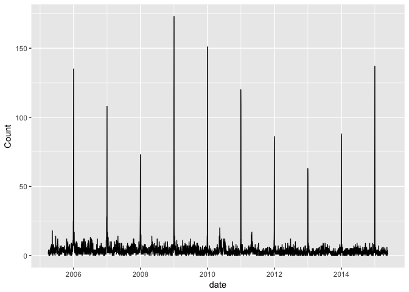
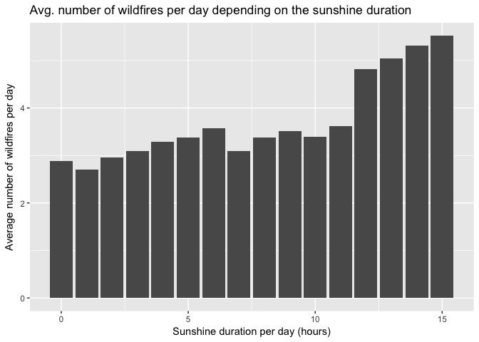
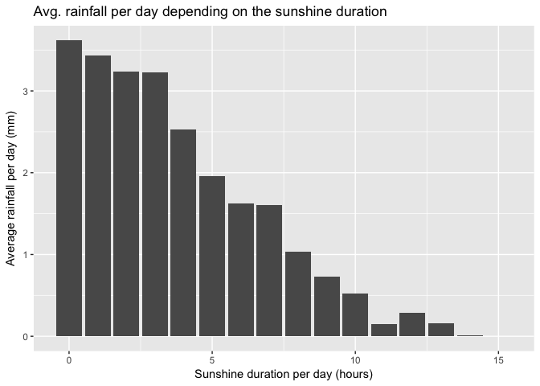

C°F 5th Weather Chart - Wildfires (NL, Amsterdam) Analysis
===========================================================

About
-----

In this analysis, we compared the amount of wildfires with sunshine duration and rainfall. The dataset is an overview of all the fire reports of the Amsterdam-Amstelland Fire Department in the period from 2010 to 2015.

The steps taken for this analysis are:

-   Get wildfires data
-   Get weather data
-   Merge weather data with wildfires data
-   Remove the 31st of December and 1st of January data point for each year
-   Average the total of wildfires per sunshine duration
-   Average the total of rainfall per sunshine duration

In the following section, you will find more details about each step.

Sources
-------

-   Fire Reports 2010-2015 in Amsterdam-Amstelland : <https://data.amsterdam.nl/index.html#?dte=dcatd%2Fdatasets%2Fbrandmeldingen-2010-2015&dtfs=T&mpb=topografie&mpz=9&mpv=52.3719:4.9012>
-   KNMI Daily weather :
    -   <http://www.knmi.nl/nederland-nu/klimatologie/daggegevens>
    -   <http://www.knmi.nl/kennis-en-datacentrum/achtergrond/data-ophalen-vanuit-een-script>
-   Information on fires : <https://nl.wikipedia.org/wiki/Brand_(vuur)>

Methodology
-----------

``` r
# Load libraries
library(plyr)
library(ggplot2)
library(lubridate)
library(dplyr)

# Load util functions
source('../utils_NL.R')
```

### Get fires data

The fires dataset contains the date of the fires reports, the type of incident and the location. There are more fields available but they are not needed for the analysis.

``` r
data <- read.csv('../data/brwaa_2010-2015.csv', header=TRUE, sep=";")

# Format date column
data$date <- as.Date(data$start_tijd, "%Y/%m/%d")

# Remove trailing whitespace
data$incident_type <- trimws(data$incident_type)
data$gemeente <- trimws(data$gemeente)

head(data)
```

    ##   incident_id                    start_tijd
    ## 1       84149 2009/12/07 20:01:50.000000000
    ## 2       45831 2012/10/13 22:05:10.000000000
    ## 3      139962 2006/02/18 15:29:15.000000000
    ## 4       53505 2012/04/15 20:09:03.000000000
    ## 5       48323 2012/08/17 03:27:55.000000000
    ## 6      126967 2006/12/21 20:23:26.000000000
    ##                        incident_type
    ## 1 Meten / overlast / verontreiniging
    ## 2                        Buitenbrand
    ## 3          Brandgerucht / nacontrole
    ## 4                      Dier te water
    ## 5                        Buitenbrand
    ## 6                        Buitenbrand
    ##   landelijke_meldingsclassificatie_niveau1
    ## 1           Dienstverlening               
    ## 2           Brand                         
    ## 3           Brand                         
    ## 4           Dienstverlening               
    ## 5           Brand                         
    ## 6           Brand                         
    ##   landelijke_meldingsclassificatie_niveau2
    ## 1           Burger                  Dienst
    ## 2           Wegvervoer                    
    ## 3           kleine inzet             Brand
    ## 4           Dieren                        
    ## 5           Wegvervoer                    
    ## 6           Buitenbrand              brand
    ##   landelijke_meldingsclassificatie_niveau3                         datum
    ## 1           Stankoverlast           Burger 2009/12/07 00:00:00.000000000
    ## 2                                          2012/10/13 00:00:00.000000000
    ## 3           Nacontrole            kl.inzet 2006/02/18 00:00:00.000000000
    ## 4           Te water                       2012/04/15 00:00:00.000000000
    ## 5                                          2012/08/17 00:00:00.000000000
    ## 6           Afval/ruigte            buitbr 2006/12/21 00:00:00.000000000
    ##   jaar maand_nr
    ## 1 2009       12
    ## 2 2012       10
    ## 3 2006        2
    ## 4 2012        4
    ## 5 2012        8
    ## 6 2006       12
    ##                                                     maand_naam dag_nr
    ## 1 December                                                          7
    ## 2 Oktober                                                          13
    ## 3 Februari                                                         18
    ## 4 April                                                            15
    ## 5 Augustus                                                         17
    ## 6 December                                                         21
    ##                                                       dag_naam week_nr
    ## 1 Dinsdag                                                           50
    ## 2 Zondag                                                            41
    ## 3 Zondag                                                             7
    ## 4 Maandag                                                           15
    ## 5 Zaterdag                                                          33
    ## 6 Vrijdag                                                           51
    ##   kwartaal prioriteit uur
    ## 1        4          2  20
    ## 2        4          1  22
    ## 3        1          1  15
    ## 4        2          3  20
    ## 5        3          1   3
    ## 6        4          2  20
    ##                                                        dagdeel
    ## 1 Avond                                                       
    ## 2 Avond                                                       
    ## 3 Middag                                                      
    ## 4 Avond                                                       
    ## 5 Nacht                                                       
    ## 6 Avond                                                       
    ##                                                     objecttype
    ## 1 bag                                                         
    ## 2 weg                                                         
    ## 3                                                             
    ## 4 water                                                       
    ## 5 weg                                                         
    ## 6                                                             
    ##                                                  objectfunctie
    ## 1 Woonfunctie                                                 
    ## 2 Straat                                                      
    ## 3                                                             
    ## 4 Kanalen en rivieren                                         
    ## 5 Straat                                                      
    ## 6                                                             
    ##                                                          buurt
    ## 1 Kinkerbuurt                                                 
    ## 2 Buikslotermeer                                              
    ## 3                                                             
    ## 4 Buitenveldert-Oost                                          
    ## 5 Hoofddorppleinbuurt                                         
    ## 6                                                             
    ##                                                           wijk
    ## 1 Stadsdeel West                                              
    ## 2 Stadsdeel Noord                                             
    ## 3                                                             
    ## 4 Stadsdeel Zuid                                              
    ## 5 Stadsdeel Zuid                                              
    ## 6                                                             
    ##                                                                         woonplaats
    ## 1 Amsterdam                                                                       
    ## 2                                                                                 
    ## 3                                                                                 
    ## 4                                                                                 
    ## 5                                                                                 
    ## 6                                                                                 
    ##         gemeente       date
    ## 1      Amsterdam 2009-12-07
    ## 2      Amsterdam 2012-10-13
    ## 3 Haarlemmermeer 2006-02-18
    ## 4      Amsterdam 2012-04-15
    ## 5      Amsterdam 2012-08-17
    ## 6 Haarlemmermeer 2006-12-21

### Get wildfires data in Amsterdam area

``` r
# Get data for amsterdam only
data_ams <- data[ data$gemeente == "Amsterdam", ]

# Get the list of incident types
incident_types <- unique(data_ams[c("incident_type")])
incident_types
```

    ##                            incident_type
    ## 1     Meten / overlast / verontreiniging
    ## 2                            Buitenbrand
    ## 4                          Dier te water
    ## 7                         Liftopsluiting
    ## 8                   Storm en Waterschade
    ## 9                  Assistentie Ambulance
    ## 11                            Reanimeren
    ## 13             Brandgerucht / nacontrole
    ## 22                           Binnenbrand
    ## 24            OMS / automatische melding
    ## 26                      Persoon te water
    ## 32                        Afhijsen spoed
    ## 35                Hulpverlening algemeen
    ## 86                   Assistentie Politie
    ## 87                  Hulpverlening Dieren
    ## 109                       Buitensluiting
    ## 123                         Herbezetting
    ## 151              Beknelling / bevrijding
    ## 326         Hulpverlening water algemeen
    ## 328        Hulpverlening algemeen Dieren
    ## 596               Letsel eigen personeel
    ## 1122                    Brandbare gassen
    ## 1293                   Voertuig te water
    ## 1644                                 NVT
    ## 2516                  Regionale bijstand
    ## 3191         Overige gevaarlijke stoffen
    ## 4280             Interregionale bijstand
    ## 17901             Brandbare vloeistoffen
    ## 21468              Buiten dienststelling

``` r
# Filter to get only wildfires (Buitenbrand) incidents
data_ams_out <- data_ams[data_ams$incident_type == as.character(incident_types[2, 'incident_type']), ]

# Get total of wildfires per day
sum_data <- aggregate(x=data_ams_out$date, by=list(data_ams_out$date), FUN=length)
colnames(sum_data) <- c('date', 'Count')
head(sum_data)
```

    ##         date Count
    ## 1 2005-03-31     1
    ## 2 2005-04-01     3
    ## 3 2005-04-02     3
    ## 4 2005-04-03     4
    ## 5 2005-04-04     2
    ## 6 2005-04-05     2

### Get the weather

For more information on how the weather is treated, see the related reference. For this analysis we will use the weather data of Schipol weather station (STN=240). We get the weather data from KNMI and subset it to the desired station. After some formatting the weather data is ready to use.

``` r
# KNMI weather stations
nl_stations <- read.csv('../data/all_station_KNMI_cleaned.csv', header=TRUE, sep=",")
# Weather data between 2005 and 2015
weather_data <- getKNMIDailyData('2005', '03', '31', '2015', '05', '20')
```

    ## [1] "http://projects.knmi.nl/klimatologie/daggegevens/getdata_dag.cgi?stns=ALL&vars=all&byear=2005&bmonth=03&bday=31&eyear=2015&emonth=05&eday=20"

``` r
# Merge with station data
weather_data_stn <- merge(weather_data, nl_stations, by='STN')
# Subset for station 240
weather_data_240 <- weather_data_stn[ weather_data_stn$STN == 240, ]
# Format weather data
weather_data_format <- formatNLWeatherDailyData(weather_data_240)
head(weather_data_format)
```

    ##       STN       date    FG  FHN  FHX   TG  TN   TX   SQ  DR  RH  LON
    ## 15123 240 2005-03-31 14.04  7.2 18.0 11.1 8.2 15.2  9.3 0.0 0.0 4.79
    ## 15124 240 2005-04-01 10.80  7.2 14.4 11.2 5.2 17.3 10.5 0.0 0.0 4.79
    ## 15125 240 2005-04-02 15.48  7.2 25.2 11.8 5.5 17.6 11.9 0.0 0.0 4.79
    ## 15126 240 2005-04-03 12.60  3.6 18.0 14.3 9.1 20.1 11.3 0.0 0.0 4.79
    ## 15127 240 2005-04-04 17.64  7.2 32.4 11.7 7.1 18.7  7.0 1.6 1.5 4.79
    ## 15128 240 2005-04-05 20.16 10.8 32.4  8.3 3.8 11.8  8.6 0.0 0.0 4.79
    ##          LAT roundedFG roundedFHN roundedFHX roundedTG roundedTN roundedTX
    ## 15123 52.318        14          7         18        11         8        15
    ## 15124 52.318        10          7         14        11         5        17
    ## 15125 52.318        15          7         25        11         5        17
    ## 15126 52.318        12          3         18        14         9        20
    ## 15127 52.318        17          7         32        11         7        18
    ## 15128 52.318        20         10         32         8         3        11
    ##       roundedSQ roundedDR roundedRH
    ## 15123         9         0         0
    ## 15124        10         0         0
    ## 15125        11         0         0
    ## 15126        11         0         0
    ## 15127         7         1         1
    ## 15128         8         0         0

### Merge weather and wildfires data

``` r
sum_data_weather <- merge(sum_data, weather_data_format, by='date', all.y=TRUE)

# For days without wildfires, set count to zero
sum_data_weather$Count[is.na(sum_data_weather$Count)] <- 0
```

### Remove New Year's Eve outliers

New Year's Eve comes with a huge peak of wildfires each year, which skew all the rest of the data. We will isolate the 31st of December and the 1st of January of each year.

``` r
ggplot(sum_data_weather, aes(x=date, y=Count)) + geom_line()
```



``` r
df_outnye <- sum_data_weather[ !(month(sum_data_weather$date) == 1 & day(sum_data_weather$date) == 1) & !(month(sum_data_weather$date) == 12 & day(sum_data_weather$date) == 31), ]
```

### Aggregate per sunshine duration

Sunshine duration is given in hours by the variable SQ. We will use the column roundedSQ which is the rounded value of the original SQ value, to an integer.

``` r
df_sq <- df_outnye %>% group_by(roundedSQ) %>% summarise(meanCount=mean(Count, na.rm=TRUE), meanRH = mean(RH, na.rm=TRUE))
df_sq
```

    ## # A tibble: 16 x 3
    ##    roundedSQ meanCount      meanRH
    ##        <dbl>     <dbl>       <dbl>
    ##  1         0  2.883951 3.615925926
    ##  2         1  2.700906 3.432628399
    ##  3         2  2.952381 3.232653061
    ##  4         3  3.093548 3.222903226
    ##  5         4  3.283019 2.530188679
    ##  6         5  3.385593 1.954661017
    ##  7         6  3.570922 1.628014184
    ##  8         7  3.092105 1.604385965
    ##  9         8  3.382353 1.032843137
    ## 10         9  3.509091 0.726060606
    ## 11        10  3.396226 0.518867925
    ## 12        11  3.617391 0.153043478
    ## 13        12  4.817308 0.289423077
    ## 14        13  5.048193 0.159036145
    ## 15        14  5.308824 0.007352941
    ## 16        15  5.517241 0.000000000

Plots
-----

``` r
p1 <- ggplot(df_sq, aes(roundedSQ)) + geom_bar(aes(weight=meanCount)) +
    ylab("Average number of wildfires per day") +
    xlab("Sunshine duration per day (hours)") +
    ggtitle("Avg. number of wildfires per day depending on the sunshine duration")
p1
```



``` r
p2 <- ggplot(df_sq, aes(roundedSQ)) + geom_bar(aes(weight=meanRH)) +
    ylab("Average rainfall per day (mm)") +
    xlab("Sunshine duration per day (hours)") +
    ggtitle("Avg. rainfall per day depending on the sunshine duration")
p2
```


