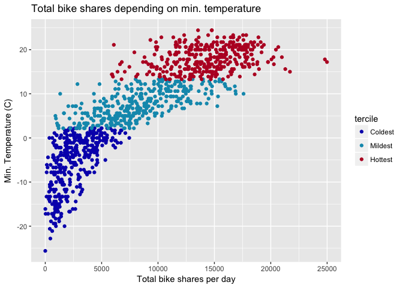
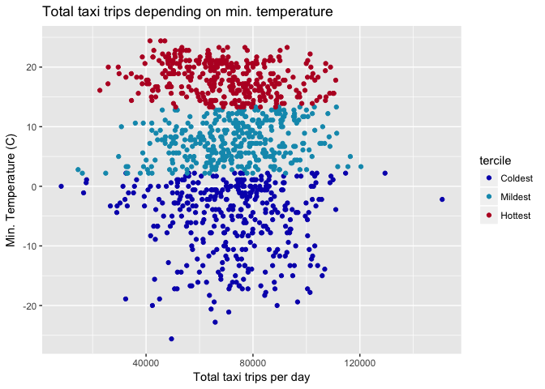

C°F 5th Weather Chart - Bike Shares & Taxi Trips (US, Chicago) Analysis
========================================================================

About
-----

In this analysis, we compared the use of bike shares and taxis with the minimum temperature in Chicago, between 2014 and 2016.

The bike share system in Chicago is called *Divvybike*. "Divvy is Chicagoland's bike share system, with 6,000 bikes available at 580+ stations across Chicago, Evanston and Oak Park. \[...\] Divvy is available for use 24 hours/day, 7 days/week, 365 days/year, and riders have access to all bikes and stations across the system." [1]

Taxi trips reported to the City of Chicago are listed on the City of Chicago open data portal.

The steps taken for this analysis are:

-   Get the taxi trips and bike shares data
-   Count the number of taxi trips and the number of bike shares trips per day
-   Merge with the weather data
-   Calculate the minimum temperature terciles

In the following section you will find more details for each step.

Sources
-------

-   Divvybike System Data: <https://www.divvybikes.com/system-data>
-   Taxi Trips: <https://data.cityofchicago.org/Transportation/Taxi-Trips-Dashboard/spcw-brbq>
-   NOAA Weather: <ftp://ftp.ncdc.noaa.gov/pub/data/ghcn/daily/by_year/>

Methodology
-----------

``` r
library(plyr)
library(ggplot2)
library(lubridate)

source('../utils_US.R')
```

### Get the taxi data

The volume of the taxi dataset is too big to be downloaded, therefore we requested pre-aggregated data via an API call. The data we used ranges from 2014-01-01 to 2016-12-31.

This request gives us the number of trips per day between 2015 and 2016:

``` url
https://data.cityofchicago.org/resource/wrvz-psew.csv?$select=date_trunc_ymd(trip_start_timestamp) AS day, count(*) AS total&$group=day&$where=trip_start_timestamp between '2015-01-01T00:00:00' and '2016-12-31T23:59:59'
```

Example response:

    "day","total"
    "2015-01-01T00:00:00.000","78147"
    "2015-01-02T00:00:00.000","58502"
    "2015-01-03T00:00:00.000","60484"
    "2015-01-04T00:00:00.000","51746"
    "2015-01-05T00:00:00.000","63714"
    "2015-01-06T00:00:00.000","67036"
    "2015-01-07T00:00:00.000","65488"

After making the request, this is how the dataset looks like:

``` r
# Taxi data
taxi <- read.csv('../data/chicago_taxi_data13-16.csv')

# Format date
taxi$date <- as.Date(taxi$day, format="%Y-%m-%d")

head(taxi)
```

    ##                       day total       date
    ## 1 2013-06-09T00:00:00.000 80348 2013-06-09
    ## 2 2014-07-20T00:00:00.000 89406 2014-07-20
    ## 3 2013-07-08T00:00:00.000 60808 2013-07-08
    ## 4 2013-02-17T00:00:00.000 71186 2013-02-17
    ## 5 2013-11-04T00:00:00.000 66446 2013-11-04
    ## 6 2013-05-08T00:00:00.000 66981 2013-05-08

### Get the bike shares data

Divvybike data is provided by quarters or months. After binding all the data together, between 2014 and 2016, the dataset looks like this:

``` r
divvybike <- read.csv('../data/US_Divvybike_2013-16.csv')
head(divvybike)
```

    ##   X trip_id        starttime         stoptime bikeid tripduration
    ## 1 1    4118 2013-06-27 12:11 2013-06-27 12:16    480          316
    ## 2 2    4275 2013-06-27 14:44 2013-06-27 14:45     77           64
    ## 3 3    4291 2013-06-27 14:58 2013-06-27 15:05     77          433
    ## 4 4    4316 2013-06-27 15:06 2013-06-27 15:09     77          123
    ## 5 5    4342 2013-06-27 15:13 2013-06-27 15:27     77          852
    ## 6 6    4480 2013-06-27 19:40 2013-06-27 22:28     27        10105
    ##   from_station_id          from_station_name to_station_id
    ## 1              85      Michigan Ave & Oak St            28
    ## 2              32 Racine Ave & Congress Pkwy            32
    ## 3              32 Racine Ave & Congress Pkwy            19
    ## 4              19      Loomis St & Taylor St            19
    ## 5              19      Loomis St & Taylor St            55
    ## 6             340  Clark St & Wrightwood Ave            46
    ##                    to_station_name usertype gender birthyear       date
    ## 1       Larrabee St & Menomonee St Customer               NA 2013-06-27
    ## 2       Racine Ave & Congress Pkwy Customer               NA 2013-06-27
    ## 3            Loomis St & Taylor St Customer               NA 2013-06-27
    ## 4            Loomis St & Taylor St Customer               NA 2013-06-27
    ## 5 Halsted St & James M Rochford St Customer               NA 2013-06-27
    ## 6             Wells St & Walton St Customer               NA 2013-06-27

We can then count the number of trips per day as follow:

``` r
divvybike$date <- as.Date(divvybike$date, format="%Y-%m-%d")
divvybike_count <- ddply( divvybike , .(date) , summarise , Count=length(date))

head(divvybike_count)
```

    ##         date Count
    ## 1 2013-06-27    95
    ## 2 2013-06-28   897
    ## 3 2013-06-29  1201
    ## 4 2013-06-30  1812
    ## 5 2013-07-01  1559
    ## 6 2013-07-02  1108

### Get the weather

For more details on how the weather data was treated, see the related reference. As we are considering the city of Chicago, we decided to average the data of the weather stations of that area.

``` r
# Get weather data
weather_data2015 <- read.csv('../data/2015.csv')
weather_data2014 <- read.csv('../data/2014.csv')
weather_data2016 <- read.csv('../data/2016.csv')
```

``` r
# Get Chicago stations
us_stations <- get_us_stations_data()
chi_stations <- us_stations[ us_stations$lat > 41.75712 & us_stations$lat < 42.01256 & us_stations$lon < -87.54939 & us_stations$lon > -87.73237, ]

# Put right column names on weather data
colnames(weather_data2014) <- c("station_id", "date", 'type', 'value')
colnames(weather_data2015) <- c("station_id", "date", 'type', 'value')
colnames(weather_data2016) <- c("station_id", "date", 'type', 'value')

# Merge with stations 
weather_CHI_2015 <- merge(weather_data2015, chi_stations, by='station_id')
weather_CHI_2014 <- merge(weather_data2014, chi_stations, by='station_id')
weather_CHI_2016 <- merge(weather_data2016, chi_stations, by='station_id')

# Merge the years
weather_data_CHI <- rbind(weather_CHI_2014, weather_CHI_2015, weather_CHI_2016)

# Get weather at the stations, and reshaped
weather_CHI_average <- weather_data_CHI[c('date', 'type', 'value')]
weather_CHI_average$date <- as.Date(as.character(weather_CHI_average$date), "%Y%m%d")
weather_CHI_average <- aggregate(x=weather_CHI_average$value, by=list(weather_CHI_average$date,weather_CHI_average$type), FUN=mean)
colnames(weather_CHI_average) <- c('date', 'type', 'value')
weather_CHI_average <- reshape(weather_CHI_average,timevar="type",idvar="date",direction="wide")

# Put right units and isolate relevant fields
weather_CHI_average$PRCP <- weather_CHI_average$value.PRCP * 0.1
weather_CHI_average$TMAX <- weather_CHI_average$value.TMAX * 0.1
weather_CHI_average$TMIN <- weather_CHI_average$value.TMIN * 0.1
weather_CHI_average$SNOW <- weather_CHI_average$value.SNOW
weather_CHI_average$SNWD <- weather_CHI_average$value.SNWD

df <- weather_CHI_average[c('date', 'PRCP', 'TMAX', 'TMIN', 'SNOW', 'SNWD')]
```

### Merge taxi, bike shares and weather

We can now merge the taxi data, the bike shares data and the weather data by date.

``` r
df$date <- as.Date(df$date, format="%Y-%m-%d")
df <- merge(taxi, df, by='date')
df <- merge(df, divvybike_count, by='date')
```

### Get terciles

"The nth percentile of an observation variable is the value that cuts off the first n percent of the data values when it is sorted in ascending order."[2] Minimum temperature was sorted in ascending order and then cut into three parts. Each of this part contains 362 days.

``` r
q <- quantile(df$TMIN, seq(0,1, by=1/3), na.rm=TRUE)
q
```

    ##        0% 33.33333% 66.66667%      100% 
    ##     -25.6       2.2      13.3      24.4

``` r
# Remove NAs
df <- df[!is.na(df$TMIN),]

# Order by max temperature
df <- df[order(df$TMIN),]

# Get the three sections
df$tercile <- ""
df[1:362, 'tercile'] <- "Coldest"
df[363:724, 'tercile'] <- "Mildest"
df[725:1086, 'tercile'] <- "Hottest"
```

### Total number of trips

For each tercile, we calculate the total number of trips for bike shares, and for taxis

``` r
# Coldest - Taxi trips
sum(df[df$tercile == "Coldest", 'total'])
```

    ## [1] 26137706

``` r
# Mildest - Taxi trips
sum(df[df$tercile == "Mildest", 'total'])
```

    ## [1] 26443220

``` r
# Hottest - Taxi trips
sum(df[df$tercile == "Hottest", 'total'])
```

    ## [1] 25057157

``` r
# Coldest - Bike shares
sum(df[df$tercile == "Coldest", 'Count'])
```

    ## [1] 929161

``` r
# Mildest - Bike shares
sum(df[df$tercile == "Mildest", 'Count'])
```

    ## [1] 2991000

``` r
# Hottest - Bike shares
sum(df[df$tercile == "Hottest", 'Count'])
```

    ## [1] 5198204

### Map data

The map uses the Divvybike stations listed in 2015. The map shows the total amount of trips that started from a location between 2014 and 2016.

``` r
# Get the divvybike stations
stations <- read.csv('../data/Divvy_Stations_2015.csv')

# Aggregate the number of trips starting from a station, by date
map_data <- aggregate(divvybike$trip_id, by=list(divvybike$from_station_id, divvybike$date), FUN=length)
colnames(map_data) <- c('id', 'date', 'sumTrips')

# Take only data from 2014 to 2016
divvybike201416 <- map_data[map_data$date > '2013-12-31',]

# Filter the outliers out
divvybike201416_out <- divvybike201416[divvybike201416$date!= '2014-07-24' & divvybike201416$date != '2014-07-25' & divvybike201416$date != '2014-09-09' & divvybike201416$date!= '2016-07-09' & divvybike201416$date != '2016-07-10' & divvybike201416$date != '2016-07-11' & divvybike201416$date != '2016-07-12' & divvybike201416$date != '2016-12-21',]

# Merge with stations data
df_start <- merge(divvybike201416_out, stations, by.x='id', by.y='id')
df_map <- ddply(df_start, .(id), summarise, Count=sum(sumTrips), lat = mean(latitude), lon=mean(longitude))
head(df_map)
```

    ##   id Count      lat       lon
    ## 1  2 28314 41.87229 -87.62409
    ## 2  3 51071 41.86723 -87.61536
    ## 3  4 35946 41.85627 -87.61335
    ## 4  5 24732 41.87405 -87.62772
    ## 5  6 36271 41.88504 -87.61279
    ## 6  7 19813 41.88635 -87.61752

Plots
-----

``` r
p1 <- ggplot(df, aes(x=Count, y=TMIN, color=tercile)) + geom_point() +
    ggtitle("Total bike shares depending on min. temperature") +
    ylab("Min. Temperature (C)") +
    xlab("Total bike shares per day") +
    scale_colour_manual(breaks = df$tercile,
                      values = c("#0b16ba",  "#ba092a", "#0a99ba"))
p1
```



``` r
p2 <- ggplot(df, aes(x=total, y=TMIN, color=tercile)) + geom_point() +
    ggtitle("Total taxi trips depending on min. temperature") +
    ylab("Min. Temperature (C)") +
    xlab("Total taxi trips per day") +
    scale_colour_manual(breaks = df$tercile,
                      values = c("#0b16ba",  "#ba092a", "#0a99ba"))
p2
```



Notes
-----

-   We removed 8 outliers from the data, due to missing data, that's why there are 362 in each section.

[1] From <https://www.divvybikes.com/about>

[2] From <http://www.r-tutor.com/elementary-statistics/numerical-measures/percentile>
