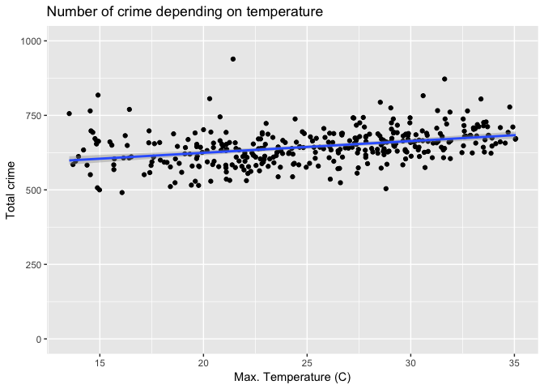

C°F 5th Weather Chart - Crime, (US, Los Angeles) Analysis
==========================================================

About
-----

In this analysis, we compared the number of crimes with the temperature.

The Los Angeles crime dataset is a list of crime being reported, per location, date and time.

The steps taken for this analysis are:

-   Get the crime data
-   Count the number of crimes per day
-   Merge with weather data
-   Calculate max. temperature terciles

In the following section you will find more details for each step.

Sources
-------

-   Crimes reported in the City of Los Angeles : <https://data.lacity.org/A-Safe-City/Crime-Data-From-2010-to-Present/y8tr-7khq>
-   Highlights :
    -   <https://news.osu.edu/news/2016/06/24/climate-theory/>
    -   <https://www.ncbi.nlm.nih.gov/pmc/articles/PMC3415828/>
-   NOAA Weather : <ftp://ftp.ncdc.noaa.gov/pub/data/ghcn/daily/by_year/>

Methodology
-----------

``` r
source('../utils_US.R')

library(plyr)
library(qdapRegex)
library(ggplot2)
library(lubridate)
library(dplyr)
```

### Get the crime data

For the final chart we only used 2014 data.

``` r
la_crime <- read.csv('../data/LA_Crimes_2012-2015.csv', header=TRUE)
la_crime$date <- as.Date(la_crime$DATE.OCC, "%m/%d/%Y")

# Get 2014 crime
la_crime_2014 <- la_crime[ la_crime$date > '2013-12-31' & la_crime$date <= '2014-12-31',]

head(la_crime)
```

    ##    Date.Rptd     DR.NO   DATE.OCC TIME.OCC AREA   AREA.NAME   RD Crm.Cd
    ## 1 03/20/2013 132007717 03/20/2013     2015   20     Olympic 2004    997
    ## 2 03/10/2013 130608787 03/10/2013      445    6   Hollywood  635    997
    ## 3 12/18/2013 131820260 12/18/2013      745   18   Southeast 1839    997
    ## 4 10/18/2013 131817514 10/18/2013     1730   18   Southeast 1827    997
    ## 5 05/26/2013 130510483 05/25/2013     2000    5      Harbor  507    440
    ## 6 05/24/2013 131213618 05/22/2013     1145   12 77th Street 1211    997
    ##                         CrmCd.Desc Status Status.Desc
    ## 1                     TRAFFIC DR #    UNK     Unknown
    ## 2                     TRAFFIC DR #    UNK     Unknown
    ## 3                     TRAFFIC DR #    UNK     Unknown
    ## 4                     TRAFFIC DR #    UNK     Unknown
    ## 5 THEFT PLAIN - PETTY (UNDER $400)    UNK     Unknown
    ## 6                     TRAFFIC DR #    UNK     Unknown
    ##                                        LOCATION
    ## 1                                        OXFORD
    ## 2               ODIN                         ST
    ## 3               105TH                        ST
    ## 4               101ST                        ST
    ## 5  1300      W  SEPULVEDA                    BL
    ## 6                                          54TH
    ##                         Cross.Street           Location.1       date
    ## 1                            OAKWOOD  (34.0776, -118.308) 2013-03-20
    ## 2    CAHUENGA                     BL (34.1113, -118.3336) 2013-03-10
    ## 3    CROESUS                      AV (33.9406, -118.2338) 2013-12-18
    ## 4    JUNIPER                      ST (33.9449, -118.2332) 2013-10-18
    ## 5                                    (33.8135, -118.2992) 2013-05-25
    ## 6                           CRENSHAW (33.9931, -118.3308) 2013-05-22

Then we aggregated the crime dataset by counting the number of crimes per day.

``` r
# Counts per day
la_crime_2014_count <-ddply( la_crime_2014 , .(date) , summarise , Count=length(date))
head(la_crime_2014_count)
```

    ##         date Count
    ## 1 2014-01-01   939
    ## 2 2014-01-02   544
    ## 3 2014-01-03   634
    ## 4 2014-01-04   529
    ## 5 2014-01-05   532
    ## 6 2014-01-06   574

### Get the weather

For more details on how the weather data was treated, see the related reference. As we are considering a city, we decided to average the weather data of the weather stations of the city, by date, in 2014.

``` r
weather_data <- read.csv('../data/US_LA_weather_2014.csv')
weather_data$date <- as.Date(weather_data$date, format="%Y-%m-%d")
head(weather_data)
```

    ##   X       date        PRCP     TMAX     TMIN     AWND SNOW SNWD
    ## 1 1 2014-01-01 0.000000000 21.42807 7.371930 4.763077    0    0
    ## 2 2 2014-01-02 0.000000000 23.60175 9.828070 5.593846    0    0
    ## 3 3 2014-01-03 0.000000000 21.71698 8.811321 3.840000    0    0
    ## 4 4 2014-01-04 0.004109589 20.35088 8.517544 4.876364    0    0
    ## 5 5 2014-01-05 0.004109589 21.26667 7.901754 5.940000    0    0
    ## 6 6 2014-01-06 0.000000000 21.08548 8.404918 6.590769    0    0

### Merge crime and weather

Then we merge weather and crime data together, by date.

``` r
weather_tmax <- weather_data[c('date', 'TMAX')]
la_crime_weather <- merge(la_crime_2014_count, weather_tmax, by='date')
head(la_crime_weather)
```

    ##         date Count     TMAX
    ## 1 2014-01-01   939 21.42807
    ## 2 2014-01-02   544 23.60175
    ## 3 2014-01-03   634 21.71698
    ## 4 2014-01-04   529 20.35088
    ## 5 2014-01-05   532 21.26667
    ## 6 2014-01-06   574 21.08548

### Remove outliers

We will remove data points of temperature below 13.5C and above 35.9C. That accounts for 12 outliers.

``` r
la_crime_weather <- la_crime_weather[la_crime_weather$TMAX >= 13.5 & la_crime_weather$TMAX < 35.9,]
```

### Terciles

"The nth percentile of an observation variable is the value that cuts off the first n percent of the data values when it is sorted in ascending order."\[^2\] Max. temperature was sorted in ascending order and then cut into three parts.

-   The 1st part has 117 days
-   The 2nd part has 118 days
-   The 3rd part has 118 days

``` r
# Terciles
q <- quantile(la_crime_weather$TMAX, seq(0,1, by=1/3))
q
```

    ##        0% 33.33333% 66.66667%      100% 
    ##  13.52414  22.65088  28.68678  35.06610

``` r
# Order by max temperature
ordered <- la_crime_weather[order(la_crime_weather$TMAX),]

# Get the three sections
first <- ordered[1:117,]
second <- ordered[118:235,]
third <- ordered[236:353,]

# Amount of street robberies - First
sum(first$Count)
```

    ## [1] 72593

``` r
# Amount of street robberies - Second 
sum(second$Count)
```

    ## [1] 75693

``` r
# Amount of street robberies - Third
sum(third$Count)
```

    ## [1] 79524

The number above are slightly different from the one we used on the weather chart. The reason for this is that we did the quantile analysis in Excel, which was slightly different.

Plots
-----

``` r
p1 <- ggplot(la_crime_weather, aes(x=TMAX, y=Count)) + geom_point() +
    geom_smooth(method="lm") +
    ylab("Total crime") +
    xlab("Max. Temperature (C)") +
    ggtitle("Number of crime depending on temperature") +
    ylim(c(0, 1000))
        
p1
```



Map data
--------

First we needed to format the latitude and longitude of the crime data.

``` r
# Format lat and lon field correctly
la_crime$lat <- rm_between(la_crime$Location.1,"(", ",", extract = TRUE)
la_crime$lon <- rm_between(la_crime$Location.1,", ", ")", extract = TRUE)
la_crime$lat <- unlist(la_crime$lat, recursive = TRUE, use.names = TRUE)
la_crime$lon <- unlist(la_crime$lon, recursive = TRUE, use.names = TRUE)
la_crime$lat <- as.numeric(la_crime$lat)
la_crime$lon <- as.numeric(la_crime$lon)
la_crime$lon[la_crime$lon ==0 ] <- NA
la_crime$lat[la_crime$lat==0 ] <- NA
```

Then we aggregated the data by common latitude and longitude, by counting the number of crimes that occured for a pair of (lat, lon).

``` r
# 2014 data
la_crime_2014 <- la_crime[ la_crime$date > '2013-12-31' & la_crime$date <= '2014-12-31',]

mapLA <- la_crime_2014 %>% group_by(lat, lon) %>% summarise(count = length(Date.Rptd))
```

And finally, we round all latitude and longitude to 0.1 precision and sum all the crimes that occured in these areas. It gives us an amount of crime at every latitude and longitude with a 0.1 step.

``` r
mapLA$lat <- round(mapLA$lat/0.1, 1) *0.1
mapLA$lon <- round(mapLA$lon/0.1, 1) *0.1
mapLA <- mapLA %>% group_by(lat, lon) %>% summarise(count = sum(count))
```

Notes
-----

-   At the time we downloaded the crime dataset, only 2012 to 2015 data was available.
-   On the final graph, temperature is plotted in Fahrenheit
-   We removed 12 outliers from the final graph, that's why the terciles are 117-118 days long
-   The relative percentage increase has been calculated by averaging the relative percentage difference between crime amounts, every 5 Fahrenheit degrees.
