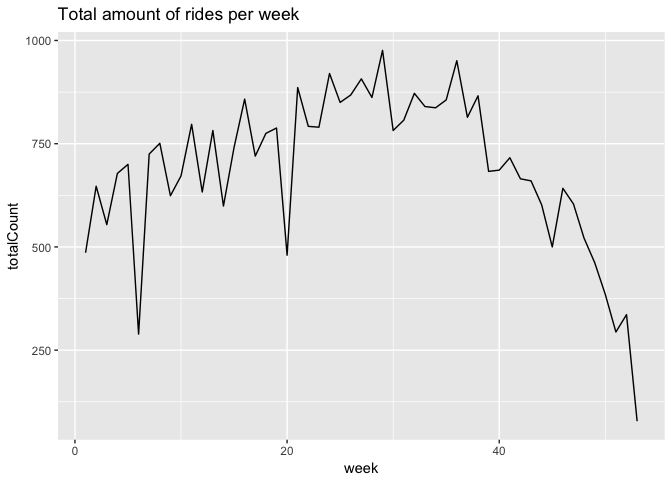
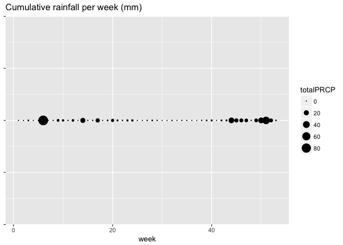
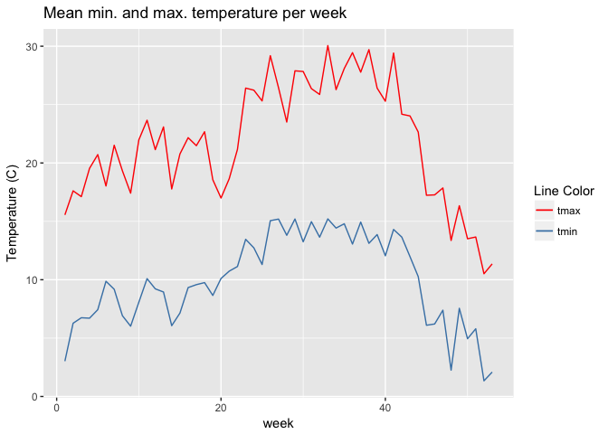

C°F 5th Weather Chart - Cycling, (US, Palo Alto) Analysis
==========================================================

On Strava
---------

Strava is a website and mobile app used to track athletic activity via GPS. One type of data from Strava is called a *Segment* and is defined as "specific sections of road" on which "athletes' times are compared". An athlete performance is called an *Effort*. Back when the analysis was made, Strava API had an available endpoint `/segments/{segment_id}/all_efforts` which allowed to request for all the performance of athletes on a given segment, for a given date range, without the need of athlete's approval. This endpoint is unfortunately not available anymore, thus fetching the data is not reproducible.

About
-----

In this analysis, we compared the number of people cycling with temperature and rainfall.

The steps taken for this analysis are:

-   Get the number of cycling rides per day
-   Merge with the weather data
-   Aggregate to the total number of rides per week, mean temperature and cumulative rainfall per week.

In the following section, you will find more details about each step.

Sources
-------

-   Strava API : <https://strava.github.io/api/>
-   Highlights :
    -   <http://sanfrancisco.cbslocal.com/2015/05/14/south-bay-hail-lightning-and-thunder-storm-rain-drought/>
    -   <https://www.ncdc.noaa.gov/stormevents/eventdetails.jsp?id=554921>
-   NOAA Weather : <ftp://ftp.ncdc.noaa.gov/pub/data/ghcn/daily/by_year/>

Methodology
-----------

``` r
source('../utils_US.R')
library(plyr)
library(ggplot2)
library(lubridate)
```

### Find a segment

There are many segments available. After logging in the Strava website, it is possible to [explore segments](https://www.strava.com/segments/explore) for a given location.

The criterias to pick a segment to analyse were:

-   The segment should have a large amount of athlete efforts recorded
-   The segment should not be a particular segment where the attendance levels could be influenced by a major factor. For example, a segment located on a university campus could be biased by scheduled sport trainings, and therefore would not reflect a weather influence.

Following this two rules we picked a segment called ["Old La Honda (Bridge to Mailboxes)"](https://www.strava.com/segments/8109834). It is a ride segment in Woodside, California.

### Get efforts for a segment

By querying the API with the segment ID, a start timestamp and an end timestamp, we get back the list of efforts conducted on the segment. For the segment we picked, the ID was `8109834`, and the date range was `start_date_local=2015-01-01T00:00:00Z` to `end_date_local=2015-12-31T23:59:59Z`. Example of the response head:

    ##   X         id resource_state                               name
    ## 1 1 5548703482              2 Old La Honda (Bridge to Mailboxes)
    ## 2 2 5546874432              2 Old La Honda (Bridge to Mailboxes)
    ## 3 3 5547274128              2 Old La Honda (Bridge to Mailboxes)
    ## 4 4 5546628964              2 Old La Honda (Bridge to Mailboxes)
    ## 5 5 5547384165              2 Old La Honda (Bridge to Mailboxes)
    ## 6 6 5546685612              2 Old La Honda (Bridge to Mailboxes)
    ##   elapsed_time moving_time           start_date     start_date_local
    ## 1         1529        1529 2015-01-01T16:35:02Z 2015-01-01T08:35:02Z
    ## 2         2096        2096 2015-01-01T16:46:03Z 2015-01-01T08:46:03Z
    ## 3         1458        1458 2015-01-01T17:36:16Z 2015-01-01T09:36:16Z
    ## 4         1574        1452 2015-01-01T17:40:28Z 2015-01-01T09:40:28Z
    ## 5         1778        1778 2015-01-01T17:42:10Z 2015-01-01T09:42:10Z
    ## 6         3333        2159 2015-01-01T17:45:18Z 2015-01-01T09:45:18Z
    ##   distance start_index end_index device_watts average_watts
    ## 1   5090.3         787      1356        FALSE         259.5
    ## 2   5114.5        1198      2342        FALSE         159.1
    ## 3   5414.1        2043      3277        FALSE         334.4
    ## 4   5563.1        3122      4285        FALSE         253.2
    ## 5   5235.5         909      1974        FALSE         157.6
    ## 6   5465.1        1702      2924        FALSE         165.2
    ##   average_heartrate max_heartrate kom_rank pr_rank average_cadence
    ## 1             150.8           157       NA      NA              NA
    ## 2                NA            NA       NA       2              NA
    ## 3                NA            NA       NA       3              NA
    ## 4             165.6           175       NA      NA              NA
    ## 5                NA            NA       NA      NA              67
    ## 6             165.5           189       NA      NA              NA
    ##   activity.id activity.resource_state athlete.id athlete.resource_state
    ## 1   235452345                       1    1879282                      1
    ## 2   235370007                       1     241807                      1
    ## 3   235392369                       1    6415477                      1
    ## 4   235354093                       1    3017993                      1
    ## 5   235397979                       1    1767663                      1
    ## 6   235358493                       1    2013116                      1
    ##   segment.id segment.resource_state                       segment.name
    ## 1    8109834                      2 Old La Honda (Bridge to Mailboxes)
    ## 2    8109834                      2 Old La Honda (Bridge to Mailboxes)
    ## 3    8109834                      2 Old La Honda (Bridge to Mailboxes)
    ## 4    8109834                      2 Old La Honda (Bridge to Mailboxes)
    ## 5    8109834                      2 Old La Honda (Bridge to Mailboxes)
    ## 6    8109834                      2 Old La Honda (Bridge to Mailboxes)
    ##   segment.activity_type segment.distance segment.average_grade
    ## 1                  Ride           4808.9                   8.1
    ## 2                  Ride           4808.9                   8.1
    ## 3                  Ride           4808.9                   8.1
    ## 4                  Ride           4808.9                   8.1
    ## 5                  Ride           4808.9                   8.1
    ## 6                  Ride           4808.9                   8.1
    ##   segment.maximum_grade segment.elevation_high segment.elevation_low
    ## 1                  24.7                    498                 107.6
    ## 2                  24.7                    498                 107.6
    ## 3                  24.7                    498                 107.6
    ## 4                  24.7                    498                 107.6
    ## 5                  24.7                    498                 107.6
    ## 6                  24.7                    498                 107.6
    ##   segment.start_latitude segment.start_longitude segment.end_latitude
    ## 1               37.39561               -122.2477             37.37251
    ## 2               37.39561               -122.2477             37.37251
    ## 3               37.39561               -122.2477             37.37251
    ## 4               37.39561               -122.2477             37.37251
    ## 5               37.39561               -122.2477             37.37251
    ## 6               37.39561               -122.2477             37.37251
    ##   segment.end_longitude segment.climb_category segment.city segment.state
    ## 1             -122.2533                      3     Woodside    California
    ## 2             -122.2533                      3     Woodside    California
    ## 3             -122.2533                      3     Woodside    California
    ## 4             -122.2533                      3     Woodside    California
    ## 5             -122.2533                      3     Woodside    California
    ## 6             -122.2533                      3     Woodside    California
    ##   segment.country segment.private segment.hazardous segment.starred
    ## 1   United States           FALSE             FALSE           FALSE
    ## 2   United States           FALSE             FALSE           FALSE
    ## 3   United States           FALSE             FALSE           FALSE
    ## 4   United States           FALSE             FALSE           FALSE
    ## 5   United States           FALSE             FALSE           FALSE
    ## 6   United States           FALSE             FALSE           FALSE

### Get the number of rides per day

The goal is to obtain the amount of rides per day. The number of records for a given date is what gives us this amount.

``` r
# Format date
segmentData$YYYYMMDD <- as.Date(segmentData$start_date_local, "%Y-%m-%d")

# Aggregate by date
sf_data <- ddply(segmentData , .(YYYYMMDD) , summarise , Count = length(YYYYMMDD))
head(sf_data)
```

    ##     YYYYMMDD Count
    ## 1 2015-01-01    61
    ## 2 2015-01-02    40
    ## 3 2015-01-03   150
    ## 4 2015-01-04   113
    ## 5 2015-01-05    15
    ## 6 2015-01-06    43

### Get the weather data

For more details on how the weather data was treated, see the related reference. As we are considering a 4km cycling path, we decided to average the weather data of the closest weather stations around the cycling path, which accounts to 22 weather stations. The weather data and the segment data are then merged by date.

``` r
# Change aggregated segment data  column name to date
names(sf_data)[names(sf_data) == 'YYYYMMDD'] <- 'date'

# Merge aggregated segment data with the weather data
sf_data_weather <- merge(sf_data, weather_sf_average, by='date')
head(sf_data_weather)
```

    ##         date Count X PRCP     TMAX     TMIN
    ## 1 2015-01-01    61 1    0 12.52222 1.288889
    ## 2 2015-01-02    40 2    0 12.24000 0.500000
    ## 3 2015-01-03   150 3    0 13.34000 0.620000
    ## 4 2015-01-04   113 4    0 13.95000 2.210000
    ## 5 2015-01-05    15 5    0 16.44000 4.100000
    ## 6 2015-01-06    43 6    0 19.05000 5.940000

### Aggregate data by week

Then we aggregate the data per week, as it is easier to read the chart this way. For this we used the *week*[1] function from *lubridate* package.

``` r
meanbyweek <- aggregate(cbind(Count, PRCP, TMAX, TMIN)~week(date),data=sf_data_weather,FUN=mean)
colnames(meanbyweek) <- c("week", "meanCount", "meanPRCP", "meanTMAX", "meanTMIN")
sumbyweek <- aggregate(cbind(Count, PRCP, TMAX, TMIN)~week(date),data=sf_data_weather,FUN=sum)
sumbyweek <- sumbyweek[c("week(date)", "Count", "PRCP")]
colnames(sumbyweek) <- c("week", "totalCount", "totalPRCP")
```

Plots
-----

``` r
l <- rep(1, nrow(sumbyweek))
p1 <- ggplot(sumbyweek, aes(x=week, y=totalCount)) + geom_line() + ggtitle("Total amount of rides per week")
p1
```



``` r
p2 <- ggplot(sumbyweek, aes(x=week, y=l, size=totalPRCP)) + geom_point() + ggtitle("Cumulative rainfall per week (mm)") + theme(axis.line=element_blank(),
        axis.text.y=element_blank(),
        axis.title.y=element_blank()) +
        scale_size_area()
p2
```



``` r
p3 <- ggplot(meanbyweek) + geom_line(aes(x=week, y=meanTMAX, color='tmax')) + geom_line(aes(x=week, y=meanTMIN, color='tmin'))+
    ggtitle("Mean min. and max. temperature per week") +
    scale_colour_manual(name="Line Color",
    values=c(tmax="red", tmin="steelblue")) +
    ylab("Temperature (C)")
p3
```



Notes
-----

-   On the final graph, we show only rainfall values that are superior to 0.1 inches per week
-   On the final graph, we removed the data point for week 53, as it only contains one day.
-   On the final graph, temperature is plotted in Fahrenheit and rainfall is plotted in inches.

[1] "week returns the number of complete seven day periods that have occured between the date and January 1st, plus one." <https://cran.r-project.org/web/packages/lubridate/lubridate.pdf>
