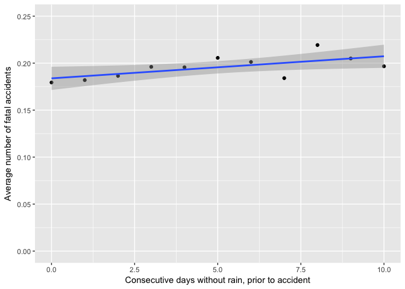
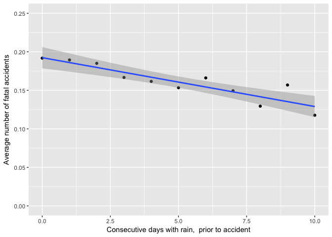

C°F 5th Weather Chart - Fatal Accidents, (US, Florida) Analysis
================================================================

About
-----

In this analysis, we compared the amount of fatal accidents with rainfall and consecutive days of rainfall.

The accidents data comes from the NHTSA FARS : "The Fatality Analysis Reporting System (FARS) contains data on all vehicle accidents in the United States that occur on a public roadway and involve a fatality." \[^1\]

The steps taken for this analysis are:

-   Get the fatal accidents data
-   Calculate the number of consecutive days of rain before the day of the crash
-   Associate the closest weather station to the location of the crash
-   Merge with the weather data
-   Calculate average amount of accidents per day for various values of rainfall

In the following section you will find more details for each step.

Sources
-------

-   Fatality Analysis Reporting System (FARS) from the National Highway Traffic Safety Administration: <http://www-fars.nhtsa.dot.gov//QueryTool/QuerySection/SelectYear.aspx>
-   Population by county in Florida: <http://edr.state.fl.us/Content/population-demographics/data/>
-   Does rainfall increase or decrease motor accidents? - by Grainne McGuire <http://actuaries.asn.au/Library/Events/GIS/2008/GIS08_2b_Paper_McGuire_Does%20rainfall%20increase%20or%20decrease%20motor%20accidents.pdf>
-   NOAA Weather : <ftp://ftp.ncdc.noaa.gov/pub/data/ghcn/daily/by_year/>

Methodology
-----------

``` r
source('../utils_US.R')
library(maps)
library(ggplot2)
library(gstat)
library(sp)
library(rgeos)
library(maptools)
library(tools)
library(reshape)
library(rjson)
library(plyr)
library(dplyr)
library(measurements)
```

### Get the accidents data

The variables that we selected are :

-   latitude in decimals
-   longitude in decimals
-   number of fatalities
-   date of the crash
-   county id
-   case number
-   state number

We only looked into Florida accidents. \[^2\] The FARS data is available by year. After binding the different years together (from 2010-01-01 to 2015-12-31), the dataset looks like this:

``` r
# Get US Fatalities data for Florida
get_us_fatalities_data <- function() {
  # FATALITIES DATA #
  us_data2015 <- read.csv('../data/US_Fatalities_2015.txt', header=TRUE, sep="\t", colClasses = c('accdate' = 'character'))
  us_data2014 <- read.csv('../data/US_Fatalities_2014.txt', header=TRUE, sep="\t", colClasses = c('accdate' = 'character'))
  us_data2013 <- read.csv('../data/US_Fatalities_2013.txt', header=TRUE, sep="\t", colClasses = c('accdate' = 'character'))
  us_data2013$atmcond2 <- NULL
  us_data2012 <- read.csv('../data/US_Fatalities_2012.txt', header=TRUE, sep="\t", colClasses = c('accdate' = 'character'))
  us_data2012$atmcond <- NULL
  us_data2011 <- read.csv('../data/US_Fatalities_2011.txt', header=TRUE, sep="\t", colClasses = c('accdate' = 'character'))
  us_data2010 <- read.csv('../data/US_Fatalities_2010.txt', header=TRUE, sep="\t", colClasses = c('accdate' = 'character'))
  
  us_data <- rbind(us_data2015, us_data2014, us_data2013, us_data2012, us_data2011, us_data2010)
  us_data$accdate <- as.Date(as.character(us_data$accdate), "%m%d%Y") # Format as date
  names(us_data)[names(us_data)=="accdate"] <- "date"
  us_data <- us_data[ us_data$latitude > 24 & us_data$latitude < 49 & us_data$longitude < -66 & us_data$longitude > -125, ]
  
  return(us_data)
}

us_data <- get_us_fatalities_data()

# Remove records where no geo data is available
us_data <- us_data[!is.na(us_data$latitude),]

head(us_data)
```

    ##   Obs. statenum casenum county       date latitude longitude numfatal  X
    ## 1    1       12       1     15 2015-01-01 27.00206 -82.01257        1 NA
    ## 2    2       12       2     23 2015-01-01 30.16142 -82.79064        1 NA
    ## 3    3       12       3    103 2015-01-01 28.08305 -82.76730        1 NA
    ## 4    4       12       4     86 2015-01-01 25.86326 -80.32282        1 NA
    ## 5    5       12       5      3 2015-01-01 30.21109 -82.39192        3 NA
    ## 6    6       12       6     99 2015-01-01 26.70779 -80.14124        1 NA

### Get the weather data

For more details on how the weather data was treated, see the related reference. As we are considering a state, we can not average the weather of all the stations. For each accidents, we need to get the weather from the closest weather station. The weather data ranges from 2010-01-01 to 2015-12-31.

``` r
# Get US weather stations data
us_stations <- get_us_stations_data()

# Get preformatted weather data for the whole US betwen 2010 and 2015
weather_data <- read.csv('../data/US_weather_10-15.csv')
head(weather_data)
```

    ##   X  station_id       date type value
    ## 1 1 US1FLAL0002 2015-05-20 PRCP     0
    ## 2 2 US1FLAL0002 2015-05-12 PRCP     0
    ## 3 3 US1FLAL0002 2015-02-02 SNOW     0
    ## 4 4 US1FLAL0002 2015-05-12 SNOW     0
    ## 5 5 US1FLAL0002 2015-01-15 SNOW     0
    ## 6 6 US1FLAL0002 2015-02-02 PRCP     0

``` r
# Get stations and weather data for florida
florida_stations <- us_stations[ us_stations$lat > 24.964079 & us_stations$lat < 30.807189 & us_stations$lon < -79.843218 & us_stations$lon > -87.532601, ]

# Subset Florida weather
weather_florida <- merge(florida_stations, weather_data, by='station_id')
weather_florida <- weather_florida[c('station_id', 'date', 'type', 'value')]
```

We need to `reshape`\[^3\] the weather dataset, in order to have the *type* column values as columns.

``` r
# Reshape weahter
weather_florida_reshaped <- reshape(weather_florida,timevar="type",idvar=c("station_id", "date"),direction="wide")

# Take only records that have PRCP and TMAX values
weather_florida_all <- weather_florida_reshaped[!is.na(weather_florida_reshaped$value.PRCP),]
```

We want weather stations that have a complete record of precipitation over the time period.

``` r
# Take only stations which have complete weahter
florida_stations_with_weather <- merge(florida_stations, unique(weather_florida_all[c("station_id")]), by='station_id')

date_range <- seq(as.Date("2010/1/1"), as.Date("2015/12/31"), "days")

weather <- merge(weather_florida_all, florida_stations_with_weather, by='station_id')

unique_stations <- unique(florida_stations_with_weather$station_id)
results <- list()
weather$station_id <- as.character(weather$station_id)
weather$date <- as.Date(weather$date, "%Y-%m-%d")

for (i in 1:length(unique_stations)) {
  name <- paste('df', unique_stations[i], sep='_')
  assign(name, subset(weather, station_id == unique_stations[i], select=station_id:date))
  
  result <- date_range %in% get(name)$date
  if (!(FALSE %in% result)) {
    results[[length(results)+1]] <- c(as.character(unique_stations[i]))
  }
}

# results_station = list of stations which have 3 years of complete data
results_station <- ldply(results, data.frame)
colnames(results_station) <- c('station_id')

results_station <- merge(results_station, florida_stations_with_weather, by='station_id', all.x=TRUE)
head(results_station)
```

    ##    station_id     lat      lon  alt                   station_name
    ## 1 US1FLBV0001 27.9512 -80.6420 11.9 FL PALM BAY 2.6 SSE           
    ## 2 US1FLGD0002 30.5823 -84.4671 85.0 FL HAVANA 4.2 SW              
    ## 3 US1FLHB0004 27.9125 -82.2261 32.9 FL VALRICO 2.2 SE             
    ## 4 US1FLHB0055 28.0126 -82.4155 15.8 FL TAMPA 5.0 NNE              
    ## 5 US1FLLK0003 28.5650 -81.8240 34.1 FL GROVELAND 1.7 E            
    ## 6 US1FLMD0022 25.6650 -80.4395  2.7 FL HAMMOCKS 0.5 SSE

Finally we want to find the closest weather station, among `results_station`, to the accident location.

``` r
# Geocode stations and fatalities
sp.mydata <- us_data
coordinates(sp.mydata) <- ~longitude+latitude
sp.florida_stations <- results_station
coordinates(sp.florida_stations) <- ~lon+lat

# Get distance between all points
d <- gDistance(sp.florida_stations, sp.mydata, byid=TRUE)
min.d <- apply(d, 1, function(x) order(x, decreasing=F)[1])

# Get minimum distance to point and merge it with corresponding weather station
newdata <- cbind(us_data, results_station[min.d,], apply(d, 1, function(x) sort(x, decreasing=F)[1]))

# Merge everything together
newdata_weather <- merge(newdata, weather_florida_all, by=c('station_id', 'date'))
head(newdata_weather)
```

    ##    station_id       date Obs. statenum casenum county latitude longitude
    ## 1 US1FLBV0001 2010-01-20  207       12     211     97 27.74560 -80.93284
    ## 2 US1FLBV0001 2010-01-21   81       12      82      9 28.01006 -80.56703
    ## 3 US1FLBV0001 2010-02-03  137       12     139      9 27.97480 -80.65767
    ## 4 US1FLBV0001 2010-02-18  432       12     442     61 27.64172 -80.69355
    ## 5 US1FLBV0001 2010-02-25  438       12     448     93 27.34844 -80.82173
    ## 6 US1FLBV0001 2010-02-26  238       12     244      9 27.98932 -80.62411
    ##   numfatal  X     lat     lon  alt                   station_name
    ## 1        1 NA 27.9512 -80.642 11.9 FL PALM BAY 2.6 SSE           
    ## 2        1 NA 27.9512 -80.642 11.9 FL PALM BAY 2.6 SSE           
    ## 3        1 NA 27.9512 -80.642 11.9 FL PALM BAY 2.6 SSE           
    ## 4        1 NA 27.9512 -80.642 11.9 FL PALM BAY 2.6 SSE           
    ## 5        1 NA 27.9512 -80.642 11.9 FL PALM BAY 2.6 SSE           
    ## 6        2 NA 27.9512 -80.642 11.9 FL PALM BAY 2.6 SSE           
    ##   apply(d, 1, function(x) sort(x, decreasing = F)[1]) value.SNOW
    ## 1                                          0.35617151          0
    ## 2                                          0.09531551          0
    ## 3                                          0.02833135         NA
    ## 4                                          0.31374725          0
    ## 5                                          0.62898838         NA
    ## 6                                          0.04210958          0
    ##   value.PRCP value.WESF value.SNWD value.WESD value.TMIN value.TMAX
    ## 1          0         NA         NA         NA         NA         NA
    ## 2          0         NA         NA         NA         NA         NA
    ## 3         69         NA         NA         NA         NA         NA
    ## 4          0         NA         NA         NA         NA         NA
    ## 5         91         NA         NA         NA         NA         NA
    ## 6          0         NA         NA         NA         NA         NA
    ##   value.TOBS value.WSF5 value.AWND value.WSF2 value.WT08 value.WT16
    ## 1         NA         NA         NA         NA         NA         NA
    ## 2         NA         NA         NA         NA         NA         NA
    ## 3         NA         NA         NA         NA         NA         NA
    ## 4         NA         NA         NA         NA         NA         NA
    ## 5         NA         NA         NA         NA         NA         NA
    ## 6         NA         NA         NA         NA         NA         NA
    ##   value.WDF2 value.WT02 value.WDF5 value.WT13 value.WT03 value.WT01
    ## 1         NA         NA         NA         NA         NA         NA
    ## 2         NA         NA         NA         NA         NA         NA
    ## 3         NA         NA         NA         NA         NA         NA
    ## 4         NA         NA         NA         NA         NA         NA
    ## 5         NA         NA         NA         NA         NA         NA
    ## 6         NA         NA         NA         NA         NA         NA
    ##   value.FMTM value.WT11 value.MDPR value.DAPR value.WT04 value.WT05
    ## 1         NA         NA         NA         NA         NA         NA
    ## 2         NA         NA         NA         NA         NA         NA
    ## 3         NA         NA         NA         NA         NA         NA
    ## 4         NA         NA         NA         NA         NA         NA
    ## 5         NA         NA         NA         NA         NA         NA
    ## 6         NA         NA         NA         NA         NA         NA
    ##   value.WT06 value.WDMV value.EVAP value.SN52 value.SX52 value.MXPN
    ## 1         NA         NA         NA         NA         NA         NA
    ## 2         NA         NA         NA         NA         NA         NA
    ## 3         NA         NA         NA         NA         NA         NA
    ## 4         NA         NA         NA         NA         NA         NA
    ## 5         NA         NA         NA         NA         NA         NA
    ## 6         NA         NA         NA         NA         NA         NA
    ##   value.MNPN value.SX32 value.SN32 value.WT21 value.WT10 value.WT18
    ## 1         NA         NA         NA         NA         NA         NA
    ## 2         NA         NA         NA         NA         NA         NA
    ## 3         NA         NA         NA         NA         NA         NA
    ## 4         NA         NA         NA         NA         NA         NA
    ## 5         NA         NA         NA         NA         NA         NA
    ## 6         NA         NA         NA         NA         NA         NA
    ##   value.SX31 value.SX33 value.SN33 value.SN31 value.TAVG value.PGTM
    ## 1         NA         NA         NA         NA         NA         NA
    ## 2         NA         NA         NA         NA         NA         NA
    ## 3         NA         NA         NA         NA         NA         NA
    ## 4         NA         NA         NA         NA         NA         NA
    ## 5         NA         NA         NA         NA         NA         NA
    ## 6         NA         NA         NA         NA         NA         NA
    ##   value.WT14 value.WT09 value.WT07 value.WT22 value.PSUN value.TSUN
    ## 1         NA         NA         NA         NA         NA         NA
    ## 2         NA         NA         NA         NA         NA         NA
    ## 3         NA         NA         NA         NA         NA         NA
    ## 4         NA         NA         NA         NA         NA         NA
    ## 5         NA         NA         NA         NA         NA         NA
    ## 6         NA         NA         NA         NA         NA         NA
    ##   value.WT19
    ## 1         NA
    ## 2         NA
    ## 3         NA
    ## 4         NA
    ## 5         NA
    ## 6         NA

Let's format weather data:

``` r
newdata_weather$PRCP <- newdata_weather$value.PRCP * 0.1
newdata_weather$TMAX <- newdata_weather$value.TMAX * 0.1
newdata_weather$TMIN <- newdata_weather$value.TMIN * 0.1
newdata_weather$AWND <- newdata_weather$value.AWND * 0.1 * 3.6
newdata_weather$SNOW <- newdata_weather$value.SNOW
newdata_weather$SNWD <- newdata_weather$value.SNWD
newdata_weather$roundedPRCP <- floor(newdata_weather$PRCP)
newdata_weather$roundedTMAX  <- floor(newdata_weather$TMAX )
newdata_weather$roundedTMIN  <- floor(newdata_weather$TMIN )

subset_newdata_weather <- newdata_weather[c("date", "numfatal", "station_id", "station_name", "latitude", "longitude", "PRCP", "TMAX", "TMIN", "AWND", "SNOW", "SNWD", "roundedPRCP", "roundedTMAX", "roundedTMIN")]
```

Now that we have fatal accidents and weather together, let sum the number of accidents per day.

``` r
# Create a count column and fill it with 1
subset_newdata_weather$count <- 1

# Aggregate per station and date
fatalities <- subset_newdata_weather %>%
  group_by(station_id, date) %>%
  summarise(count = sum(count), numFatal=sum(numfatal))

# Merge back with weather to also have days without accidents
final_stations <- unique(fatalities$station_id)

final_weather <- weather[weather$station_id %in% final_stations, ]
final_weather$station_id <- as.character(final_weather$station_id)

fatalities$station_id <- as.character(fatalities$station_id)
fatalities$date <- as.Date(fatalities$date, "%Y-%m-%d")

final_data <- merge(fatalities, final_weather, by=c('station_id', 'date'), all.y =TRUE)

final_data[is.na(final_data$numFatal), 'count'] <- 0
final_data[is.na(final_data$numFatal), 'numFatal'] <- 0
```

### Consecutive days of rain, Consecutive days without rain

We are going to compute the number of consecutive days of rain (&gt;=0.04) prior to an accident, and the consecutive days without rain (&lt; 0.04)

``` r
# Consecutive days of rain: create column
df <- final_data
df$daysRain <- NA

# Order by date
df <- df[order(df$station_id,df$date),]

# Get the weather unique stations
results_station <- unique(df$station_id)

# Prepare output data frame
newDf <- data.frame(station_id=character(0), date=character(0), value.PRCP=numeric(0), daysRain=numeric(0), count=numeric(0))

# For each station, and each day, compute the number of consecutive days of rain prior to the current day
for (j in 1:length(results_station)) {
  station <- results_station[j]
  # print(station)
  
  df_temp <- df[df$station_id == station,]
  
  for (i in 2:nrow(df_temp)) {
    
    if (df_temp$value.PRCP[i] > 0.04) {
      df_temp$daysRain[i] = df_temp$daysRain[i-1] + 1
    } else {
      df_temp$daysRain[i] = 0
    }
  }
  newDf <- rbind(newDf, df_temp)
}

newDfRain <- newDf[c('station_id', 'date', 'value.PRCP', 'daysRain', 'count')]

# Same as above but with days without rain
df$daysDrought <- NA
df <- df[order(df$station_id,df$date),]
newDfDrought <- data.frame(station_id=character(0), date=character(0), value.PRCP=numeric(0), daysDrought=numeric(0), count=numeric(0))

for (j in 1:length(results_station)) {
  station <- results_station[j]
  print(station)
  
  df_temp <- df[df$station_id == station,]
  
  for (i in 2:nrow(df_temp)) {
    
    if (df_temp$value.PRCP[i] < 0.04) {
      df_temp$daysDrought[i] = df_temp$daysDrought[i-1] + 1
    } else {
      df_temp$daysDrought[i] = 0
    }
  }
  newDfDrought <- rbind(newDfDrought, df_temp)
}
```

    ## [1] "US1FLBV0001"
    ## [1] "US1FLGD0002"
    ## [1] "US1FLHB0004"
    ## [1] "US1FLHB0055"
    ## [1] "US1FLLK0003"
    ## [1] "US1FLMD0022"
    ## [1] "US1FLOK0029"
    ## [1] "USC00081651"
    ## [1] "USC00083163"
    ## [1] "USC00083874"
    ## [1] "USC00084095"
    ## [1] "USC00084210"
    ## [1] "USC00084366"
    ## [1] "USC00084461"
    ## [1] "USC00085359"
    ## [1] "USC00085612"
    ## [1] "USC00085667"
    ## [1] "USC00086406"
    ## [1] "USC00086657"
    ## [1] "USC00087760"
    ## [1] "USC00088782"
    ## [1] "USW00012815"
    ## [1] "USW00012816"
    ## [1] "USW00012834"
    ## [1] "USW00012838"
    ## [1] "USW00012839"
    ## [1] "USW00012842"
    ## [1] "USW00012843"
    ## [1] "USW00012844"
    ## [1] "USW00012897"
    ## [1] "USW00013889"
    ## [1] "USW00013899"
    ## [1] "USW00053860"
    ## [1] "USW00093805"

``` r
newDfDrought <- newDfDrought[c('station_id', 'date', 'value.PRCP', 'daysDrought', 'count')]

final_data_cumu <- merge(newDfDrought, newDfRain, by=c('station_id', 'date', 'value.PRCP', 'count'), all.x=TRUE)
head(final_data_cumu)
```

    ##    station_id       date value.PRCP count daysDrought daysRain
    ## 1 US1FLBV0001 2010-01-01         20     0          NA       NA
    ## 2 US1FLBV0001 2010-01-02        104     0           0       NA
    ## 3 US1FLBV0001 2010-01-03          0     0           1        0
    ## 4 US1FLBV0001 2010-01-04          0     0           2        0
    ## 5 US1FLBV0001 2010-01-05          0     0           3        0
    ## 6 US1FLBV0001 2010-01-06          0     0           4        0

### Plots

``` r
agg3 <- final_data_cumu %>%
  group_by(daysDrought) %>%
  summarise(totalAcc = sum(count), totalDays = length(date))

agg3$avgAccPerDayWithdaysDrought <- agg3$totalAcc / agg3$totalDays
agg3 <- agg3[agg3$daysDrought <= 10,]

p5 <- ggplot(agg3, aes(x=daysDrought, y=avgAccPerDayWithdaysDrought)) +
  geom_point() +
  geom_smooth(method='lm') +
  ylim(c(0, 0.25)) +
  labs(x='Consecutive days without rain, prior to accident', y='Average number of fatal accidents')

p5
```



``` r
agg4 <- final_data_cumu %>%
  group_by(daysRain) %>%
  summarise(totalAcc = sum(count), totalDays = length(date))

agg4$avgAccPerDayWithdaysRain <- agg4$totalAcc / agg4$totalDays
agg4 <- agg4[agg4$daysRain <= 10,]

p6 <- ggplot(agg4, aes(x=daysRain, y=avgAccPerDayWithdaysRain)) +
  geom_point() +
  geom_smooth(method='lm') +
  ylim(c(0, 0.25)) +
  labs(x='Consecutive days with rain,  prior to accident', y='Average number of fatal accidents')

p6
```

 <!-- ### Map data --> <!-- For the accidents map, we are going to calculate the average amount of crash per inhabitant and per year.  --> <!-- The population data is given by county, and varies over the year (2010 to 2015), therefore we average the population per county over the 6 years. -->

<!-- ```{r pop} -->
<!-- pop <- read.csv('Florida_Pop_Estimates.csv') -->
<!-- pop$pop10to15 <- (pop$X2010 + pop$X2011 + pop$X2012 + pop$X2013 + pop$X2014 +  pop$X2015) / 6 -->
<!-- head(pop) -->
<!-- ``` -->
<!-- Then we aggregate the amount of accidents by county.  -->
<!-- ```{r geoloc} -->
<!-- geoloc <- us_data %>% group_by(county) %>% summarise(sumAcc=length(date)) -->
<!-- colnames(geoloc) <- c('county', 'Count') -->
<!-- head(geoloc) -->
<!-- ``` -->
<!-- Then we merge the population data with the accidents data, and calculate the average amount of accidents per 10 000 inhabitants and per year -->
<!-- ```{r merge-geo} -->
<!-- geoloc <- merge(geoloc, pop[c('county', 'pop10to15', 'county_name')], by='county') -->
<!-- geoloc$per10ThousandsPerYear <- (geoloc$Count / (geoloc$pop10to15 / 10000)) / 6 -->
<!-- ``` -->
<!-- To get the latitude and longitude data per county, we are going to use google maps services. -->
<!-- ```{r maps} -->
<!-- # This function returns latitude and longitude data for a given address -->
<!-- getCoordinates <- function(address) { -->
<!--     url <-  paste('http://maps.google.com/maps/api/geocode/json?address=', address,'&sensor=false',sep='') -->
<!--     # print(url) -->
<!--     map_data <- fromJSON(paste(readLines(url),collapse="")) -->
<!--     if (map_data$status == 'OK') { -->
<!--         lat <- map_data$results[[1]]$geometry$location$lat -->
<!--         lon <- map_data$results[[1]]$geometry$location$lng -->
<!--         return(c(lat, lon)) -->
<!--     } else { -->
<!--         return(c("","")) -->
<!--     } -->
<!-- } -->
<!-- # For each county, get the latitude and longitude of the county -->
<!-- for (i in 1:nrow(geoloc)) { -->
<!--     county <- geoloc$county_name[i] -->
<!--     address <- paste(county, '+florida+county', sep='') -->
<!--     address <- gsub(" ", "+", address) -->
<!--     address <- gsub(",", "", address) -->
<!--     coord <- getCoordinates(address) -->
<!--     geoloc$lat[i] <- coord[1] -->
<!--     geoloc$lon[i] <- coord[2] -->
<!-- } -->
<!-- head(geoloc) -->
<!-- ``` -->
<!-- ## Notes -->
<!-- - The decrease value has been calculated by averaging the difference between amounts of accidents per day, for each additional consecutive day of rain.  -->
<!-- [^1]: From <https://www-fars.nhtsa.dot.gov//QueryTool/QuerySection/SelectYear.aspx> -->
<!-- [^2]: You can apply this selection in the filters. -->
<!-- [^3]: `reshape` comes from the package *reshape*. -->
<!-- [^4]: We picked this number.  -->
