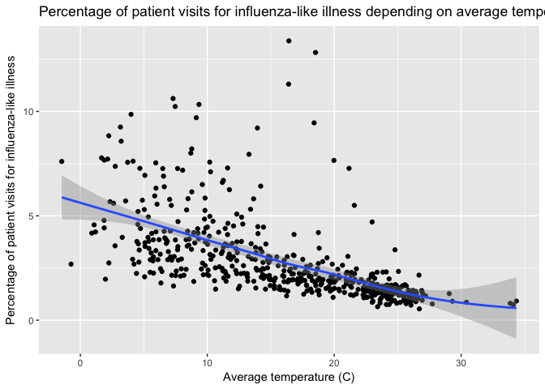

C°F 5th Weather Chart - Flu, (US, South Central) Analysis
==========================================================

About
-----

In this analysis, we compared the proportion of people visiting their healthcare providers for influenza-like illness with the temperature.

South Central is Arkansas, Louisiana, New Mexico, Oklahoma, and Texas.

"Information on patient visits to health care providers for influenza-like illness is collected through the U.S. Outpatient Influenza-like Illness Surveillance Network (ILINet). \[...\] The percentage of patient visits to healthcare providers for ILI reported each week is weighted on the basis of state population. This percentage is compared each week with the national baseline. The baseline is developed by calculating the mean percentage of patient visits for ILI during non-influenza weeks for the previous three seasons and adding two standard deviations. "[1]

The steps taken for this analysis are:

-   Get the flu data
-   Merge with the weather data (average temperature per week)

In the following section you will find more details for each step.

Sources
-------

-   CDC Fluview - National and Regional Level Outpatient Illness and Viral Surveillance[2] : <https://gis.cdc.gov/grasp/fluview/fluportaldashboard.html>
-   Highlights :
    -   <http://sitn.hms.harvard.edu/flash/2014/the-reason-for-the-season-why-flu-strikes-in-winter/>
    -   <http://www.who.int/csr/disease/swineflu/frequently_asked_questions/about_disease/en/>
-   CDC Fluview documentation <https://gis.cdc.gov/grasp/fluview/FluViewPhase2QuickReferenceGuide.pdf>
-   NOAA Weather : <ftp://ftp.ncdc.noaa.gov/pub/data/ghcn/daily/by_year/>

Methodology
-----------

``` r
source('../utils_US.R')

library(plyr)
library(ggplot2)
library(lubridate)
library(dplyr)
```

### Get the flu data

The flu dataset that we used is about the region 6 of Health and Human Services (HHS) Regions which corresponds to Arkansas, Louisiana, New Mexico, Oklahoma, and Texas. The final chart uses the ILINet data between 2007 to 2016.

``` r
ilit <- read.csv('../data/ilit.csv')
head(ilit)
```

    ##   REGION.TYPE   REGION YEAR WEEK X..WEIGHTED.ILI X.UNWEIGHTED.ILI AGE.0.4
    ## 1 HHS Regions Region 6 1997   40         1.01898         0.747384       2
    ## 2 HHS Regions Region 6 1997   41         1.44932         0.877193       2
    ## 3 HHS Regions Region 6 1997   42          1.4623          0.89955       2
    ## 4 HHS Regions Region 6 1997   43         1.64702            1.059       2
    ## 5 HHS Regions Region 6 1997   44         2.46072          1.69492       4
    ## 6 HHS Regions Region 6 1997   45         2.68891          1.92308       4
    ##   AGE.25.49 AGE.25.64 AGE.5.24 AGE.50.64 AGE.65 ILITOTAL NUM..OF.PROVIDERS
    ## 1        NA         1        2        NA      0        5                 4
    ## 2        NA         2        2        NA      0        6                 4
    ## 3        NA         2        2        NA      0        6                 4
    ## 4        NA         2        2        NA      1        7                 4
    ## 5        NA         3        2        NA      2       11                 4
    ## 6        NA         3        3        NA      1       11                 3
    ##   TOTAL.PATIENTS
    ## 1            669
    ## 2            684
    ## 3            667
    ## 4            661
    ## 5            649
    ## 6            572

### Get the weather data

For more details on how the weather data was treated, see the related reference. The flu dataset gives no indication of location, therefore we had to average the weather over all the weather stations located in the Region 6 (HHS). Although it brings imprecision as it is an average over 5 U.S. states, we are only considering temperature variations which still have a general common trend among those 5 states.

The weather data was then averaged per week, between 2007 and 2016.

``` r
weather_data <- read.csv('../data/weather_2007-16_week.csv')
names(weather_data)[names(weather_data) == 'isoweek.date.'] <- 'WEEK'
weather_data <- weather_data[c('YEAR', 'WEEK', 'TAVG')]
head(weather_data)
```

    ##   YEAR WEEK     TAVG
    ## 1 2016    1 4.450140
    ## 2 2016    2 5.097403
    ## 3 2016    3 5.386685
    ## 4 2016    4 8.931610
    ## 5 2016    5 5.624435
    ## 6 2016    6 9.783206

### Flu and weather

Then we merge weather and flu data together, per year and week:

``` r
df <- merge(ilit, weather_data, by=c('YEAR', 'WEEK'))
head(df)
```

    ##   YEAR WEEK REGION.TYPE   REGION X..WEIGHTED.ILI X.UNWEIGHTED.ILI AGE.0.4
    ## 1 2007    1 HHS Regions Region 6         3.85813          3.90649     474
    ## 2 2007   10 HHS Regions Region 6          5.0833           4.9934     593
    ## 3 2007   11 HHS Regions Region 6         4.45923          4.58341     496
    ## 4 2007   12 HHS Regions Region 6         3.04201          2.93945     248
    ## 5 2007   13 HHS Regions Region 6          2.6156          2.76906     248
    ## 6 2007   14 HHS Regions Region 6         2.58951           2.7325     304
    ##   AGE.25.49 AGE.25.64 AGE.5.24 AGE.50.64 AGE.65 ILITOTAL NUM..OF.PROVIDERS
    ## 1        NA       352      339        NA     90     1255               162
    ## 2        NA       468      746        NA     84     1891               150
    ## 3        NA       535      515        NA    106     1652               137
    ## 4        NA       259      311        NA     35      853               130
    ## 5        NA       311      298        NA     78      935               130
    ## 6        NA       340      290        NA     92     1026               152
    ##   TOTAL.PATIENTS      TAVG
    ## 1          32126  6.200846
    ## 2          37870 12.322857
    ## 3          36043 14.423790
    ## 4          29019 16.297778
    ## 5          33766 15.590317
    ## 6          37548 11.962222

Plots
-----

``` r
df$ilit_percentage <- as.numeric(as.character(df$X..WEIGHTED.ILI))

p1 <- ggplot(df, aes(x=TAVG, y=ilit_percentage)) + geom_point() + geom_smooth() +
    xlab("Average temperature (C)") +
    ylab("Percentage of patient visits for influenza-like illness") + 
    ggtitle("Percentage of patient visits for influenza-like illness depending on average temperature")
    
p1
```



[1] From CDC Fluview documentation <https://gis.cdc.gov/grasp/fluview/FluViewPhase2QuickReferenceGuide.pdf>

[2] Fluview needs Flash to work correctly, therefore you could use Firefox to open it.
