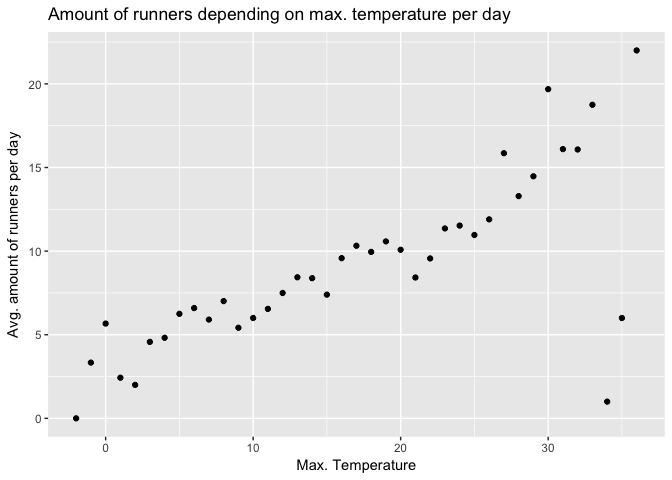
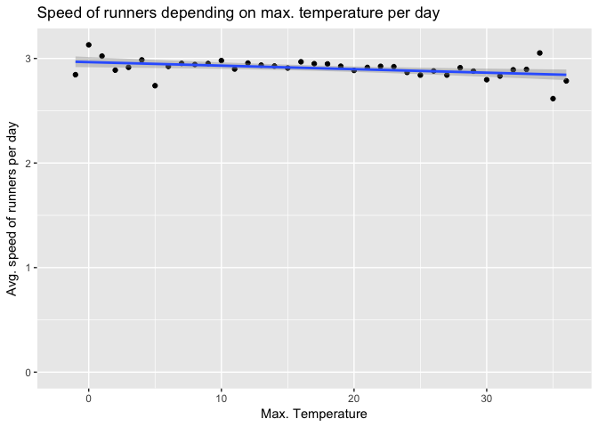

C°F 5th Weather Chart - Running, (US, Seattle) Analysis
========================================================

On Strava
---------

Strava is a website and mobile app used to track athletic activity via GPS. One type of data from Strava is called a *Segment* and is defined as "specific sections of road" on which "athletes' times are compared". An athlete performance is called an *Effort*. Back when the analysis was made, Strava API had an available endpoint `/segments/{segment_id}/all_efforts` which allowed to request for all the performance of athletes on a given segment, for a given date range, without the need of athlete's approval. This endpoint is unfortunately not available anymore, thus fetching the data is not reproducible.

About
-----

In this analysis, we compared the number of people running with temperature.

The steps taken for this analysis are:

-   Get the number of runs per day
-   Merge with the weather data
-   Aggregate to the total number of runs per week and temperature per week.

In the following section, you will find more details about each step.

Sources
-------

-   Strava API : <https://strava.github.io/api/>
-   NOAA Weather : <ftp://ftp.ncdc.noaa.gov/pub/data/ghcn/daily/by_year/>

Methodology
-----------

``` r
source('../utils_US.R')
library(plyr)
library(ggplot2)
library(lubridate)
library(dplyr)
```

### Find a segment

There are many segments available. After logging in the Strava website, it is possible to [explore segments](https://www.strava.com/segments/explore) for a given location.

The criterias to pick a segment to analyse were:

-   The segment should have a large amount of athlete efforts recorded
-   The segment should not be a particular segment where the attendance levels could be influenced by a major factor. For example, a segment located on a university campus could be biased by scheduled sport trainings, and therefore would not reflect a weather influence.

Following this two rules we picked a segment called ["Let it RIP!"](https://www.strava.com/segments/1475344). It is a ride segment in Woodland Park, Seattle.

### Get efforts for a segment

By querying the API with the segment ID, a start timestamp and an end timestamp, we get back the list of efforts conducted on the segment. For the segment we picked, the ID was `1475344`, and the date range was `start_date_local=2010-01-01T00:00:00Z` to `end_date_local=2015-12-31T23:59:59Z`. Example of the response head:

    ##   X          id resource_state         name elapsed_time moving_time
    ## 1 1 17679007761              2 Let it RIP!           286         286
    ## 2 2  1518615679              2 Let it RIP!           216         216
    ## 3 3   753817078              2 Let it RIP!           389         389
    ## 4 4  1990696531              2 Let it RIP!           206         206
    ## 5 5  1990696541              2 Let it RIP!           199         199
    ## 6 6 17679008232              2 Let it RIP!           286         286
    ##             start_date     start_date_local distance start_index end_index
    ## 1 2010-01-02T01:50:34Z 2010-01-01T17:50:34Z  832.400         558       844
    ## 2 2010-01-04T22:01:40Z 2010-01-04T14:01:40Z  841.200         318       359
    ## 3 2010-01-09T23:44:02Z 2010-01-09T15:44:02Z  823.174         254       341
    ## 4 2010-01-12T16:45:46Z 2010-01-12T08:45:46Z  821.600         181       225
    ## 5 2010-01-12T17:04:07Z 2010-01-12T09:04:07Z  835.200         419       465
    ## 6 2010-01-18T03:13:14Z 2010-01-17T19:13:14Z  830.400         447       733
    ##   kom_rank pr_rank average_heartrate max_heartrate average_cadence
    ## 1       NA       2                NA            NA              NA
    ## 2       NA      NA                NA            NA              NA
    ## 3       NA      NA             136.2           152              NA
    ## 4       NA      NA                NA            NA              NA
    ## 5       NA      NA                NA            NA              NA
    ## 6       NA       3                NA            NA              NA
    ##   activity.id activity.resource_state athlete.id athlete.resource_state
    ## 1   720486783                       1    4051962                      1
    ## 2    76041446                       1    2734050                      1
    ## 3    44305948                       1    1822673                      1
    ## 4    67220175                       1    1020809                      1
    ## 5    67220175                       1    1020809                      1
    ## 6   720486790                       1    4051962                      1
    ##   segment.id segment.resource_state segment.name segment.activity_type
    ## 1    1475344                      2 Let it RIP!                    Run
    ## 2    1475344                      2 Let it RIP!                    Run
    ## 3    1475344                      2 Let it RIP!                    Run
    ## 4    1475344                      2 Let it RIP!                    Run
    ## 5    1475344                      2 Let it RIP!                    Run
    ## 6    1475344                      2 Let it RIP!                    Run
    ##   segment.distance segment.average_grade segment.maximum_grade
    ## 1           830.79                  -0.2                   1.3
    ## 2           830.79                  -0.2                   1.3
    ## 3           830.79                  -0.2                   1.3
    ## 4           830.79                  -0.2                   1.3
    ## 5           830.79                  -0.2                   1.3
    ## 6           830.79                  -0.2                   1.3
    ##   segment.elevation_high segment.elevation_low segment.start_latitude
    ## 1                   52.4                  50.5               47.67137
    ## 2                   52.4                  50.5               47.67137
    ## 3                   52.4                  50.5               47.67137
    ## 4                   52.4                  50.5               47.67137
    ## 5                   52.4                  50.5               47.67137
    ## 6                   52.4                  50.5               47.67137
    ##   segment.start_longitude segment.end_latitude segment.end_longitude
    ## 1               -122.3423             47.67567             -122.3337
    ## 2               -122.3423             47.67567             -122.3337
    ## 3               -122.3423             47.67567             -122.3337
    ## 4               -122.3423             47.67567             -122.3337
    ## 5               -122.3423             47.67567             -122.3337
    ## 6               -122.3423             47.67567             -122.3337
    ##   segment.climb_category segment.city segment.state segment.country
    ## 1                      0      Seattle            WA   United States
    ## 2                      0      Seattle            WA   United States
    ## 3                      0      Seattle            WA   United States
    ## 4                      0      Seattle            WA   United States
    ## 5                      0      Seattle            WA   United States
    ## 6                      0      Seattle            WA   United States
    ##   segment.private segment.hazardous segment.starred
    ## 1           FALSE             FALSE           FALSE
    ## 2           FALSE             FALSE           FALSE
    ## 3           FALSE             FALSE           FALSE
    ## 4           FALSE             FALSE           FALSE
    ## 5           FALSE             FALSE           FALSE
    ## 6           FALSE             FALSE           FALSE

### Get the amount of runs per day

The goal is to obtain the amount of runs per day and the average speed of runners. The number of records for a given date is what gives us this amount, and the total Time and Distance ran will give us the average speed.

``` r
# Format date
segmentData$YYYYMMDD <- as.Date(segmentData$start_date_local, "%Y-%m-%d")

# Aggregate by date
st_data <- ddply( segmentData , .(YYYYMMDD) , summarise , Count = length(YYYYMMDD), totalDistance = sum(distance), totalTime = sum(elapsed_time), meanTime= mean(elapsed_time), meanDistance=mean(distance) )

head(st_data)
```

    ##     YYYYMMDD Count totalDistance totalTime meanTime meanDistance
    ## 1 2010-01-01     1       832.400       286    286.0      832.400
    ## 2 2010-01-04     1       841.200       216    216.0      841.200
    ## 3 2010-01-09     1       823.174       389    389.0      823.174
    ## 4 2010-01-12     2      1656.800       405    202.5      828.400
    ## 5 2010-01-17     1       830.400       286    286.0      830.400
    ## 6 2010-01-24     2      1662.800       548    274.0      831.400

### Get the weather data

For more details on how the weather data was treated, see the related reference. As we are considering a 1km running path, we decided to average the weather data of the closest weather stations around the running path. The weather data and the segment data are then merged by date. Result of merge is:

    ##   X       date Count totalDistance totalTime meanTime meanDistance
    ## 1 1 2010-01-01     1         832.4       286      286        832.4
    ## 2 2 2010-01-02     0            NA        NA       NA           NA
    ## 3 3 2010-01-03     0            NA        NA       NA           NA
    ## 4 4 2010-01-04     1         841.2       216      216        841.2
    ## 5 5 2010-01-05     0            NA        NA       NA           NA
    ## 6 6 2010-01-06     0            NA        NA       NA           NA
    ##         PRCP  TMAX TMIN  AWND roundedPRCP roundedTMAX roundedTMIN
    ## 1 11.3100000 11.65 7.50 20.16          11          11           7
    ## 2  6.4615385 10.00 5.60 14.76           6          10           5
    ## 3  0.2461538  9.45 4.75  2.16           0           9           4
    ## 4 10.9153846  9.15 6.95  7.92          10           9           6
    ## 5 12.0769231  9.15 7.50  5.40          12           9           7
    ## 6  0.7750000 10.30 4.15  5.76           0          10           4
    ##   roundedAWND
    ## 1          20
    ## 2          14
    ## 3           2
    ## 4           7
    ## 5           5
    ## 6           5

### Speed and number of people running

-   The average number of people running per day is defined as the sum of all the recorded runs divided by the number of days, for days with a temperature falling in a bucket.
-   The average speed of people running per day is defined as the sum of the whole distance ran divided by the whole duration ran per day, for days with a temperature falling in a bucket.

Plot
----

``` r
df_tmax <- df %>% group_by(tmax = round(TMAX,0)) %>% summarise(meanCount = mean(Count, na.rm=TRUE))

p1 <- ggplot(df_tmax, aes(x=tmax, y=meanCount)) + geom_point() + labs(x="Max. Temperature", y="Avg. amount of runners per day") + ggtitle("Amount of runners depending on max. temperature per day")
p1
```



``` r
df_speed <- df %>% group_by(tmax = round(TMAX,0)) %>% summarise(sumDistance = sum(totalDistance, na.rm=TRUE), sumDuration=sum(totalTime,na.rm=TRUE))
df_speed$speed <- df_speed$sumDistance / df_speed$sumDuration

p2 <- ggplot(df_speed, aes(x=tmax, y=speed)) + geom_point() + labs(x="Max. Temperature", y="Avg. speed of runners per day") + ggtitle("Speed of runners depending on max. temperature per day") + geom_smooth(method=lm) + expand_limits(y = 0)
p2
```



Notes
-----

-   On the final chart, the temperature is in Fahrenheit and the speed is in miles per hour
-   We removed the days where the temperature was below 30F and above 95F because both these buckets had less than 10 data points in them.
