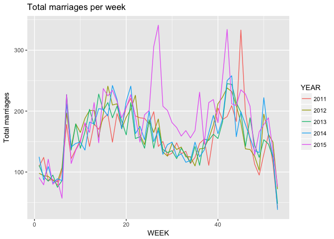
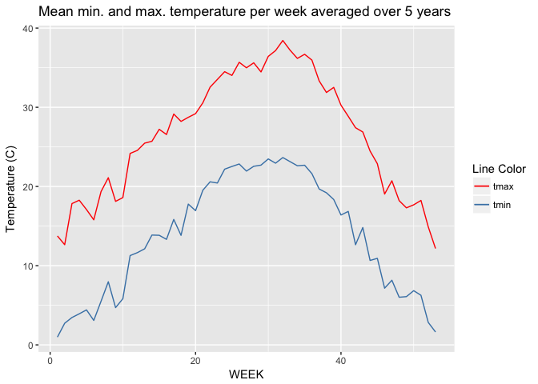

C°F 5th Weather Chart - Weddings, (US, Travis County, Texas) Analysis
======================================================================

About
-----

In this analysis, we compared the number of people getting married with temperature.

The Travis County Clerk Web Search presents a list of marriage records with the date of the marriage. From that list which can be exported, we can count the number of marriage records per day.

The steps taken for this analysis are:

-   Get weddings data
-   Count the number of weddings per day
-   Merge with the weather data
-   Average the temperature per week over the 5 years
-   Count the total number of weddings per week and per year

In the following section you will find more details for each step.

Sources
-------

-   Travis County Clerk Web Search, Marriage Records : <http://www.tccsearch.org/>
-   Highlights :
    -   <https://en.wikipedia.org/wiki/Same-sex_marriage_in_Texas>
-   NOAA Weather : <ftp://ftp.ncdc.noaa.gov/pub/data/ghcn/daily/by_year/>

Methodology
-----------

``` r
source('../utils_US.R')
library(plyr)
library(ggplot2)
library(lubridate)
library(dplyr)
```

### Get the marriages

The marriages analysis uses 5 years of data: the start date is 2011-01-01, the end date is 2015-12-31. We extracted the *Date of marriage* column. This is how the list looks like so far:

    ##           V1
    ## 1 01/01/2011
    ## 2 01/01/2011
    ## 3 01/01/2011
    ## 4 01/01/2011
    ## 5 01/01/2011
    ## 6 01/01/2011

Then we aggregate the dataset by date, by counting the number of times a date is present. Finally we sum the number of marriages per day over a week. For this we used the *week*[1] function from *lubridate* package.

    ##   WEEK count YEAR
    ## 1    1   109 2011
    ## 2    2   124 2011
    ## 3    3    86 2011
    ## 4    4    88 2011
    ## 5    5    78 2011
    ## 6    6   102 2011

### Get the weather data

For more details on how the weather data was treated, see the related reference. As we are considering a county, we decided to average the weather data of the weather stations of the county, by date between 2011-01-01 and 2015-12-31. Then we averaged the weather data by week over the 5 years, which gives us a data point per week and year.

    ##   X WEEK value.AWND  value.PRCP value.SNOW value.SNWD value.TAVG
    ## 1 1    1   32.52381  55.0214816          0          0   55.07143
    ## 2 2    2   32.04762  27.3911399          0          0   28.92857
    ## 3 3    3   21.42857   1.4886503          0          0  104.78571
    ## 4 4    4   33.04762 103.9259081          0          0  105.78571
    ## 5 5    5   29.14286  24.0912993          0          0  103.92857
    ## 6 6    6   29.61905   0.3470945          0          0  128.21429
    ##   value.TMAX value.TMIN YEAR        PRCP      TMAX       TMIN      AWND
    ## 1  103.54337   3.727041 2015  5.50214816 10.354337  0.3727041 11.708571
    ## 2   46.47704  -5.173469 2015  2.73911399  4.647704 -0.5173469 11.537143
    ## 3  187.46429  33.267857 2015  0.14886503 18.746429  3.3267857  7.714286
    ## 4  181.08929  42.035714 2015 10.39259081 18.108929  4.2035714 11.897143
    ## 5  154.30357  53.982143 2015  2.40912993 15.430357  5.3982143 10.491429
    ## 6  202.94643  59.696429 2015  0.03470945 20.294643  5.9696429 10.662857
    ##   SNOW SNWD      TAVG
    ## 1    0    0  5.507143
    ## 2    0    0  2.892857
    ## 3    0    0 10.478571
    ## 4    0    0 10.578571
    ## 5    0    0 10.392857
    ## 6    0    0 12.821429

### Marriages and weather

Merging the marriages and weather data by week and year gives us a final dataset :

``` r
df <- merge(marriages, weather_data, by=c('YEAR', 'WEEK'))
head(df)
```

    ##   YEAR WEEK count   X value.AWND value.PRCP value.SNOW value.SNWD
    ## 1 2011    1   109 213   11.61905 2.52654313          0          0
    ## 2 2011   10   152 222   31.00000 4.92325767          0          0
    ## 3 2011   11   180 223   35.52381 0.60448912          0          0
    ## 4 2011   12   142 224   38.04762 0.01700257          0          0
    ## 5 2011   13   179 225   26.61905 0.72426700          0          0
    ## 6 2011   14   170 226   36.95238 1.93554685          0          0
    ##   value.TAVG value.TMAX value.TMIN        PRCP     TMAX      TMIN
    ## 1   92.71429   168.9603   24.88690 0.252654313 16.89603  2.488690
    ## 2  145.85714   227.9683   56.11111 0.492325767 22.79683  5.611111
    ## 3  188.85714   255.6190  125.76389 0.060448912 25.56190 12.576389
    ## 4  221.85714   289.3016  167.12698 0.001700257 28.93016 16.712698
    ## 5  174.42857   242.9841  105.68254 0.072426700 24.29841 10.568254
    ## 6  214.14286   285.2540  132.90476 0.193554685 28.52540 13.290476
    ##        AWND SNOW SNWD      TAVG
    ## 1  4.182857    0    0  9.271429
    ## 2 11.160000    0    0 14.585714
    ## 3 12.788571    0    0 18.885714
    ## 4 13.697143    0    0 22.185714
    ## 5  9.582857    0    0 17.442857
    ## 6 13.302857    0    0 21.414286

### Temperature

Let's average the temperature per week over the 5 years:

``` r
temp <- weather_data %>% group_by(WEEK) %>% summarise(meanTMIN = mean(TMIN), meanTMAX = mean(TMAX))
head(temp)
```

    ## # A tibble: 6 x 3
    ##    WEEK meanTMIN meanTMAX
    ##   <int>    <dbl>    <dbl>
    ## 1     1 0.981780 13.75320
    ## 2     2 2.729983 12.64902
    ## 3     3 3.455278 17.83762
    ## 4     4 3.920754 18.26619
    ## 5     5 4.417126 17.08471
    ## 6     6 3.088135 15.79032

Plots
-----

``` r
p1 <- ggplot(df, aes(x=WEEK, y=count, color=YEAR)) + geom_line() +
    ggtitle("Total marriages per week") + 
    ylab("Total marriages")
p1
```



``` r
p3 <- ggplot(temp) + geom_line(aes(x=WEEK, y=meanTMAX, color='tmax')) + geom_line(aes(x=WEEK, y=meanTMIN, color='tmin'))+
    ggtitle("Mean min. and max. temperature per week averaged over 5 years") +
    scale_colour_manual(name="Line Color",
    values=c(tmax="red", tmin="steelblue")) +
    ylab("Temperature (C)")
p3
```



Notes
-----

-   On the final graph, we removed the data point for week 53, as it only contains one day.
-   On the final graph, temperature is plotted in Fahrenheit

[1] "week returns the number of complete seven day periods that have occured between the date and January 1st, plus one." <https://cran.r-project.org/web/packages/lubridate/lubridate.pdf>
